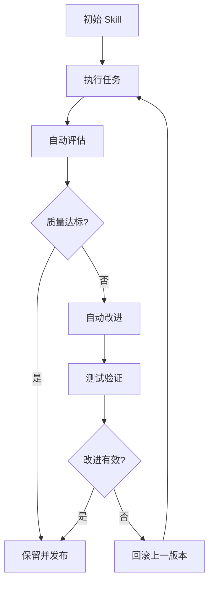

# darwin-skill — Agent Skill 自进化系统

## 一句话定位

让你的 Skill 无限进化的系统：评估 → 改进 → 测试 → 保留或回滚。

## 解决的问题

当前的 Agent Skill 一旦创建就基本静态，缺少系统化的质量评估和迭代改进机制。darwin-skill 引入了"自然选择"式的 Skill 优化循环。

## 为什么值得关注

1. **填补 Skill 生命周期管理的空白**：大多数 Skill 框架只关注创建和执行，darwin 关注的是持续改进
2. **评估-改进-回滚闭环**：具备版本管理和回退能力，不是盲目的自动调参
3. **与 nuwa-skill 互补**：nuwa 蒸馏人的思维，darwin 让 Skill 自主进化，两者组合构成了完整的 Skill 生命周期

## 热度来源判断

热度合理。952 stars / 4天，增速健康。来自 AI Agent 社区对 Skill 质量管控的真实需求，非刷量。

## 关键技术亮点

- 自动评估 Skill 执行效果
- 基于评估结果的自动改进
- A/B 测试机制（保留或回滚）
- 版本化 Skill 管理

## 架构启发

Skill 生命周期管理（Create → Evaluate → Improve → Test → Keep/Revert）可能成为 Agent 平台的标准能力。类似 CI/CD 之于代码，Skill 需要自己的持续集成和质量门控。

## 定位判断

**平台候选**。Skill 自进化引擎可以成为 Skill Marketplace 或 Agent 平台的核心质量管控组件。

## 风险/局限/泡沫点

1. **"进化"效果存疑**：自动化改进的质量上限取决于评估指标的合理性
2. **与 nuwa-skill 同作者**：alchaincyf 产出多个 xxx-skill 项目，需警惕概念包装
3. **评估标准不透明**：Skill "好不好"的度量本身是一个开放问题
4. **泛化能力未知**：在复杂、多步骤 Skill 上的效果尚未验证

## 与同类项目的关系

- **vs nuwa-skill**：同作者，互补关系——nuwa 蒸馏人的思维模型，darwin 让 Skill 自动进化
- **vs superpowers**：superpowers 提供静态的 Skill 框架和方法论，darwin 提供动态的 Skill 改进机制
- **vs oh-my-codex**：oh-my-codex 是 Skill 集合，darwin 是 Skill 生命周期引擎

## 是否值得持续跟踪

**是。** Skill 自优化方向是 Agent 系统工程化的必经之路。

## 是否值得企业 PoC

**可以小规模验证。** 评估-改进-回滚的闭环思路值得借鉴，但需要自建评估指标体系。

## 后续观察点

1. 是否有真实的 Skill 改进案例（改进前后对比）
2. 评估指标的透明度和合理性
3. 社区是否有其他开发者贡献 Skill 进化用例
4. 是否会与 nuwa-skill 深度整合

---
*最近更新：2026-04-18 | 1,082★ (+130)，但最后推送 4/14，活跃度需关注*
