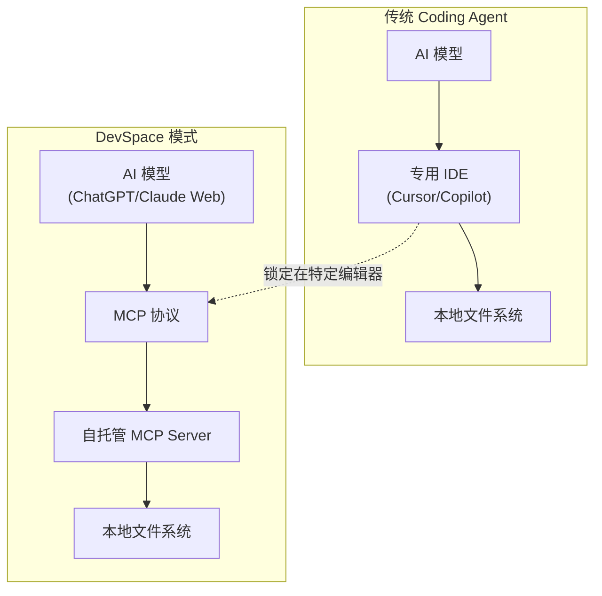

# DevSpace — ChatGPT→Coding Agent 桥接层

## 一句话定位
自托管 MCP server，让 ChatGPT Web（或 Claude Web）直接操作本地文件系统——读写代码、搜索项目、执行命令，把 Web 聊天 UI 变成 Coding Agent。

## 它解决的问题
开发者想用 ChatGPT/Claude Web 的强大模型做日常编码，但 Web UI 无法访问本地代码。现有方案要么用 Cursor/Copilot 等 IDE 集成（锁定在特定编辑器），要么手动复制粘贴（效率极低）。DevSpace 通过 MCP 协议桥接 Web AI 和本地开发环境。

## 为什么值得关注（2026-07-12）
DevSpace 提出了一个重要的架构问题：**Agent 的终态是独立应用，还是现有 UI + 能力注入？**

如果 ChatGPT Web + MCP server 就能实现 Codex/Claude Code 80% 的功能——文件读写、代码搜索、命令执行——那么独立 Coding Agent IDE 的护城河在哪里？

28 天 3.2K⭐ 的增速说明这个需求是真实的：大量开发者日常使用 ChatGPT/Claude Web，但不想为编码场景切换到独立 Agent IDE。

## 热度来源判断
- **真实需求驱动**：ChatGPT/Claude Web 用户基数巨大，编码需求真实存在
- **MCP 协议红利**：Anthropic 推 MCP 后，社区寻找落地场景，DevSpace 是最自然的 Coding 场景
- **低门槛**：`npm install -g @waishnav/devspace` 一键安装，零配置启动
- **非泡沫型**：不是 AI 概念包装，是实际的开发工具

## 关键技术亮点

### 1. 自托管安全模型
- MCP server 运行在本机，文件不上传第三方
- 通过用户控制的隧道暴露（非公网）
- 密码认证机制，仅用户可批准连接

### 2. MCP 协议落地
- 实现了文件读写、代码搜索、命令执行等 MCP 工具
- 可与任何支持 MCP 的 AI 客户端对接（ChatGPT、Claude Web 等）
- 验证了 MCP 作为 Agent 能力层标准协议的可行性

### 3. 一键导入 Claude Code 认证
- 支持从 Claude Code 一键迁移现有认证
- 降低从 Coding Agent IDE 迁移到 Web + MCP 的门槛

### 4. npm 分发 + CI 完备
- npm 包发布（@waishnav/devspace）
- GitHub Actions CI pipeline
- 版本管理规范

## 架构启发

**核心 insight：Agent = 能力层（MCP tools）+ UI 层（Web Chat）。** 这两层可以解耦。DevSpace 让你用喜欢的 Web AI UI + 自托管能力层 = 完整的 Coding Agent。

这种解耦如果成为主流，会削弱独立 Coding Agent IDE 的锁定能力。

## 定位判断
**工具型项目**。不是平台，不是基础设施。但验证了一个重要的架构模式（Agent 能力层/UI 层解耦），可能影响 Coding Agent 整体赛道的竞争格局。

## 风险 / 局限 / 泡沫点

1. **安全模型未经审计**：自托管 MCP server 暴露文件系统 + 终端执行，攻击面需要严肃评估。隧道安全、密码强度、会话管理等都是潜在风险点
2. **依赖第三方 Web UI**：ChatGPT/Claude Web 的 UI 变更可能影响 DevSpace 可用性
3. **竞争壁垒低**：MCP server 实现不复杂，容易被官方或大厂替代
4. **赞助商模式风险**：README 已有赞助商（Rebates——终端广告），商业化路径可能影响用户体验
5. **单人项目**：主要贡献者 Waishnav，bus factor = 1

## 与同类项目的关系

| 项目 | 定位 | 差异 |
|------|------|------|
| Cursor | AI IDE | 独立编辑器，锁定体验 |
| Claude Code | Terminal Agent | 官方出品，深度集成 |
| Codex CLI | Terminal Agent | OpenAI 官方 CLI |
| DevSpace | MCP Bridge | 不新建 UI，赋能 Web AI |

DevSpace 的差异化在于**不做 UI，只做桥接**。

## 是否值得持续跟踪
**是。** DevSpace 验证的"Web AI + MCP = Coding Agent"模式可能成为主流。关注 MCP 生态演进和大厂的反应。

## 后续观察点
1. OpenAI/Anthropic 是否官方支持 MCP（如果支持，DevSpace 价值大增）
2. 安全审计——是否出现安全事件或社区安全分析
3. 是否扩展到 Coding 以外的场景（数据分析、DevOps 等）
4. 大厂是否推出类似官方方案（如 ChatGPT 原生 MCP 支持）
5. 用户留存率——尝鲜后的持续使用率

---
*首次记录：2026-07-12*
