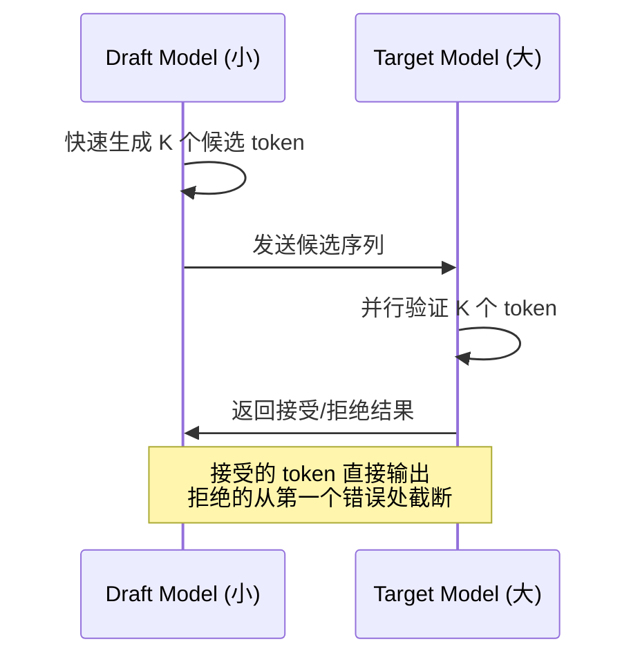

# dflash-mlx — MLX 无损推测解码

## 一句话定位

Apple Silicon 上 MLX 的无损 DFlash 推测解码，端侧 LLM 推理加速。

## 解决的问题

端侧 LLM 推理速度是最大瓶颈。推测解码（Speculative Decoding）是一种在不损失精度的情况下加速推理的技术，dflash-mlx 将其带到了 MLX（Apple Silicon ML 框架）。

## 为什么值得关注

1. **无损加速**：推测解码的 key promise 是"不损失精度"的前提下加速推理
2. **Apple Silicon 生态**：MLX 是 Apple 官方 ML 框架，生态增长中
3. **推理优化是端侧 AI 的核心瓶颈**

## 热度来源判断

443 stars，适度。来自 ML/编译器社区的技术关注。

## 关键技术亮点

- DFlash 推测解码算法实现
- MLX 框架集成
- 针对 Apple Silicon GPU 优化

## 架构启发

推测解码模式：一个小模型（draft model）快速生成候选 token，大模型并行验证。这是一种用计算换延迟的经典架构模式。

## 定位判断

**工具型/基础设施候选**。如果成熟，可以成为 MLX 生态的标准推理加速组件。

## 风险/局限/泡沫点

1. **平台限制**：仅 Apple Silicon
2. **无损声明需验证**：推测解码在某些场景下可能引入微小偏差
3. **模型兼容性**：需要 draft model 和 target model 的 tokenizer 兼容

## 与同类项目的关系

- **vs vLLM / TensorRT-LLM**：服务端推理加速，dflash-mlx 是端侧对标
- **vs MLX 官方**：dflash-mlx 是 MLX 之上的优化层

## 是否值得持续跟踪

**是。** 端侧推理加速是明确趋势，推测解码是关键技术路径。

## 是否值得企业 PoC

**可以评估。** 如果企业有 Apple Silicon 端侧 AI 部署场景，值得测试加速效果。

## 后续观察点

1. 加速比的基准测试数据
2. 与不同模型的兼容性
3. 是否被 MLX 官方采纳
4. 社区是否有非 Apple 平台的移植计划
