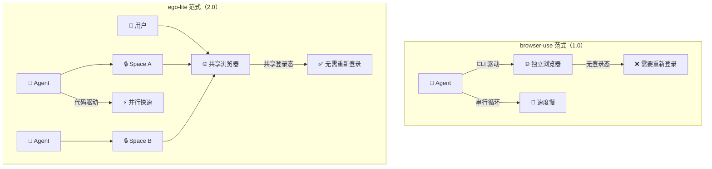

# citrolabs/ego-lite

## 一句话定位
人机并行浏览器——Agent 在独立 Space 中工作，共享你的登录态但不干扰你的标签页。

## 它解决的问题
现有 Agent 浏览器工具（browser-use / agent-browser）需要单独启动浏览器实例，登录态无法继承，Agent 和人抢同一个浏览器。Agent 完成多步任务时频繁在"调用命令 → 看结果 → 调用下一条"的循环中浪费时间。

## 为什么值得关注（2026-07-24）
ego-lite 代表了 Agent 浏览器的范式转变：从"驱动浏览器"到"共享浏览器"。Agent 在你的浏览器里有自己的隔离 Space，能看到你的登录状态但不干扰你。代码驱动而非 CLI 驱动的设计让复杂任务快 2.5x。

## 热度来源判断
- **真实痛点**：Agent 浏览器自动化中的登录态和标签冲突是普遍痛点
- **范式创新**：从 CLI 驱动到代码驱动的效率提升是实打实的
- **Chrome 迁移**：一键继承 Chrome 数据降低了试用门槛
- **早期阶段**：2K stars，日增 247，仍在快速增长

## 关键技术亮点
1. **Code-based 非 CLI-based**：Agent 写 JavaScript 函数直接调用浏览器 API，多步任务一次执行，比 CLI 循环快 2.5x
2. **Space 隔离**：每个 Agent / 任务有独立 Space（并行工作区），10 个 Space 同时运行互不干扰
3. **最强 Page Snapshot**：内核级定制，高质量页面快照，可靠处理深层 iframe
4. **Chrome 数据迁移**：首次启动可选择迁移 Chrome 登录态/cookies/扩展/书签
5. **ego-browser Skill**：标准 Skill 安装方式（`npx skills add`），兼容 Claude Code / Codex / Cursor

## 架构启发

## 定位判断
工具型——当前阶段是 Agent 浏览器自动化工具的有力竞争者，但其长期价值取决于是否能从"工具"升级为"平台"（如开放 Space API 供第三方编排）。

## 风险 / 局限 / 泡沫点
1. **仅 macOS**：Windows 和 Linux 仍在 roadmap，限制了采用范围
2. **闭源核心**：浏览器本身闭源，仅 Skill 层开源，社区信任度有限
3. **早期阶段**：2K stars，部分功能（体验积累）仍在 coming soon
4. **安全考量**：Agent 可访问用户登录态，企业场景需要额外控制层
5. **竞争激烈**：browser-use、ChatGPT Atlas、Perplexity Comet 都在同一赛道

## 与同类项目的关系
| 维度 | ego-lite | browser-use | ChatGPT Atlas | Perplexity Comet |
|------|----------|-------------|---------------|------------------|
| 范式 | 共享浏览器 | 驱动浏览器 | 独立浏览器 | 独立浏览器 |
| 并行 | ✅ 多 Space | ❌ 单线程 | ✅ | ✅ |
| 登录态 | ✅ Chrome 迁移 | ❌ 需重登 | ❌ | ❌ |
| 驱动方式 | 代码（JS） | CLI | 内置 Agent | 内置 Agent |
| 开源 | Skill 层开源 | ✅ 完全开源 | ❌ 闭源 | ❌ 闭源 |

## 是否值得持续跟踪
**建议跟踪。** "共享浏览器"范式如果能被验证，将成为 Agent 浏览器自动化的主流方式。重点关注跨平台支持进度和企业采用情况。

## 后续观察点
1. Windows/Linux 版本发布时间表
2. 浏览器内核是否开源（当前仅 Skill 层开源）
3. 企业级安全控制（Agent 权限 scope、数据隔离）
4. 与 Claude Code / Codex 的深度集成质量
5. "体验积累"功能的落地效果（声称可加速 5x）

---
*首次记录：2026-07-24*
