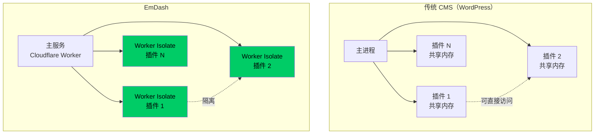

# EmDash — Cloudflare 的 WordPress 精神继任者

## 一句话定位

全栈 TypeScript CMS，基于 Astro 6.0 + Cloudflare Workers，用沙箱化 Worker Isolate 运行插件，从架构层面解决 WordPress 四十年的安全顽疾。

## 解决的问题

WordPress 是全球最大的 CMS（43% 网站使用），但其核心安全问题是**插件运行在进程内**——一个恶意或漏洞插件可以影响整个站点。EmDash 用 Cloudflare Worker Isolate 实现了操作系统级的插件隔离，从根本上消除了这个风险。

## 为什么值得关注

1. **Cloudflare 官方出品**：不是独立开发者的 side project，而是 Cloudflare 战略级产品
2. **架构级创新**：Worker Isolate 插件沙箱是 CMS 领域的重大突破
3. **MIT 开源**：消除了许可顾虑
4. **现代化技术栈**：TypeScript + Astro 6.0 + D1 + R2，对开发者友好
5. **WordPress 创始人关注**：Matt Mullenweg 公开评论，说明引起了行业重视

## 热度来源判断

- 真实需求驱动：CMS 市场长期缺乏有竞争力的现代化方案
- 品牌效应：Cloudflare 的全球基础设施 + 开发者社区
- 话题性：4 月 1 日发布 + "WordPress 继任者"叙事
- 行业讨论：WordPress 创始人的公开评论引发广泛讨论

## 关键技术亮点

### 插件沙箱架构

### 技术栈
- **前端**：Astro 6.0（SSR + Islands 架构）
- **运行时**：Cloudflare Workers（全球边缘网络）
- **数据库**：D1（SQLite，Cloudflare 托管）
- **对象存储**：R2（S3 兼容）
- **插件隔离**：Worker Isolate（操作系统级隔离）
- **类型安全**：全栈 TypeScript

## 架构启发

1. **插件隔离应该是默认选项**：任何需要插件系统的项目都应该考虑进程级/容器级隔离
2. **Serverless CMS 是可行路径**：CMS 不需要 7×24 长驻进程，Serverless + Edge 才是正确架构
3. **平台能力决定产品上限**：EmDash 的能力直接受 Cloudflare 平台能力限制

## 定位判断

**平台候选**。CMS 是 Web 生态的基础设施层。Cloudflare 有网络基础设施、开发者社区、全球边缘网络——这三点加起来构成平台基础。如果 EmDash 成功建立插件生态，有潜力成为 WordPress 的真正挑战者。

## 风险/局限/泡沫点

1. **Beta 阶段**：核心功能可用但离生产级还有距离
2. **插件生态为零**：CMS 的价值在生态，EmDash 目前没有插件生态
3. **Cloudflare 锁定风险**：虽然 MIT 开源，但 Workers 运行时有迁移成本。Matt Mullenweg 已公开指出这一点
4. **WordPress 的惯性巨大**：43% 的市场份额不是靠一个更好的产品就能颠覆的
5. **模板系统局限**：目前提供 blog/marketing/portfolio/starter/blank 模板，覆盖面有限

## 与同类项目的关系

- **vs WordPress**：EmDash 不是 WordPress 的替代品，而是对 CMS 架构的根本性重新思考
- **vs Ghost**：Ghost 专注博客/出版，EmDash 定位更广的全栈 CMS
- **vs Astro Content Collections**：EmDash 基于 Astro 但提供完整的 CMS 管理界面和插件系统

## 是否值得持续跟踪

**✅ 是**。这是 2026 年 Web 基础设施领域最重要的事件之一。Cloudflare 有资源持续投入。

## 是否值得企业 PoC

**✅ 是**。特别是对于安全敏感的企业 CMS 场景，插件沙箱架构提供了根本性的安全优势。建议：
- 先在非核心站点试用
- 评估插件生态建设路径
- 监控 Cloudflare 的长期投入承诺

## 后续观察点

1. 插件生态发展速度——这是成败关键
2. 是否有知名站点迁移到 EmDash
3. Cloudflare 的投入力度（团队规模、迭代速度）
4. 社区对 Cloudflare 锁定风险的接受度
5. WordPress 社区的反应和可能的对策
