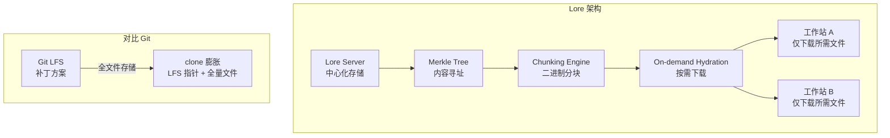

# EpicGames/lore

## 一句话定位
Epic Games 开源的下一代版本控制系统——内容寻址 + Merkle Tree + 大二进制优先，专为游戏/娱乐产业设计。

## 它解决的问题
游戏和娱乐产业在使用 git 时遇到根本性痛点：大型 binary asset（3D 模型、纹理、音频、视频）导致仓库膨胀、clone 慢、branch 切换耗时。Git LFS 是补丁不是解决方案。Perforce 等商业方案昂贵且封闭。行业需要一个原生支持大二进制的开源 VCS。

## 为什么值得关注（2026-06-21）
Epic Games（Fortnite、Unreal Engine 母公司）正式开源了他们内部的 VCS——Lore。这不是玩具项目，而是**UEFN（Unreal Editor for Fortnite）内置 VCS 的开源版本**。Epic 作为全球最大的游戏引擎和游戏公司之一，他们的 VCS 经过了 AAA 游戏生产的真实考验。Rust 实现 + MIT 协议 + 全 API 覆盖（C/C++/C#/Rust/Go/Python/JS），显示出长期投入的决心。

## 热度来源判断
- **Epic Games 品牌背书**：游戏行业巨头开源基础设施级别项目天然吸引关注
- **UEFN 关联**：Fortnite 创作者生态已经使用 Lore 的商业版本
- **痛点真实性极高**：每个游戏工作室都在为 VCS 头疼
- **Rust 实现**：技术社区的"好品味"信号
- **Pre-1.0 的早期红利**：早期参与者可以影响设计方向

## 关键技术亮点
1. **内容寻址存储 + Merkle Tree**：每个文件、目录、提交都通过内容哈希引用，天然支持去重和完整性验证。分支比较变成图比较，O(1) 级别。
2. **大二进制优先设计**：不同于 git 的 delta 存储，Lore 的 chunking 策略专门为大型 binary 文件优化，按内容分块存储，修改二进制文件时只存储变化的数据块。
3. **按需 hydration（Sparse Checkout 极致版）**：本地只需要当前工作所需的文件数据，其余保持在远端。新人 clone 一个 500GB 的游戏项目只需下载工作目录所需的几个 GB。
4. **去重跨历史和分支**：相同内容只存储一次，不论它出现在多少分支、多少提交中。
5. **可验证的防篡改历史链**：revision chain 是 immutable 的，任何篡改都会导致哈希不匹配。
6. **全语言 API**：C/C++/C#/Rust/Go/Python/JavaScript——可以集成到任何工具链中。

## 架构启发
Lore 的核心设计选择是**中心化架构 + 内容寻址**，而不是 git 的去中心化模型。这意味着：
- 权限管理更自然（中心化服务控制）
- 大文件的存储和传输可以集中优化
- 分支和 tag 操作不依赖本地完整历史
- 但也意味着离线工作能力有限

这个 trade-off 对游戏/媒体行业是合理的——他们的二进制资产太大，去中心化模型的 clone/clone 成本不可接受。

## 定位判断
**游戏/娱乐行业的 VCS 基础设施候选。** 不太可能成为通用软件开发的 VCS（git 的网络效应太强），但在游戏、影视、设计等 binary-heavy 场景中有潜力成为行业标准。与 Perforce/SVN 竞争，不是与 git 竞争。

## 风险 / 局限 / 泡沫点
1. **Pre-1.0，接口和格式可能变化**——生产采用风险高
2. **UEFN 压缩格式不统一**——开源版本和 UEFN 内置版本目前使用不同压缩格式，Epic 正在统一
3. **采用成本极高**——从 git/Perforce 迁移到 Lore 需要完整的工具链迁移
4. **受众有限**——对纯代码项目，Lore 相比 git 没有明显优势
5. **生态从零开始**——IDE 集成、CI/CD 集成、团队工作流工具都需要重建

## 与同类项目的关系
- **git + LFS**：通用 VCS 之王。LFS 是 binary 大文件的补丁，Lore 是原生解决方案。
- **Perforce (Helix Core)**：游戏行业 VCS 事实标准。商业、封闭、昂贵。Lore 是开源替代。
- **Plastic SCM (Unity）**：另一个游戏行业 VCS。商业 + 有限开源。Lore 更彻底开源。
- **jj (Jujutsu)**：新一代通用 VCS，但仍是文本代码优先。

## 是否值得持续跟踪
**是。** 游戏行业基础设施的开源化是一个中期趋势。Epic 的投入力度（Rust、全 API、MIT 协议）显示这不是营销行为。建议每 2 周跟踪一次。

## 后续观察点
1. **UEFN 压缩格式统一进度**——这是开源版本能否真正可用的关键里程碑
2. **首个 1.0 release 的时间线和功能范围**——是否包含分布式模式
3. **Unreal Engine 集成**——UE 原生支持 Lore 会极大推动采用
4. **社区采用案例**——关注是否有 AAA 工作室宣布迁移到 Lore
5. **桌面客户端发布**——非技术用户（艺术家、设计师）的使用入口

---
*首次记录：2026-06-21*
