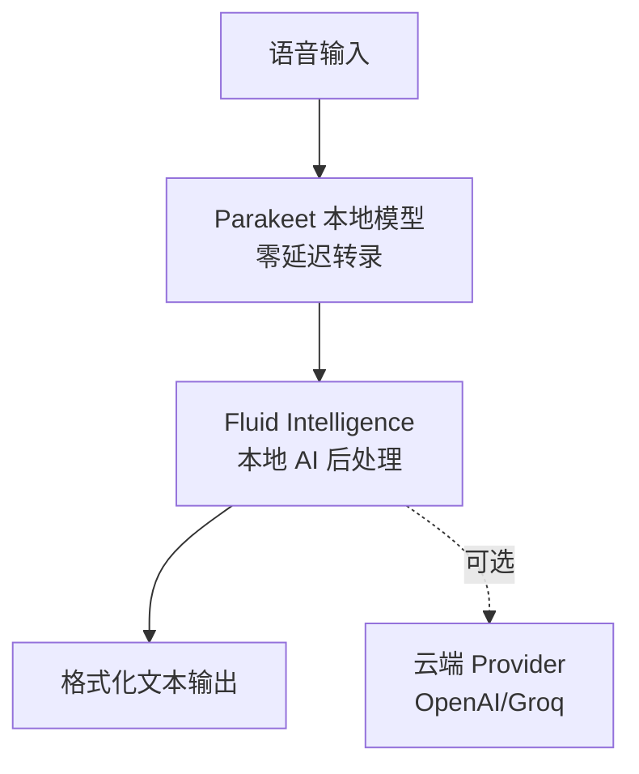

# FluidVoice — macOS 最快离线听写

## 一句话定位
macOS 本地语音转文字应用，基于 NVIDIA Parakeet 模型实现零延迟显示，完全离线运行，带本地 AI 后处理增强。

## 它解决的问题
**目标用户：** Mac 用户、写作者、开发者、有无障碍需求的人群
**痛点：** macOS 自带听写体验差（延迟高、准确率低）、云端听写服务有隐私风险（数据上传）、商业听写软件订阅费用高

## 为什么值得关注（2026-06-29）
GitHub Trending Daily 上榜，日增 491 stars。结合了两个趋势：本地 AI 推理成熟 + Voice I/O 成为人机交互标配。FluidVoice 的"零延迟+完全离线+智能后处理"组合在开源项目中尚属首次。

## 热度来源判断
真实用户需求。产品级的体验（Homebrew 一键安装、实时预览、自适应主题）+ 真实痛点解决（不想为听写付月费、不想数据上云）。社区贡献者中有 Claude（AI 辅助开发），说明项目本身也是 AI 时代开发模式的产物。

## 关键技术亮点
1. **Parakeet 零延迟实现**：重新实现 NVIDIA Parakeet 模型，"几乎零延迟"——说话的同时看到文字
2. **Fluid Intelligence 本地 AI 增强**：独立的本地 AI 运行时，负责智能格式化、上下文感知大小写、数字/标点后处理——全部在设备上运行
3. **Command Mode**：语音控制 Mac（启动应用、运行快捷指令、触发系统操作、自动化工作流）
4. **Write Mode**：在任意应用的文本框中直接写入或重写文本
5. **多模型架构**：Nemotron Speech 3.5、Parakeet Flash/TDT v3&v2、Cohere Transcribe、Apple Speech、Whisper——按语言和延迟需求选择

## 架构启发
FluidVoice 的"本地推理 + 可选云端增强"分层架构值得学习：

这种模式——核心能力本地化，增强能力可选云端——是隐私敏感场景的通用架构模式。

## 定位判断
工具型。优秀的产品级项目，但受限于 macOS 平台（Swift 实现）。不会演化为平台或基础设施，但可以作为"本地 Voice I/O"架构模式的参考实现。

## 风险 / 局限 / 泡沫点
1. **macOS 限定**：Swift 实现，无法跨平台（Linux/Windows 用户无法使用）
2. **Fluid Intelligence 闭源**：核心 AI 增强引擎是私有运行时，开源的只是基础听写层
3. **模型依赖**：Parakeet 是 NVIDIA 出品，许可和模型更新节奏依赖上游
4. **Apple 原生竞争**：Apple Intelligence 正在大幅改进 macOS 原生听写，可能挤压第三方空间

## 与同类项目的关系
- **vs voicebox**：voicebox 跨平台+更全面（TTS+STT+Cloning），FluidVoice 专注 macOS 听写体验
- **vs macOS 原生听写**：FluidVoice 更快（Parakeet）、更智能（Fluid Intelligence）、更可控（离线）
- **vs WisprFlow**：FluidVoice 开源免费，WisprFlow 是商业产品

## 是否值得持续跟踪
**观察型。** 作为 Voice I/O 趋势的产品案例跟踪，但不具备平台化潜力。值得关注的点是"本地 AI 分层架构"模式是否被更广泛采用。

## 后续观察点
1. Fluid Intelligence 是否会开源
2. 是否扩展到 iOS/iPadOS
3. Apple Intelligence 改进后对 FluidVoice 用户量的影响
4. Parakeet 模型的更新节奏和性能提升

---
*首次记录：2026-06-29*
