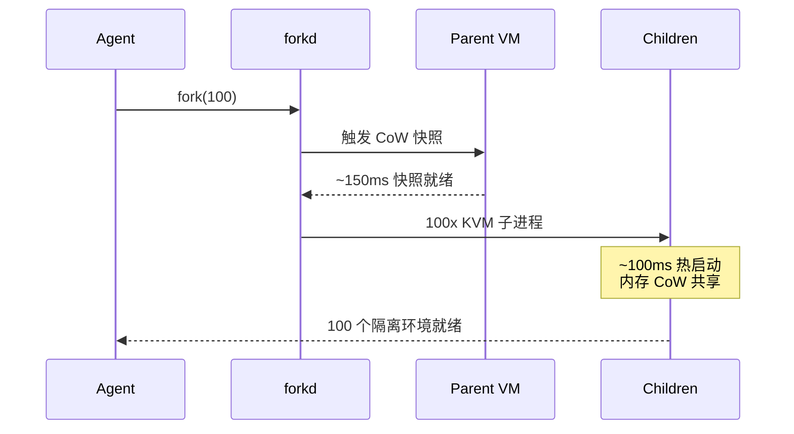

# forkd

## 一句话定位
AI Agent 的 fork() — Rust 实现的 microVM 管理，KVM 隔离 + CoW 快照，100 个子进程 ~100ms 热启动。

## 它解决的问题
AI Agent 并行执行任务时需要轻量级隔离。Docker 容器启动需要数百毫秒到数秒，thread 共享内存不安全。Agent 需要的是：进程级隔离 + 毫秒级启动 + 可快速分支/回滚。forkd 提供了 Unix fork() 的现代 microVM 实现。

## 为什么值得关注（2026-06-05）
fork() for AI agents 是当前最正确的 Agent 隔离抽象。1.3K stars 虽然不多，但 Apache 2.0 + Rust + KVM 的技术组合非常扎实。97 forks 说明核心开发者群体在认真研究。

## 热度来源判断
- 纯技术驱动：正确的问题 + 正确的技术方案
- Agent 隔离是刚需，当前方案（Docker/namespace/seccomp）都不够好
- Rust + KVM 组合在性能和安全性上是最佳选择
- 97 forks 高于普通 1.3K stars 项目，说明技术深度吸引核心开发者

## 关键技术亮点
1. **热启动 fork**：预热父 VM，fork 100 个子进程只需 ~100ms。对比 Docker 容器启动 ~300-500ms
2. **KVM 隔离**：硬件级虚拟化隔离，比 namespace/seccomp 更强
3. **Copy-on-Write 快照**：分支一个活动 VM 只需 ~150ms，内存共享直到写入
4. **Rust 实现**：内存安全 + 零开销抽象，适合系统级项目

## 架构启发
- **fork() 是 Agent 的正确抽象**：Unix 哲学在 AI Agent 时代的复兴
- **microVM > Docker**：Agent 不需要完整容器，只需要进程级隔离
- **CoW > checkpoint/restore**：写时复制比完整快照恢复快几个数量级
- **预热父 VM**：相当于 JIT 编译——第一次慢，后续都快

## 定位判断
**基础设施候选。** 如果 Agent 并行执行成为标准模式，forkd 这类轻量级 microVM 管理器将成为 Agent 运行时的核心组件。

## 风险 / 局限 / 泡沫点
1. **仅支持 Linux（KVM）**：不支持 macOS/Windows，限制开发者群体
2. **早期阶段**：1.3K stars，API 可能频繁变动
3. **KVM 权限要求**：需要 /dev/kvm 访问权限，云环境和本地开发机配置有差异
4. **生态缺失**：缺乏编排、监控、日志等运维工具链

## 与同类项目的关系
- **Firecracker (AWS)**：microVM 先驱，forkd 更轻量、面向 Agent 场景
- **NVIDIA OpenShell**：Agent 沙箱（策略引擎 + 凭证隔离），forkd 专注进程隔离，互补关系
- **Docker**：重量级容器 vs 轻量级 microVM，不同抽象层级
- **crabtrap**：网络层 Agent 沙箱，forkd 是进程层

## 是否值得持续跟踪
**强烈建议跟踪。** Agent 隔离是确定性基础设施需求，forkd 的技术方案（Rust + KVM + CoW fork）是当前最优组合。

## 后续观察点
1. 是否支持 macOS（Hypervisor.framework）或跨平台方案
2. 与主流 Agent 框架（OpenAI Agents SDK / LangChain / CrewAI）的集成
3. 出现基于 forkd 构建的上层 Agent 编排工具
4. 与 Firecracker 的性能对比基准

---
*首次记录：2026-06-05*
