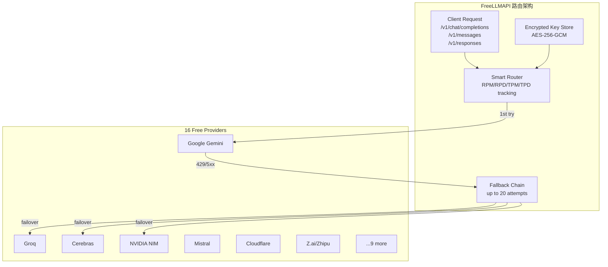

# FreeLLMAPI

## 一句话定位
聚合 16 家免费 LLM Provider 的 OpenAI/Anthropic 双兼容代理——~1.7B tokens/月免费推理能力，2 个月 17 倍增长。

## 它解决的问题
开发者需要在多个 LLM Provider 之间切换以利用各自的免费额度，但每个 Provider 的 SDK、rate limit、key 管理都不同。FreeLLMAPI 将这些聚合为一个 OpenAI 兼容端点 + Anthropic 兼容端点。

## 为什么值得关注（2026-06-27 更新）
从 5 月 1 日的 783⭐ 暴涨至 13,142⭐（2 个月 17 倍），日增 586。代表了一个加速的新兴模式——**免费推理聚合**。16 家 Provider 聚合后 ~1.7B tokens/月，已形成可用的推理能力。

### 最近动态（2026-06-27）
- Provider 从 14 扩展至 16（新增 OVH AI Endpoints、OpenCode Zen）
- 新增 Anthropic Messages API 兼容（`/v1/messages`）——Claude Code 可直接对接免费 pool
- 新增 Responses API（`/v1/responses`）——Codex CLI 兼容
- 新增图片生成（`/v1/images/generations`）和 TTS（`/v1/audio/speech`）
- 新增 Embeddings（`/v1/embeddings`，family-based 路由）
- Sticky sessions（30 分钟同模型，避免中途切换幻觉）
- Context handoff（model switch 时注入 compact system message）
- 桌面 App + Docker 部署支持

## 热度来源判断
- **实用性驱动**：~1.7B tokens/月免费额度对个人开发者有巨大吸引力
- **Claude Code / Codex 兼容**：直接对接主流 Agent 工具是增长加速器
- **合规讨论引发关注**：ToS 灰色地带本身也是话题传播点
- **17 倍增长验证需求**：不是一日热点，持续 2 个月高增长

## 关键技术亮点
1. **三协议兼容**——OpenAI `/v1/chat/completions` + Anthropic `/v1/messages` + Responses API（`/v1/responses`）
2. **智能路由 + 自动 failover**——429/5xx 自动跳到下一个 Provider，每 key RPM/RPD/TPM/TPD 计数，最多 20 次重试
3. **Sticky sessions**——多轮对话 30 分钟内保持同一模型，避免中途切换的幻觉
4. **AES-256-GCM 加密 key 存储**——16 个 Provider 的 API key 加密存储在 SQLite
5. **Embeddings family-based 路由**——failover 只在同模型 Provider 间发生（不同模型向量不兼容）
6. **16 Provider 覆盖**——Google/Groq/Cerebras/NVIDIA/Mistral/OpenRouter/GitHub Models/Cloudflare/Z.ai/Cohere/HuggingFace/Ollama Cloud/Kilo/Pollinations/LLM7/OVH

## 架构启发

FreeLLMAPI 的架构本质上是一个 **LLM Gateway 的免费版**。企业级 LLM Gateway（如 Portkey、LiteLLM）做的是多 Provider 路由 + 可观测性 + 成本控制，FreeLLMAPI 聚焦在免费 tier 的最大化利用。

启示：
1. LLM Gateway 层标准化加速——OpenAI 兼容已成为事实标准，Anthropic 兼容正在成为第二标准
2. 免费 tier 聚合是一种新型 Cloud Arbitrage——不同 Provider 的免费额度等价于"云资源碎片"
3. Agent 工具（Claude Code/Codex）兼容是增长杠杆

## 定位判断
- **个人实验工具 → 开发者基础设施过渡**
- 适合 PoC 和个人开发者降低成本
- Anthropic/OpenAI 双兼容是关键差异化
- 对 SLA 有要求的场景不可用

## 评分
| 维度 | 分数 | 理由 |
|------|------|------|
| 热度质量 | 8 | 17 倍增长真实，但增速可能见顶 |
| 技术创新度 | 6 | 路由+failover 非新概念，免费聚合角度有新意 |
| 工程成熟度 | 7 | 功能完整，三协议支持，但依赖外部 Provider 稳定性 |
| 架构启发价值 | 7 | LLM Gateway 标准化+Cloud Arbitrage 模式 |
| 企业落地潜力 | 4 | ToS 灰色地带是硬伤 |
| 中期趋势概率 | 7 | 免费 tier 聚合需求持续，但政策风险大 |
| 平台化潜力 | 5 | 可演化为个人 AI infra 入口 |
| 基础设施潜力 | 4 | 合规限制使其难以成为企业基础设施 |
| **总分** | **48/80** | **工具型→平台候选过渡** |

## 风险 / 局限 / 泡沫点
1. ⚠️ **合规灰色地带（高）**：部分 Provider 免费 tier 限个人非商用（如 NVIDIA eval-only ToS）
2. ⚠️ **无 SLA 保障**：免费 tier 随时可能被限流或取消
3. ⚠️ **Provider 政策变更**：任何一家 Provider 修改免费 tier 政策都会影响整体可用性
4. ⚠️ **安全攻击面**：16 个 Provider 的 key 集中存储，即使加密也增加攻击面
5. ⚠️ **ToS 审查风险**：随着规模增长，可能引发 Provider 的合规审查

## 与同类项目的关系
- **LiteLLM**：企业级 LLM Gateway，100+ Provider，更成熟但非免费导向
- **Portkey AI**：LLM Gateway + 可观测性，企业级方案
- **OneAPI / New API**：国内 API 聚合方案
- **Cloudflare AI Gateway**：云厂商提供的 Gateway 方案

差异化：免费 tier 最大化 + Anthropic 兼容 + Claude Code 可直接对接

## 是否值得持续跟踪
✅ **持续跟踪**。17 倍增长验证需求。关键观察点：
1. Provider 是否会限制此类聚合使用
2. 是否有 Provider 推出官方聚合方案
3. Claude Code / Codex 兼容是否带动更多 Agent 工具集成
4. 是否出现企业级合规版本

## 后续观察点
1. Provider 政策变更影响
2. 社区合规性讨论
3. 是否出现 SaaS 化版本
4. 免费 tier 总额度是否随 AI 竞争加剧而增长

---
*首次记录：2026-05-01*
*重大更新：2026-06-27 — stars 783→13K（17 倍），Provider 14→16，新增 Anthropic/Responses API 兼容，评分 76→85*
