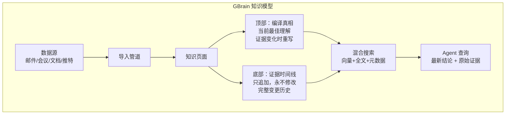

# GBrain

## 一句话定位
Garry Tan 的个人知识脑，为 AI Agent 提供持久化结构化知识管理，30 分钟内部署完成。

## 它解决的问题
AI Agent 没有持久记忆，每次对话都是全新开始。GBrain 为 Agent 提供一个可积累、可搜索、可推理的知识库，Agent 越用越聪明。

## 为什么值得关注（2026-04-12）
- YC 总裁 Garry Tan 出品，硅谷影响力加持
- PGLite（WASM Postgres）零服务器启动，2 秒初始化
- 情报评估知识模型创新——借鉴情报分析领域的"当前评估 + 证据链"模式
- Agent-first 安装流程：整个部署由 AI Agent 完成

## 热度来源判断
- **Garry Tan 影响力**：YC 总裁身份带来大量关注
- **真实痛点**：Agent 知识管理是确定性需求
- **低门槛部署**：30 分钟内可运行，PGLite 无需服务器

## 关键技术亮点
1. **PGLite 嵌入式数据库**：基于 WASM 的 Postgres 17.5，2 秒初始化，无需服务器。大脑超过 1000 文件时可一键迁移到 Supabase
2. **情报评估知识模型**：每个页面分为"编译真相"（顶部，证据变化时重写）和"证据时间线"（底部，只追加，永不修改）
3. **混合搜索**：向量搜索 + 全文搜索 + 元数据过滤，37 种操作
4. **SkillPack 模式**：将 Agent 行为规范（brain-first lookup、entity detection、back-linking）打包为可分发的 Skill Pack
5. **多数据源集成**：meetings、emails、tweets、calendar、voice calls、original ideas

## 架构启发
- **情报分析模型用于知识管理**：借鉴情报领域方法论，将知识分为"当前最佳理解"和"原始证据"，非常适合 Agent 知识更新场景
- **嵌入式数据库作为 Agent 存储**：PGLite 的 WASM 方案让 Agent 存储无需服务器，是边缘计算的思路
- **Agent-first 部署**：安装和配置全由 Agent 完成，人类只负责 API Key，这是 Agent 产品化的正确方向
- **渐进式架构**：从本地 PGLite 到 Supabase 的迁移路径，适配不同规模

## 定位判断
**平台候选** — GBrain 的知识管理架构有平台级潜力，特别是 SkillPack 模式和渐进式存储方案。但当前更偏个人工具。

## 风险 / 局限 / 泡沫点
1. **依赖前沿模型**：明确需要 Claude Opus 4.6 或 GPT-5.4 Thinking，小模型会出错
2. **个人项目风险**：Garry Tan 的长期维护承诺不明确
3. **导入准确性**：文档导入依赖 Agent 能力，不可控
4. **规模上限**：PGLite 本地方案适合个人，团队/企业场景需验证

## 与同类项目的关系
- **MemPalace**：不同层次——MemPalace 是存储/检索层（存一切），GBrain 是知识组织层（结构化理解），互补关系
- **llm_wiki**：llm_wiki 是桌面应用（增量 Wiki），GBrain 是 Agent Brain（知识库），定位差异
- **claude-memory-compiler**：memory compiler 侧重会话知识提取，GBrain 侧重全生命周期知识管理

## 是否值得持续跟踪
**是**。情报评估知识模型为 Agent 知识管理提供了创新范式，PGLite 方案值得关注。

## 后续观察点
1. 企业知识管理场景的适配方案
2. 与 MemPalace 的互补/集成可能性
3. SkillPack 生态的发展
4. PGLite 到 Supabase 的迁移体验

---
*首次记录：2026-04-12*
