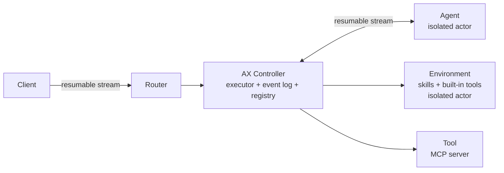

# google/ax

## 一句话定位
Google 开源的分布式 Agent Runtime，提供 Agent 循环协调、执行状态管理、本地和远程 Actor 通信的运行时基础设施。

## 它解决的问题
随着 Agent 从单机助手走向长时间运行的自主工作者，开发者需要：
1. 可靠的执行状态管理（Agent 崩溃后能恢复）
2. 分布式部署能力（Agent/Tool/Skill 可独立运行）
3. 审计与策略执行（所有调用都经过统一 Controller）

现有 Agent 框架（LangChain、CrewAI 等）都是单机库，不是 Runtime。ax 填补的是 Agent 的"操作系统"层。

## 为什么值得关注（2026-06-01）
1. **Google 出品**——Agent Runtime 层的标准制定者之一
2. **分布式设计**——面向数据中心级部署，不是单机玩具
3. **K8s Native**——与现有云原生基础设施无缝衔接
4. **与 Microsoft AGT 互补**——ax 管"怎么跑"，AGT 管"不能做什么"

## 热度来源判断
1.3K star 量级说明还在"圈内"阶段。热度来自：
- Google 品牌背书
- Agent Runtime 是公认缺失的基础设施层
- 与 K8s 生态的天然结合

不是泡沫。是早期基础设施项目应有的热度水平。

## 关键技术亮点
1. **Single-Writer Controller**：单控制器保证状态一致性，避免分布式状态冲突
2. **Event Log**：持久化执行状态，支持故障恢复和重放
3. **Resumable Stream**：Client-Router-Controller-Agent 全链路可恢复
4. **隔离 Actor 模型**：Agent、Tool、Environment 都作为独立 Actor 运行
5. **计算层无关**：虽然瞄准 K8s，但不绑定具体计算平台

## 架构启发

设计哲学：
- **确定性优于概率性**——Agent 行为不可预测，但 Runtime 行为必须可预测
- **Event Sourcing**——所有状态变更通过事件日志记录，天然可审计
- **关注点分离**——Controller 管"怎么跑"，Skill/Tool 管"做什么"，Agent 管"想什么"

## 定位判断
Agent 领域的 Kubernetes。不是框架，是 Runtime。如果成功，会成为 Agent 部署的标准基础设施层。

## 风险 / 局限 / 泡沫点
1. **Google Graveyard 风险**——Google 有大量开源项目半途而废的历史
2. **早期不接受 PR**——社区参与受限，过度依赖 Google 内部投入
3. **明确标注 breaking changes**——不适合当前生产使用
4. **与现有 Agent 框架的兼容性未知**——迁移成本可能很高

## 与同类项目的关系
| 项目 | 定位 | 差异 |
|------|------|------|
| google/ax | Agent Runtime | 分布式，K8s native，Google 出品 |
| Microsoft AGT | Agent Governance | 策略执行层，不是完整 Runtime |
| herdr | Agent Multiplexer | 终端级多路复用，不是 Runtime |
| Temporal | Workflow Runtime | 通用工作流，不是 Agent 专用 |

## 是否值得持续跟踪
✅ 是。这是 Agent 基础设施层最重要的项目之一。

## 后续观察点
1. Google 是否持续投入（看 commit frequency 和 Google 内部使用情况）
2. 社区是否开始围绕 ax 构建工具链
3. 与 K8s Operator 的集成方式
4. 是否发布正式路线图和稳定版时间表

---
*首次记录：2026-06-01*
