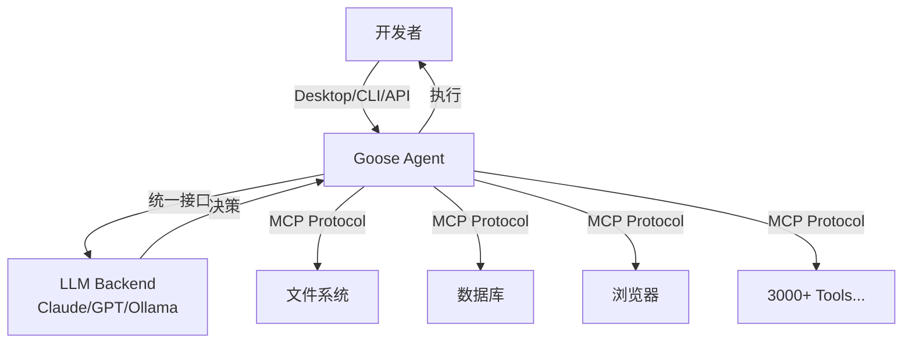

# Goose

## 一句话定位

Block（Square 母公司）开源的本地 AI Coding Agent，模型无关，支持 3000+ MCP 工具，Apache 2.0 完全免费。

## 解决的问题

1. **AI Coding 工具成本高**：Claude Code $200/月，企业成本压力
2. **代码离开本地**：云端 Agent 意味着代码需上传到第三方
3. **模型锁定**：多数 Coding Agent 绑定特定 LLM

## 为什么值得关注

- Block 内部 **60% 采用率**，有真实企业验证
- **Apache 2.0** 免费开源，对比 Claude Code 商业模式差异巨大
- **模型无关**：可使用 Claude、GPT、本地模型（Ollama）等任意 LLM
- **3000+ MCP 工具连接**，生态扩展能力远超单一产品
- 本地运行，代码不离开开发机

## 热度来源判断

- **真实企业验证**：Block 的 60% 内部采用率是硬数据
- **Apache 2.0 + 免费**：对比 Claude Code 定价，有明确的成本优势
- **MCP 生态红利**：3000+ 工具连接是可量化价值
- **Block 品牌**：Square/Block 在开发者工具领域的声望

## 关键技术亮点

1. **MCP 原生架构**：通过 MCP 协议连接工具，标准化扩展
2. **模型无关设计**：统一的 Agent 接口适配不同 LLM 后端
3. **本地优先**：所有操作在本地执行，零数据外泄
4. **Desktop + CLI + API**：三种使用模式覆盖不同场景

## 架构启发

- "模型无关 + MCP 标准化" 可能是 AI Coding Agent 的正确架构方向
- 本地优先 + 工具标准化 = 企业安全合规 + 灵活扩展

## 定位判断

**工具型**。是优秀的 Coding Agent 工具，但目前更多是 Claude Code 的本地化替代品，平台化特征尚不明显。

## 风险/局限/泡沫点

1. **复杂任务能力不足**：本地模型（如 Ollama）的能力与 Claude/GPT 有差距
2. **Block 战略依赖**：项目可持续性取决于 Block 的持续投入
3. **MCP 生态碎片化**：3000+ 工具的质量参差不齐
4. **维护成本**：模型无关意味着需要持续适配新模型

## 与同类项目的关系

| 项目 | 许可证 | 模型依赖 | 定位 |
|------|--------|---------|------|
| Goose | Apache 2.0 | 模型无关 | 本地 Coding Agent |
| Claude Code | 商业 | Claude | 云端 Coding Agent |
| Cursor | 商业 | 多模型 | IDE 内 Coding |
| Hermes Agent | MIT | 多模型 | 通用自进化 Agent |

## 是否值得持续跟踪

**是**。作为 Claude Code 的本地化替代方案，Goose 代表了 AI Coding 工具的去中心化方向。

## 是否值得企业 PoC

**是**。Block 的 60% 内部采用率 + Apache 2.0 使 PoC 风险很低。建议优先评估本地模型（Ollama）场景下的效果。

## 后续观察点

1. 模型无关性在复杂任务场景下的实际表现
2. Block 是否持续投入资源
3. MCP 工具生态的成熟度和质量
4. 企业部署案例和安全合规情况
