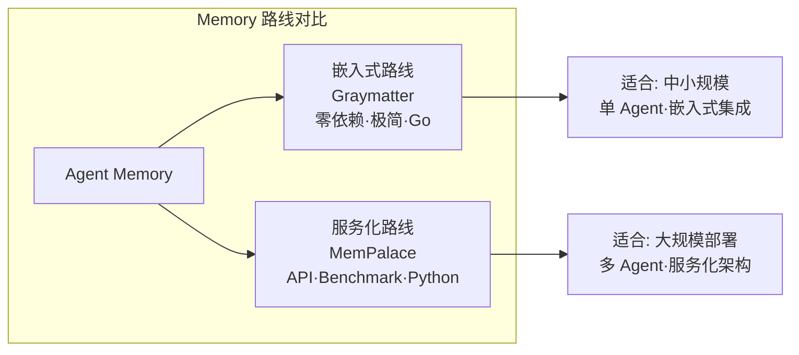

# Graymatter

## 一句话定位
三行 Go 代码为 AI Agent 添加持久记忆，声称降低 90% Token 消耗同时保持回答质量。

## 它解决的问题
Agent 每次对话都需要把完整历史上下文发送给 LLM，Token 消耗随对话长度线性增长。长期运行的 Agent（如个人助理）成本高昂。Graymatter 通过智能压缩和持久化记忆降低 Token 使用。

## 为什么值得关注（2026-04-25）
代表了 Memory 层的"SQLite 路线"——嵌入式、零依赖、极简集成。与 MemPalace 的独立服务路线形成对比。如果效果属实，可能改变 Agent Memory 的集成模式。

## 热度来源判断
277 stars，早期项目。"三行代码"和"降低 90% Token"的营销话术吸睛，但需要独立验证。

## 关键技术亮点
1. **三行代码集成**：极简 API 设计，降低接入门槛
2. **Token 消耗优化**：通过智能压缩历史上下文而非简单截断
3. **Go 嵌入式实现**：零外部依赖，可直接编译进 Agent 二进制

## 架构启发
Graymatter 代表了 Memory 层的嵌入式路线，与 MemPalace 的服务化路线形成对比：

## 定位判断
工具型。如果效果属实，是 Agent Memory 的轻量级选择。不适合作为基础设施，但作为工具层组件有价值。

## 风险 / 局限 / 泡沫点
1. **"90% Token 降低"未经验证**：需要独立 benchmark，可能仅在特定场景下成立
2. **Star 数极低**：277 stars，社区验证不足
3. **压缩质量**：Token 降低是否以回答质量下降为代价

## 与同类项目的关系
- **MemPalace**：服务化路线，benchmark 驱动，49.5K stars
- **claude-mem**：Claude Code 的记忆插件
- **MemGPT / Letta**：更完整的 Memory 框架

## 是否值得持续跟踪
观察型。理念有启发性但验证不足，需要观察社区反馈和实际效果。

## 后续观察点
1. 独立 benchmark：Token 降低与回答质量的 trade-off
2. 与 MemPalace 的实际对比测试
3. Star 增长趋势和社区活跃度

---
*首次记录：2026-04-25*
