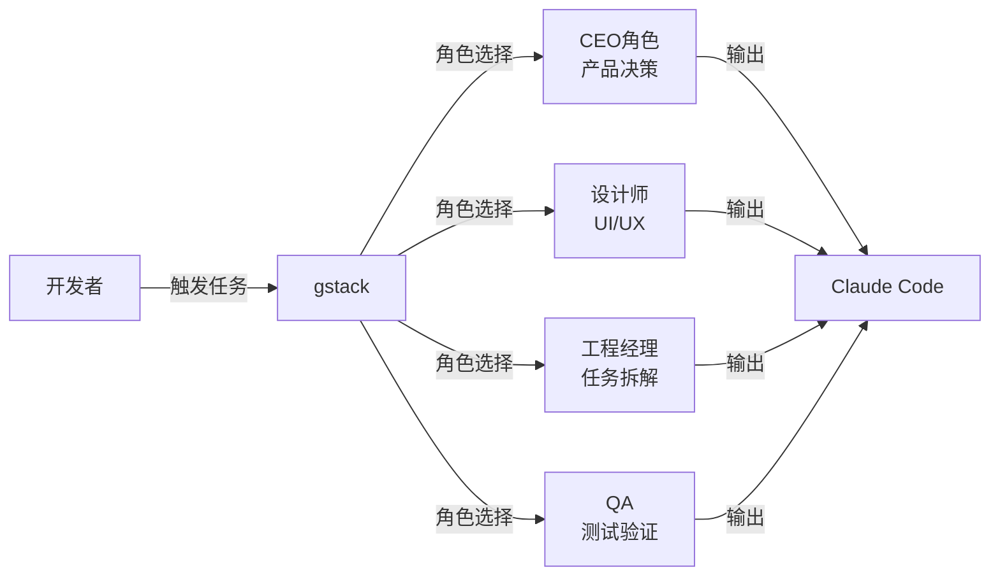

# gstack

## 一句话定位

YC 总裁 Garry Tan 的 Claude Code 工作流配置系统，23 个专化角色将 AI 编程从单兵作战升级为虚拟团队。

## 解决的问题

1. **AI Coding 角色混乱**：单 Agent 承担所有职责，缺少专业分工
2. **工作流一致性差**：不同开发者使用 AI 的方式和质量差异大
3. **最佳实践难以沉淀**：个人经验无法规模化复用

## 为什么值得关注

- Garry Tan 声称 60 天写 60 万行代码，展示了 AI Coding 的生产力上限
- 66K stars 说明市场对"AI Coding 工作流标准化"有强烈需求
- YC 生态影响力加持，会影响大量创业公司的工作方式

## 热度来源判断

- **Garry Tan 个人影响力**：YC 总裁的背书效应远大于技术本身
- **AI Coding 工作流标准化需求真实**：开发者确实需要方法论
- **部分粉丝效应**：66K stars 中大量来自 YC 社区而非技术评估

## 关键技术亮点

1. **23 个专化角色**：CEO、设计师、工程经理、QA、文档工程师等
2. **角色切换机制**：同一 Agent 在不同上下文切换认知模式
3. **可复用工作流**：将个人最佳实践固化为可分享的配置

## 架构启发

- "单 Agent + 角色切换" 可能比 "多 Agent 编排" 更务实
- 最佳实践可配置化是 AI Coding 工具的演进方向

## 定位判断

**工具型偏平台候选**。本质是配置文件集合，但揭示的"AI Coding 工作流标准化"趋势有平台化潜力。

## 风险/局限/泡沫点

1. **技术门槛低**：核心是一组 prompt 配置，护城河很浅
2. **过度炒作**：60 天 60 万行代码的数据缺乏验证
3. **Cargo Cult 风险**：开发者可能照搬而非理解背后的方法论
4. **强绑定 Claude Code**：限制了适用范围

## 与同类项目的关系

| 项目 | 定位 | Star | 核心差异 |
|------|------|------|---------|
| gstack | Claude Code 工作流 | 66K | 角色切换 + YC 背书 |
| oh-my-claudecode | Claude Code 多Agent | 27K | 多Agent编排 + 企业级 |
| Archon | Harness Builder | 16K | YAML 标准化 + 可重复 |

## 是否值得持续跟踪

**是**，但关注重点不是项目本身，而是它代表的"AI Coding 工作流标准化"趋势。

## 是否值得企业 PoC

**谨慎评估**。思路值得借鉴，但直接采用需要适配团队实际情况。

## 后续观察点

1. 社区是否涌现更多 gstack 风格的工作流配置
2. Claude Code 是否原生支持类似角色系统
3. 工作流标准是否开始形成共识
4. 其他 AI Coding 工具（Cursor、Copilot）是否跟进
