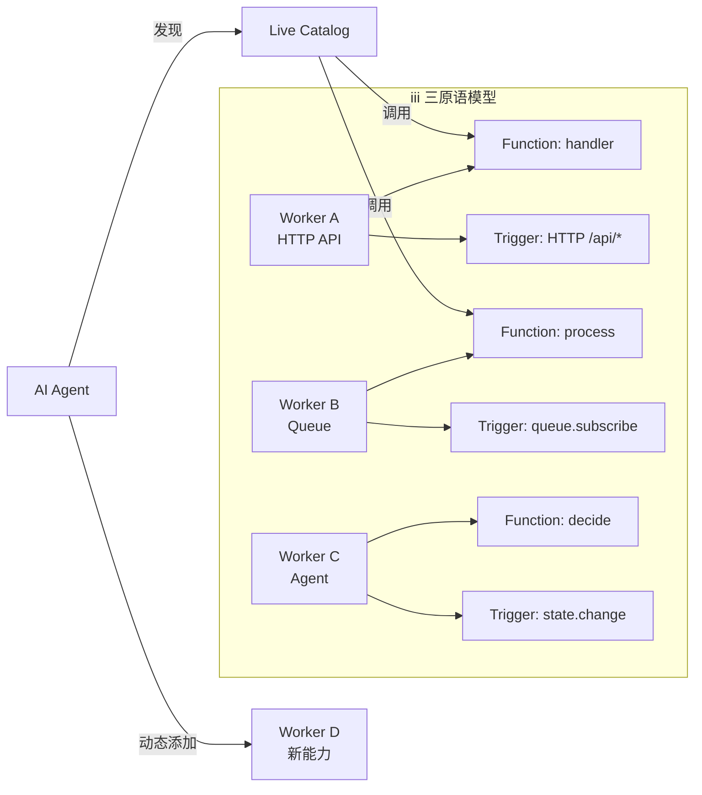

# iii

## 一句话定位
服务组合/扩展/实时观测平台——Worker/Function/Trigger 三原语统一开发面，零集成，Agent 可在运行时动态扩展系统能力。

## 它解决的问题
后端开发中，每个新能力（队列、定时任务、HTTP 端点、可观测性、Agent）都需要独立集成。iii 将所有能力统一为 Worker/Function/Trigger 三个原语，新能力通过 `iii worker add` 接入。

## 为什么值得关注（2026-06-03）
- **17.5K stars**，Rust 引擎 + 多语言 SDK（Node/Python/Rust）
- **三原语抽象**简洁有力：Worker（进程）→ Function（工作单元）→ Trigger（触发条件）
- **Agent 可动态扩展**：Agent 在运行时发现缺少某个能力时，可以自己 `iii worker add` 添加
- **零集成实时可观测**：所有 Worker/Function 自动可追踪
- 预构建 Worker 生态：[workers.iii.dev](https://workers.iii.dev/)

## 热度来源判断
- 「零集成」承诺击中后端开发痛点
- Agent 运行时扩展能力的概念新颖
- Rust 性能保障 + 多语言 SDK 覆盖面广

## 关键技术亮点
1. **Worker/Function/Trigger 三原语**：统一所有后端能力的抽象模型
2. **Agent 可编排**：Agent 用同一套接口发现和调用 Function
3. **实时可观测**：所有调用自动 trace，无需额外集成
4. **SDK 多语言**：Node.js/Python/Rust 三端支持
5. **iii-console**：开发运维控制台，Worker/Function/Trigger 全可视

## 架构启发

**架构师启发：**
1. 三原语模型可以简化微服务架构的服务注册/发现
2. Agent 运行时扩展能力是一个有趣的方向——Agent 不只是调用工具，还能扩展平台本身
3. 零集成可观测的承诺如果兑现，可以大幅降低 DevOps 复杂度

## 定位判断
**平台候选。** 如果三原语模型被验证有效，可以成为后端开发的新范式。但目前仍需验证大规模场景下的可行性。

## 风险/局限/泡沫点
1. **Elastic License 2.0（引擎部分）**——商业使用受限
2. 17.5K stars 增速快，但真实生产案例较少
3. 「零集成」承诺需要验证——现实中的集成往往比预期复杂
4. 与 Kubernetes/Docker Compose 等编排工具的定位重叠
5. 「Agent 可扩展平台」概念新颖但可能导致不可控的系统膨胀

## 与同类项目的关系
- **Kubernetes**：编排层，iii 更偏应用层的组合抽象
- **Temporal/Inngest**：工作流引擎，iii 用更轻量的 Trigger 模型
- **Dapr**：类似的多语言运行时，iii 更简洁

## 是否值得持续跟踪
**是。** 三原语模型和 Agent 运行时扩展是有意思的架构创新，值得观察。

## 后续观察点
1. 生产环境案例和规模验证
2. Worker 生态的丰富度（workers.iii.dev 增长情况）
3. Agent 动态扩展能力的实际使用场景
4. 引擎 License 是否会调整

---

*档案创建于 2026-06-03 · 数据截止 2026-06-03 06:00 CST*
