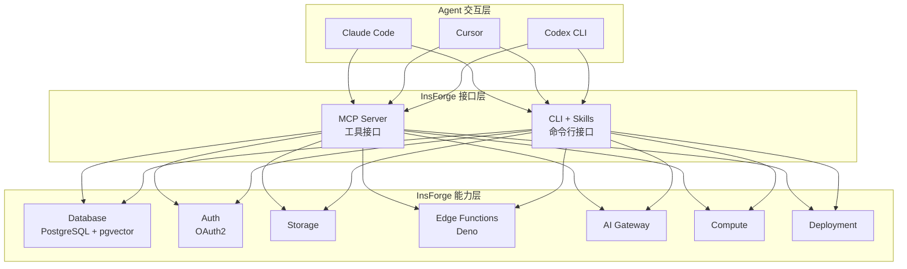

# InsForge

## 一句话定位

面向 Coding Agent 的全栈开源后端平台——Database、Auth、Storage、Compute、Hosting、AI Gateway 通过 MCP Server 接口暴露给 Agent，让 Agent 像后端工程师一样操作基础设施。

## 它解决的问题

Coding Agent（Claude Code、Cursor、Codex）能写前端代码，但部署全栈应用时缺乏后端基础设施的 Agent 友好接口。传统 BaaS（Supabase/Firebase）暴露 REST/GraphQL API 供前端调用，但 Agent 需要的是能直接操作数据库 schema、部署函数、管理存储的**工具接口**。

## 为什么值得关注（2026-06-08）

1. **MCP-first 接口设计**：后端主动适配 Agent，而非让 Agent 适配后端
2. **全栈能力**：DB（PostgreSQL + pgvector）、Auth（OAuth2）、Storage、Edge Functions、AI Gateway、Deployment
3. **+469/天增速**，Trendshift 推荐，Vercel OSS Program 支持
4. 代表了 BaaS 的 Agent 时代重写方向

## 热度来源判断

- **趋势驱动**。Agent coding 是 2026 年最热赛道，"Agent-friendly backend" 是自然延伸
- 解决真实痛点：Agent 能写代码但不能部署，缺少可调用的后端原语
- Supabase / Firebase 没有原生 MCP 支持，留出了差异化空间

## 关键技术亮点

1. **双接口架构**：MCP Server（self-hosted + cloud）供 Agent 调用，CLI + Skills 供终端使用
2. **Agent 操作语义**：Agent 可以读取后端上下文（schema、metadata、runtime logs）、配置原语（部署函数、创建 bucket、设置 auth provider）
3. **Edge Functions**：Deno 运行时，Agent 可直接部署
4. **AI Gateway**：统一 LLM 调用入口
5. **Realtime WebSockets**：支持实时应用

## 架构启发

**核心洞察**：BaaS 的 Agent 化不是简单加 MCP 接口，而是**重新定义后端原语的粒度**。Agent 不需要 CRUD API，它需要的是"部署一个函数""创建一个用户表""设置 OAuth"这样的高层操作。

## 定位判断

- 当前：**平台候选**（11.5K stars，全栈能力，MCP-first）
- 趋势：如果 Agent coding 赛道持续爆发，InsForge 有潜力成为 Agent 时代的 Supabase

## 风险 / 局限 / 泡沫点

1. **Supabase 可能原生支持 MCP**，直接挤压差异化空间
2. **全栈 = 高复杂度**：数据库 + Auth + Storage + Compute + Hosting 全部自研，每个方向都有强竞品
3. **初期阶段**：85 个 open issues，生产案例不足
4. **锁定风险**：Agent 依赖 InsForge 的特定操作语义，迁移成本可能很高
5. **Vercel OSS 支持不等于 Vercel 官方背书**，需区分社区赞助和战略投入

## 与同类项目的关系

- **vs Supabase**：Supabase 更成熟、更大社区，但缺少原生 MCP 支持；InsForge 是 Agent-first 设计
- **vs Firebase**：Firebase 是 Google 生态、移动优先；InsForge 是开源、Agent 优先
- **vs Appwrite**：Appwrite 有 50K+ stars 的成熟 BaaS，但同样缺少 Agent 接口
- **vs Convex**：Convex 是反应式 BaaS，定位不同

## 是否值得持续跟踪

**是。** BaaS 的 Agent 化重写是一个重要方向，InsForge 的 MCP-first 设计值得深入研究。

## 后续观察点

1. Supabase / Appwrite 是否推出原生 MCP 支持
2. 生产用户案例和复杂应用场景
3. AI Gateway 的 LLM 路由能力
4. 社区贡献者增长和 Vercel 投入程度

---
*首次记录：2026-06-08*
