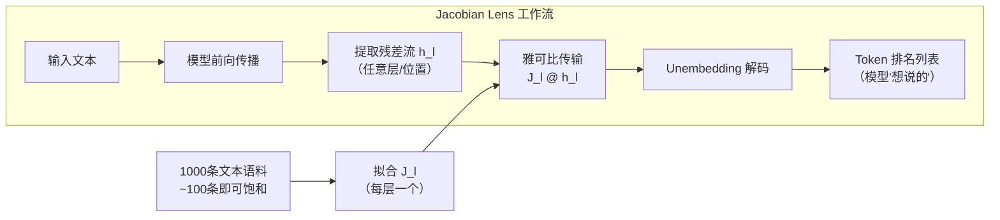

# Jacobian Lens

## 一句话定位
Anthropic 论文《Verbalizable Representations Form a Global Workspace in Language Models》的配套参考实现——用平均输入-输出雅可比矩阵将任意中间层激活投影到词表空间，逐层逐位置读出模型"想说的话"。

## 它解决的问题
LLM 可解释性领域缺少一种直观、忠实的方法来"读取"模型内部表示。现有工具（logit lens、tuned lens）要么只在最终层投影、要么需要训练额外的变换，且缺乏理论支撑。Jacobian Lens 提供了有理论基础的线性传输方法——平均雅可比矩阵——让任意层的残差流向量解码为可读 token 列表。

## 为什么值得关注（2026-07-11）
Anthropic 的可解释性研究一直是行业标杆。这篇论文提出了"全局工作空间"理论——语言模型的中间表示是可言语化的（verbalizable），形成全局工作空间。Jacobian Lens 是验证这一理论的工具。从工程角度，它代表 LLM 可解释性从纯学术走向可安装、可复现的工具化产品。

## 热度来源判断
- **Anthropic 品牌效应**：Transformer Circuits 团队的论文自带关注
- **论文质量**：《Verbalizable Representations Form a Global Workspace》理论深度高
- **可复现性**：提供完整代码 + 预拟合 lens + walkthrough notebook
- **学术社区需求**：LLM 可解释性是热门研究方向

## 关键技术亮点

### 1. 平均雅可比矩阵传输
核心公式：`lens_l(h) = unembed(J_l @ h)`，其中 `J_l = E[∂h_final / ∂h_l]`
- 对残差流向量用平均输入-输出雅可比矩阵做线性传输
- 再用模型自身 unembedding 解码为 token 排名列表
- 传输矩阵在 1000 条 128 token 序列上拟合，质量在 ~100 条就饱和

### 2. 全局工作空间理论
论文核心论点：语言模型的中间表示形成"全局工作空间"（借用认知科学概念），即不同处理阶段的信息汇聚到一个共享的、可言语化的表示空间。

### 3. 逐层逐位置读出
不像 logit lens 只看最终层，Jacobian Lens 可以读取任意层、任意位置的激活，生成 layer × position 的交互式可视化。

### 4. 模型无关
适配任意 HuggingFace decoder transformer。支持并行拟合（disjoint slices + merge）。

### 5. 参考实现质量
- 完整的 `jlens.fitting` 模块文档
- walkthrough.ipynb 端到端示例
- 支持预拟合 lens 加载和自定义拟合

## 架构启发

**可解释性工具的设计哲学：忠实 vs 可读。** 很多可解释性工具追求"好看"但不忠实。Jacobian Lens 的设计原则是"有理论基础的线性方法"——雅可比矩阵是输入到输出的真实传输关系的线性近似，而非训练一个额外的黑箱变换。

对架构师的启发：在需要"理解模型内部状态"的场景（如安全审计、行为预测、对齐研究），Jacobian Lens 提供了一种比 attention visualization 更有信息量的工具。

## 定位判断
**学习型/研究工具。** 是论文配套参考实现，明确标注"Not maintained, not accepting contributions"。价值在于理论和方法的可复现性，不适合生产使用。

## 风险 / 局限 / 泡沫点
1. **明确标注不维护**："Not maintained and not accepting contributions"，参考实现性质
2. **拟合成本**：虽然 ~100 prompts 可用，但精确拟合需要模型自身的 backward pass
3. **线性近似局限**：雅可比矩阵是线性近似，对强非线性区域可能不忠实
4. **仅支持 decoder transformer**：不适用于 encoder、encoder-decoder 架构
5. **学术性质**：没有生产化计划，社区贡献被拒绝

## 与同类项目的关系
| 项目 | 方法 | 差异 |
|------|------|------|
| Logit Lens (nostalgebraist, 2021) | 最终层投影 | 无传输，仅看 unembedding |
| Tuned Lens (Belrose et al., 2023) | 仿射变换适配 | 需训练额外变换 |
| Jacobian Lens (Anthropic, 2026) | 平均雅可比矩阵传输 | 有理论基础的线性传输 |
| SAE (Sparse Autoencoders) | 稀疏自编码器 | 非线性方法，更高维但可解释性争议 |

## 是否值得持续跟踪
**轻量跟踪。** 作为 LLM 可解释性方向的参考工具。关注论文引用量和社区是否出现维护 fork。

## 后续观察点
1. 是否有社区 fork 添加更多模型支持和维护
2. 论文的引用量和"全局工作空间"理论的接受度
3. 是否出现基于 Jacobian Lens 的产品化工具（如交互式可解释性 IDE）
4. 与 SAE 方法的对比研究结论
5. 是否影响 AI 安全审计实践（如 Anthropic 自己的 alignment 团队是否采用）

---
*首次记录：2026-07-11*
