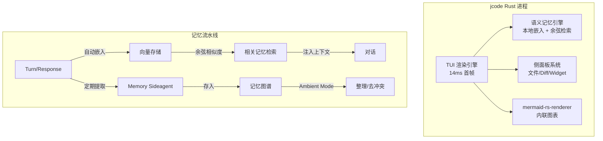

# jcode

## 一句话定位
用 Rust 从头重写的 Coding Agent 运行时（Harness），以极端性能优化和语义记忆系统为核心差异化，设计为多会话并行工作流的基础。

## 它解决的问题
现有 Coding Agent 运行时（Claude Code、Cursor Agent、OpenCode、GitHub Copilot CLI）在资源效率上严重浪费——单会话占用数百 MB 内存，启动延迟数秒。当开发者需要多会话并行（如同时开发多个功能、review + write 并行）时，10 个会话轻松吃掉 2-3 GB 内存。Node.js/TypeScript 实现的运行时无法从根本上解决 GC 和启动开销问题。

## 为什么值得关注（2026-07-24）
周增 2,586 stars，Rust Trending 上榜。作者自测的性能对比数据令人震惊：单会话 PSS 仅 27.8 MB（Claude Code 386.6 MB 的 1/14），10 会话仅 117 MB（Claude Code 2.3 GB 的 1/20），启动到首帧 14ms（Claude Code 3437ms 的 1/245）。

## 热度来源判断
- **性能对比有冲击力**：直接对标 Claude Code、Cursor Agent、OpenCode 等主流工具，数据极端
- **Rust 重写叙事**：开发者社区对"用 Rust 重写一切"有天然热情
- **多会话场景痛点真实**：Agent fleet 管理趋势下，运行时效率是多会话可行的前提
- **语义记忆系统**：自动提取+向量嵌入+余弦检索的记忆图谱，不是简单的 session history
- **独立开发者作品**：单人项目（1jehuang），但有产品质量

## 关键技术亮点
1. **Rust 运行时**：从零用 Rust 实现，无 Node.js/TypeScript 依赖。PSS（Proportional Set Size）在 10 会话下仅 117 MB
2. **本地嵌入语义记忆**：每个 turn/response 自动向量化并存储到记忆图谱。对话时通过余弦相似度自动检索相关历史。可选 Memory Sideagent 验证相关性
3. **Memory Consolidation**：后台 Ambient Mode 自动整理记忆——重组、检查过期、检测冲突
4. **mermaid-rs-renderer**：自研 Mermaid 渲染库，无浏览器/TypeScript 依赖，渲染速度提升 1800x。可在终端内联渲染 Mermaid 图
5. **侧面板系统**：辅助信息（文件预览、diff 查看器等）不占用主屏幕，通过负空间利用展示 Info Widgets
6. **多会话优化**：每新增会话仅增加 ~9.9 MB（vs Claude Code ~212.7 MB）

## 架构启发

**核心 insight：** 当 Agent 从"单会话交互"走向"多会话并行 fleet"，运行时的内存和启动延迟不是性能优化——是可用性的硬约束。Rust 不是锦上添花，是让 fleet 模式从理论可行到日常可用的关键。

## 定位判断
工具型。jcode 作为独立 Harness 的定位清晰，但面临"Claude Code/Cursor 会不会也优化性能"的持续压力。差异化在于语义记忆系统和极致多会话支持。

## 风险 / 局限 / 泡沫点
1. **单人项目**：所有代码由 1jehuang 一人维护，bus factor = 1
2. **Benchmark 可信度**：性能对比由作者自行执行，测试方法论和条件未独立验证。需谨慎看待"245x faster"等 headline
3. **功能深度未知**：性能优秀，但在实际复杂编码任务中的表现（vs Claude Code 的成熟工具链）尚待验证
4. **生态依赖**：仍需接入外部 LLM（Claude/GPT），自身不做模型
5. **Claude Code / Cursor 可能跟进优化**：如果主流工具也做内存优化和 Rust 重写，jcode 的差异化会被抹平

## 与同类项目的关系
- **vs Claude Code**：Claude Code 功能最全面但资源最重。jcode 在性能上有数量级优势
- **vs earendil-works/pi**：pi（76.7K⭐）是 TypeScript 实现的 Agent 工具包，功能更全但资源占用高（144 MB vs 27.8 MB 单会话）
- **vs OpenCode**：OpenCode 也是 TS 实现，10 会话 3.2 GB，jcode 的 1/28
- **vs Codex CLI**：OpenAI 出品，140 MB 单会话

## 是否值得持续跟踪
**是。** Rust Agent 运行时是多会话 fleet 场景的关键基础设施。关注独立验证的 benchmark 结果和生产环境实际表现。

## 后续观察点
1. 独立第三方对 benchmark 的复现结果
2. 在真实复杂项目中的编码能力表现（不只是性能指标）
3. 社区贡献者增长情况（目前是单人项目）
4. Claude Code / Cursor 是否推出类似的性能优化（竞争反应）
5. Memory Graph 的实际效果（是否真的提升了跨会话连续性）

---
*首次记录：2026-07-24*
