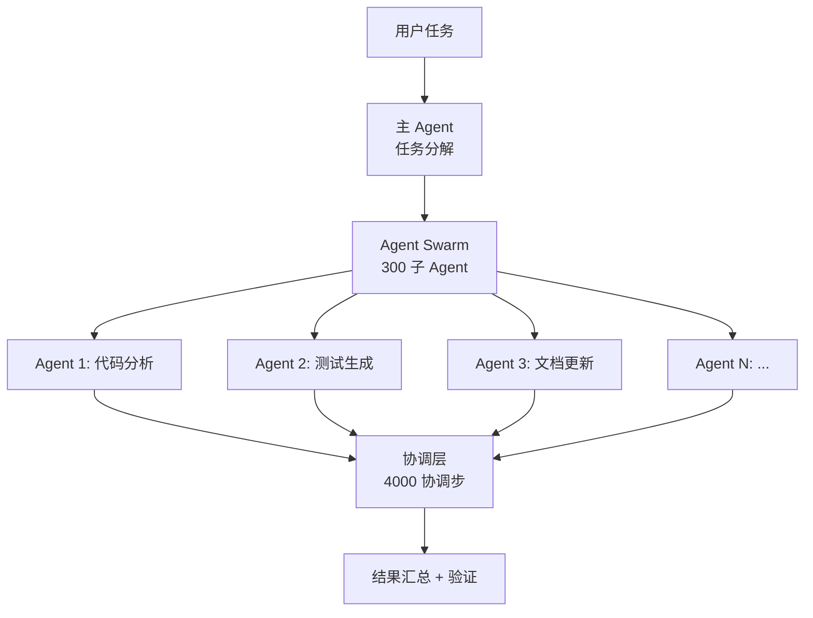

# Kimi K2.6

## 一句话定位

月之暗面（Moonshot AI）发布的 1T MoE Agentic Coding 模型——SWE-Bench Pro 58.6% 登顶，300 Agent Swarm 并行编排，12 小时自主运行。

## 它解决的问题

1. **Agentic Coding 的上限**：当前大多数 Coding Agent 是单 Agent + 工具调用模式，处理复杂任务时力不从心。K2.6 的 300 Agent Swarm 开辟了"Agent 集群工程"的新范式
2. **开源 vs 闭源的性能鸿沟**：K2.6 首次让开源模型在 SWE-Bench Pro 上超过 GPT-5.4 和 Claude Opus 4.6
3. **推理成本控制**：1T 总参数但只激活 32B，推理成本在可控范围

面向的用户是需要在 Agentic Coding 场景中部署高性能开源模型的开发者和企业。

## 为什么值得关注（2026-04-28）

- SWE-Bench Pro 58.6%，超过 GPT-5.4（57.7%）和 Claude Opus 4.6（53.4%）
- 300 Agent Swarm 并行编排，4000 协调步——突破"单 Agent"范式
- 12 小时自主运行，适合处理大型长期任务
- Google Trends 搜索增速 +900%
- Modified MIT License，商业友好
- Kimi K2 系列仓库已达 10.7K stars

## 热度来源判断

- **硬 benchmark**：SWE-Bench Pro 是最接近真实 GitHub Issue 解决能力的指标，K2.6 登顶不是营销
- **Agent Swarm 创新**：300 Agent 并行是全球首次在开源模型中实现这种规模
- **品牌积累**：月之暗面在过去 9 个月持续交付（K2 → K2.5 → K2.6），建立了"持续进步"的信任
- **定价策略**：API 成本比 GPT-5.4 和 Claude Opus 4.6 低 4-8 倍

## 关键技术亮点

1. **Agent Swarm 架构**：300 个子 Agent 并行执行、协调、汇总，支持 4000 协调步。这不是简单的工具调用链，而是真正的分布式 Agent 编排
2. **长 Horizon 执行**：12 小时自主运行不中断。对任务规划、错误恢复、上下文管理要求极高
3. **原生多模态**：不是后接视觉模块，而是原生多模态训练
4. **1T MoE + 32B 活跃**：用总参数量撑起能力，用稀疏激活控制成本
5. **Kimi Code CLI**：配套的命令行工具，可直接在终端中使用

## 架构启发

K2.6 的核心架构创新是 **Agent Swarm**：

**关键洞察**：Agentic Coding 的未来可能不是"一个超级 Agent 做所有事"，而是"一群专业 Agent 协作"。这与微服务架构的演进逻辑一致——单体 → 服务拆分 → 编排。

## 定位判断

**Agentic Coding 领域的开源基础设施候选**。如果 Agent Swarm 被验证可靠，K2.6 可能成为 Coding Agent 领域的"标准底座模型"，就像 Linux 之于服务器。

## 风险 / 局限 / 泡沫点

1. **Agent Swarm 的可靠性**：300 Agent 并行听起来壮观，但协调错误、Agent 间冲突、结果一致性都是硬挑战
2. **12 小时运行的经济性**：长时间自主运行意味着高 token 消耗，成本可能远超预期
3. **纯数学能力偏弱**：报告明确指出"trails on pure math"，不适合数学推理场景
4. **Modified MIT License 限制**：虽商业友好，但有使用限制条款

## 与同类项目的关系

- **vs GPT-5.4**：K2.6 在 Agentic Coding benchmark 上领先，但通用能力可能不及
- **vs Claude Opus 4.6**：Opus 在推理深度上更强，K2.6 在 Agent 编排上更强
- **vs Hy3 Preview**：Hy3 更通用，K2.6 更专精于 Coding
- **vs DeepSeek-V4**：DeepSeek 在推理和数学上更强，Agentic Coding 上 K2.6 领先

## 是否值得持续跟踪

**是，强烈建议。** 这是目前 Agentic Coding 赛道最有潜力的开源模型。建议立即启动 PoC 评估。

## 后续观察点

1. Agent Swarm 在真实项目中的可靠性和经济性
2. 社区基于 K2.6 的 fine-tune 和部署方案
3. 与 Claw Code / Claude Code 的集成深度
4. 企业用户的生产环境反馈

---
*首次记录：2026-04-28*
