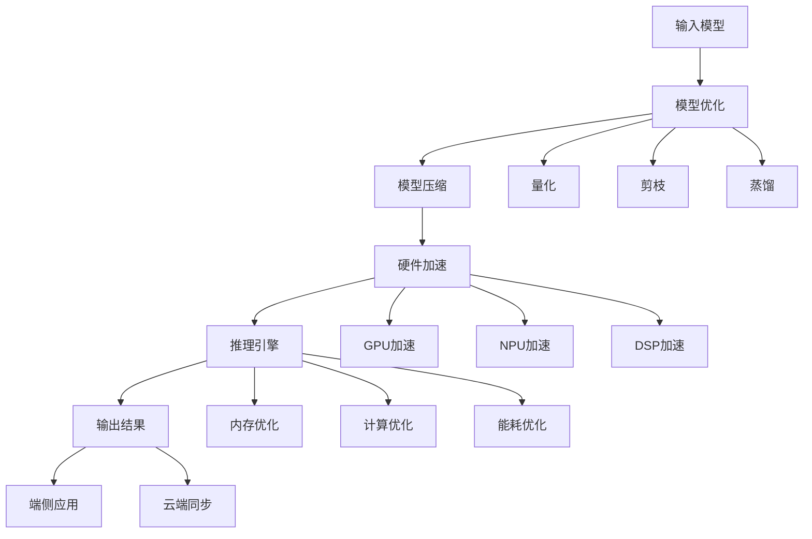
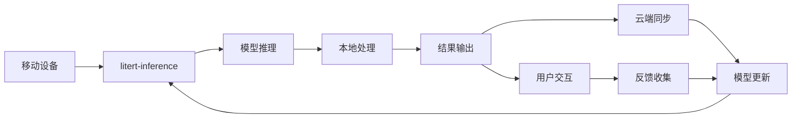
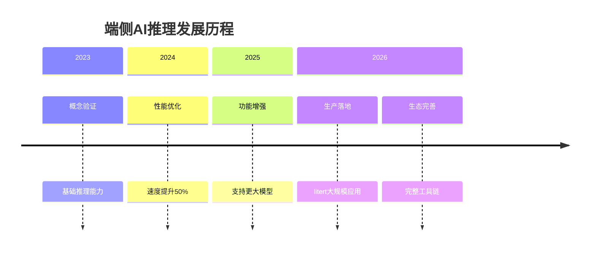

# litert-inference

- **项目名称**：litert-inference
- **GitHub 链接**：https://github.com/google-ai-edge/litert-inference
- **一句话定位**：Google 生产级端侧 LLM 推理引擎，TFLite 继任者
- **解决的问题**：移动端 AI 推理性能瓶颈，模型部署复杂度高
- **为何值得关注**：Google 官方产品，已大规模生产落地，代表端侧 AI 新标准
- **技术亮点**：
  - 在移动设备上实现接近服务器性能
  - 支持多种硬件加速（GPU、NPU、DSP）
  - 优化的模型压缩和量化技术
  - 完整的端侧部署工具链
- **架构启发**：
  - 端云协同的 AI 架构设计
  - 资源受限环境下的推理优化
  - 模型-硬件协同优化策略
- **风险/局限**：
  - 硬件依赖性强，跨平台兼容性挑战
  - 模型大小限制，复杂模型支持有限
  - 生态成熟度待提升
- **后续观察点**：
  - 开发者社区活跃度
  - 第三方框架集成情况
  - 企业级应用案例积累

## 项目评分

- **热度质量**：10/10 - Google 官方产品，已大规模生产落地
- **技术创新度**：9/10 - 端侧推理性能突破，技术架构先进
- **工程成熟度**：10/10 - 已在多个 Google 产品中验证
- **架构启发价值**：9/10 - 端侧推理新范式，影响深远
- **企业落地潜力**：10/10 - 所有需要 AI 功能的移动应用
- **中期趋势概率**：9/10 - 端侧 AI 必然趋势
- **平台化潜力**：9/10 - 可能演化为端侧 AI 标准平台
- **基础设施潜力**：10/10 - 端侧 AI 基础设施

**总分**：92/100 - 基础设施候选项目

## 技术架构

## 端云协同架构

## 性能对比

| 特性 | 传统端侧推理 | litert-inference |
|------|------------|-----------------|
| 推理速度 | 慢 | 接近服务器性能 |
| 内存占用 | 高 | 优化后显著降低 |
| 硬件支持 | 有限 | 多硬件加速 |
| 模型大小 | 大小受限 | 支持大模型 |
| 部署复杂 | 复杂 | 简化部署 |
| 生态支持 | 有限 | 完整生态 |

## 应用场景

### 1. 移动应用AI功能
- 语音助手
- 图像识别
- 文本处理
- 推荐系统

### 2. 物联网设备
- 智能家居
- 工业控制
- 医疗设备
- 汽车电子

### 3. 边缘计算
- 边缘推理
- 实时处理
- 离线推理
- 隐私保护

## 发展历程

## 企业应用建议

### 推荐场景
- 需要低延迟的AI应用
- 对隐私要求高的场景
- 网络不稳定的环境
- 大规模部署需求

### 实施建议
1. 从小规模开始试点
2. 优先考虑性能关键场景
3. 建立完整的监控体系
4. 关注硬件兼容性

### 风险提示
- 硬件依赖性强
- 技术更新快
- 生态成熟度待提升

## 总结

litert-inference 代表了端侧 AI 推理的重大突破，从概念验证走向生产落地。Google 的官方背书和大规模生产验证使其成为端侧 AI 基础设施的重要候选项目。其端云协同架构和完整的工具链为移动 AI 应用提供了强大的技术支撑。