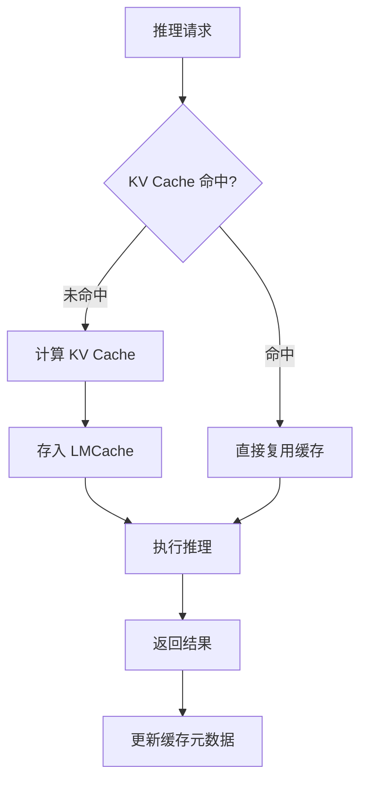

# LMCache

## 一句话定位
LLM 推理的 KV Cache 加速层——将注意力计算的中间结果（Key-Value Cache）从推理引擎中解耦，实现跨请求缓存复用，大幅提升推理吞吐。

## 它解决的问题
LLM 推理的核心瓶颈之一是 KV Cache 的内存占用和重复计算。同一个 system prompt + few-shot 上下文在不同请求中被重复计算成百上千次。PagedAttention（vLLM）解决了单次推理内的内存碎片问题，但跨请求的缓存复用仍是空白。LMCache 填补的就是这个空白。

目标用户：LLM 推理服务提供方、企业 AI 平台团队、MaaS 运营商。

## 为什么值得关注（2026-06-15）
本周 GitHub Python 周榜上榜，9,043 stars 且增速稳定。在上下文工程工具链（headroom 压缩 + turbovec 索引 + LMCache 缓存）三位一体中担任缓存层角色。KV Cache 管理是 vLLM/PagedAttention 之后推理优化的下一个前沿。

## 热度来源判断
真实需求驱动。LLM 推理成本是企业落地的核心障碍。KV Cache 复用可以直接降低 GPU 占用和推理延迟，ROI 明确。vLLM 生态的扩展为这类项目提供了天然的集成入口。

## 关键技术亮点
1. **跨请求 KV Cache 复用**：相同前缀（system prompt、few-shot 模板）的 KV Cache 计算一次、复用多次
2. **vLLM 生态集成**：与 PagedAttention 兼容，可作为 vLLM 的扩展模块使用
3. **多层级缓存策略**：GPU 内存 → CPU 内存 → 分布式存储，按延迟/成本分层
4. **Prefix Caching 优化**：自动检测输入前缀匹配，避免重复计算

## 架构启发
缓存层的解耦是推理基础设施成熟化的标志。从 GPU 内存 → 进程内缓存 → 跨进程缓存 → 分布式缓存，这个层次结构与 CPU 缓存（L1→L2→L3→RAM）的演进如出一辙。推理引擎不再需要自己管理所有缓存逻辑，而是可以依赖独立的缓存层。

## 定位判断
LLM 推理基础设施栈中的缓存层。类比数据库生态中的 Redis——不是必需，但在规模化场景下是刚需。当前处于从"vLLM 插件"向"独立缓存基础设施"演进的关键期。

## 风险 / 局限 / 泡沫点
1. **vLLM 强依赖**：与 vLLM 深度绑定，如果 vLLM 内置了类似功能（如 vLLM 已在开发 prefix caching），项目价值会被稀释
2. **缓存失效复杂性**：模型版本更新、tokenizer 变更都会导致缓存全部失效，管理复杂度高
3. **收益场景有限**：KV Cache 复用的收益主要在多请求共享相同前缀的场景（如 RAG、Agent system prompt），对于完全不同的请求收益有限

## 与同类项目的关系
- **vLLM (PagedAttention)**：互补关系，vLLM 管理单次推理的内存碎片，LMCache 管理跨请求的缓存复用
- **TensorRT-LLM**：NVIDIA 的推理引擎内置了 KV Cache 管理，但非开源生态
- **SGLang**：另一条推理优化路线（RadixAttention），与 LMCache 的缓存策略不同但目标一致

## 是否值得持续跟踪
**是。** KV Cache 管理是 LLM 推理优化的核心赛道，LMCache 代表了缓存层独立化的早期尝试。如果 vLLM 不内置等效功能，LMCache 有潜力成为推理栈的标准组件。

## 后续观察点
1. vLLM 是否在核心代码中内置 prefix caching，以及 LMCache 的应对策略
2. 大规模生产环境的 benchmark 数据（当前主要是小规模测试）
3. 是否支持 TensorRT-LLM、SGLang 等其他推理引擎

---
*首次记录：2026-06-15*
