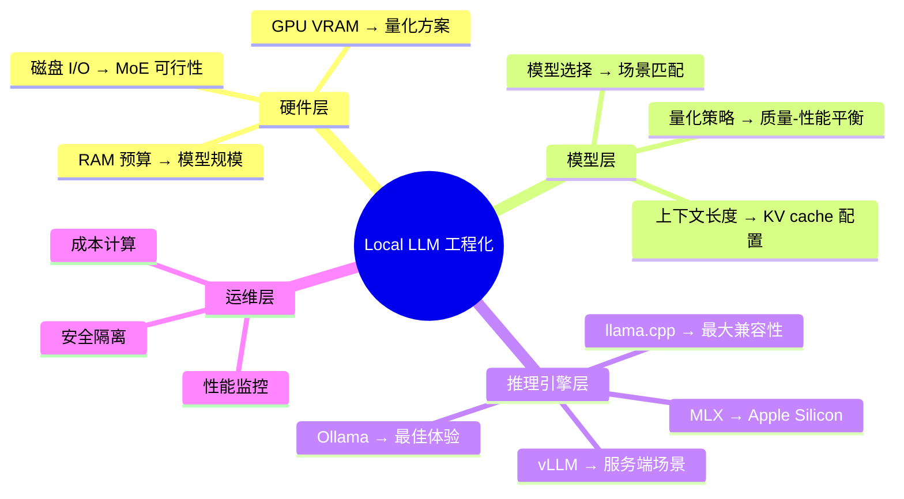

# local-llm — 本地大模型运维百科

## 一句话定位
一本精心策划的"本地运行 LLM 我知道的一切"工程知识库——覆盖硬件选型、量化策略、推理后端对比、性能调优，以可执行 Shell 脚本形式组织。

## 它解决的问题
本地运行大模型在 2025-2026 年从极客玩具走向工程实践，但知识极度分散在博客、Reddit 帖子、Discord 讨论中。开发者想要在本地跑 70B 模型时，需要自己拼凑硬件推荐、量化方案、推理引擎选择等信息。local-llm 把这些经验系统化为一个可执行的知识库。

## 为什么值得关注（2026-07-12）
local-llm 的火热（9 天 1.3K⭐）本身就是一个信号：**local LLM 正在从"能跑"进入"怎么跑好"的工程化阶段**。

这不是一个代码项目——它是一份工程手册。但它的价值不在于代码量，而在于：
1. **决策树清晰**：不同 RAM/GPU 预算下应该选什么模型、什么量化、什么后端
2. **实测对比**：不是搬运文档，而是有实际的性能对比数据
3. **可执行**：以 Shell 脚本组织，既是读物也是工具箱

## 热度来源判断
- **信号价值 > 工具价值**：用户 star 不一定是为了"使用"它，而是为了"收藏备查"
- **真实需求**：随着 Ollama/llama.cpp 普及，越来越多开发者尝试 local LLM，急需系统指南
- **作者信誉**：jamesob（Notion 工程师），有工程背景背书
- **非泡沫型**：知识库类项目不会"爆火后沉寂"，长期参考价值稳定

## 关键技术亮点

### 1. 硬件决策框架
- 不同 RAM 预算（16GB/32GB/64GB/128GB）下的推荐模型规模
- GPU VRAM 与模型大小的量化关系
- Apple Silicon vs NVIDIA GPU vs CPU-only 的场景划分

### 2. 量化策略对比
- int4/int8/fp16 的质量-性能 trade-off
- 不同量化方案（GPTQ/AWQ/GGUF/exl2）的实测对比
- 何时该用量化、何时不该用

### 3. 推理后端选择
- llama.cpp / Ollama / vLLM / LM Studio / MLX 的场景推荐
- 每个后端的优劣势矩阵
- 安装配置的可执行脚本

### 4. 性能调优
- KV cache 配置
- Batch size 调优
- 磁盘 I/O 优化（尤其 MoE 模型）

## 架构启发

local-llm 的存在本身就是一个架构信号：

local-llm 的价值在于把这张思维导图展开为可操作的决策树。

## 定位判断
**学习型项目。** 不是工具，不是平台。但它填补了 local LLM 工程化的知识空白。对于正在评估"是否在内部部署 local LLM"的架构师，这是很好的起点参考。

## 风险 / 局限 / 泡沫点

1. **时效性风险**：LLM 硬件和推理引擎更新极快，知识库可能快速过时
2. **单人维护**：jamesob 个人经验有限，覆盖面有边界
3. **非标准化**：个人知识库的组织方式不一定适合团队使用
4. **主观性强**：推荐基于个人经验，可能与社区共识有偏差
5. **非工具非框架**：不能直接集成到系统中，参考价值为主

## 与同类项目的关系

| 项目 | 类型 | 差异 |
|------|------|------|
| llama.cpp | 推理引擎 | local-llm 介绍 llama.cpp，不是竞争 |
| Ollama | 推理产品 | local-llm 指导如何选 Ollama |
| Awesome-Local-LLM | 资源列表 | local-llm 更深度、有实测、有决策树 |

## 是否值得持续跟踪
**是（低频）。** 每 2-3 个月检查一次更新即可。关注硬件推荐和推理后对比是否有大更新。

## 后续观察点
1. 是否被更大的社区知识库吸收（如 Awesome lists）
2. 是否有社区贡献扩展覆盖面
3. 是否进化为可交互的推荐工具（而非静态文档）
4. 硬件推荐是否跟上新一代 GPU/Apple Silicon 发布

---
*首次记录：2026-07-12*
