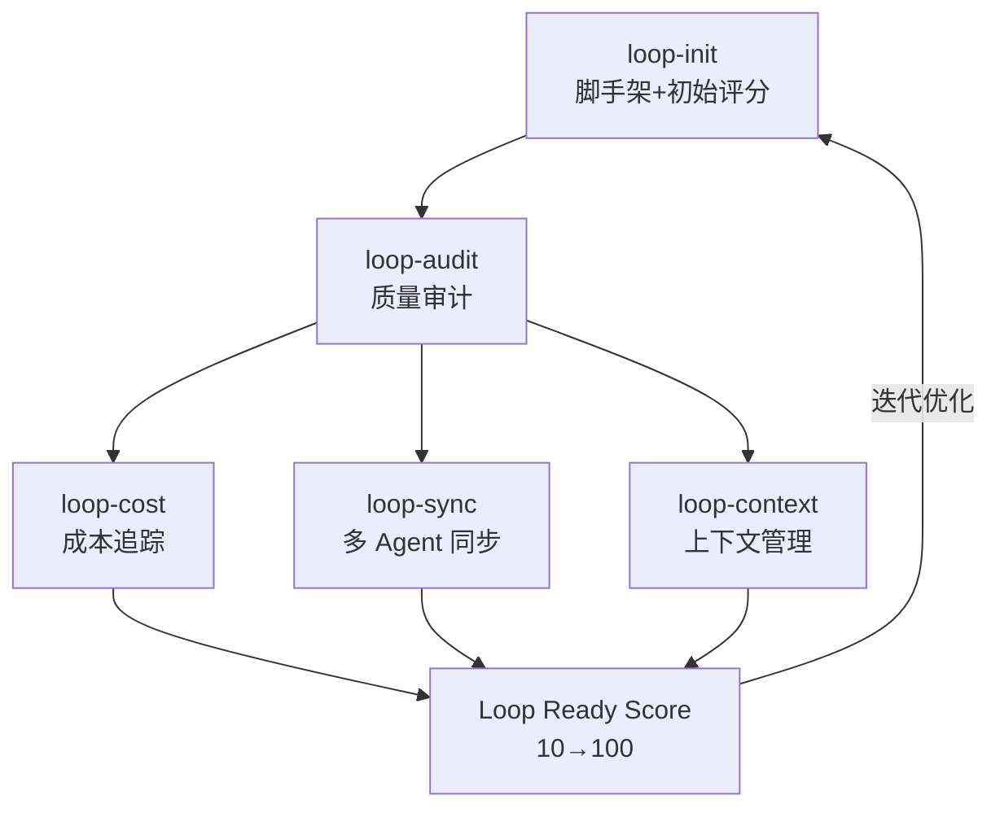

# Loop Engineering — Agent 编排工程方法论+工具链

> **一句话定位：** 将 AI Coding Agent 的编排从 ad-hoc prompting 提升为系统化工程方法论，配套 5 个 CLI 工具实现脚手架→评分→成本→同步→上下文管理全链路。

## 解决的问题

当前 AI Coding Agent（Claude Code、Codex、Cursor 等）的使用方式高度依赖个人 prompting 技巧。同一个任务，不同人写的 prompt 效果差异巨大。缺乏标准化的方法来设计、评估和优化 Agent 工作循环。

Loop Engineering 的核心命题是：**不要手动 prompt Agent，而是设计一个系统来 prompt Agent，然后给这个系统打分**。

## 为什么值得关注

- **方法论+工具并重**：不只是概念，有 5 个 npm 包可以直接用
- **27 天 5.9K⭐**：2026-06-09 创建，稳定增长
- **受 Addy Osmani + Boris Cherny 启发**：行业意见领袖背书
- **loop-audit 评分系统**：Loop Ready 分数（10→100）让 Agent 编排质量可量化
- **多 Agent 兼容**：支持 Claude Code、Codex、OpenCode 等主流工具
- **GitHub Actions 集成**：CI/CD 中自动运行 loop-audit

## 热度来源判断

- Addy Osmani 等大 V 的推广效应
- Agent 编排方法论是社区普遍痛点
- 实际可用的 npm 工具（不只是 README 项目）
- 持续活跃（最近 push: 2026-07-05）

## 关键技术亮点

1. **loop-init**：脚手架工具，自动创建 skills/state/budget 文件，输出 Loop Ready 分数
2. **loop-audit**：审计现有 loop 配置，输出质量评分和改进建议
3. **loop-cost**：追踪 Agent 运行的 token 消耗和成本
4. **loop-sync**：多 Agent 状态同步
5. **loop-context**：Agent 上下文窗口管理

## 架构启发

Loop Engineering 的核心洞察：**Agent 编排质量可以像代码质量一样被度量和自动化**。

传统软件工程有 lint/test/coverage 来度量代码质量，Loop Engineering 用 loop-audit 度量 Agent 编排质量。这是一个新的工程学科——Agent 工程学（Agent Engineering）的方法论雏形。

五件套对应软件工程的五个阶段：
- loop-init = 项目脚手架（如 create-react-app）
- loop-audit = lint + test
- loop-cost = 性能 profiling
- loop-sync = CI/CD pipeline
- loop-context = 依赖管理

## 定位判断

- **不是**Agent 框架（不执行 Agent 代码）
- **不是**Agent 运行时
- **是**Agent 工程方法论 + 开发者工具链

定位：**平台候选** — 如果 Agent 工程标准化持续推进，Loop Engineering 有潜力成为 Agent 开发的标准方法论框架。

## 风险/局限/泡沫点

- **方法论项目的通病**：看的人多，真正落地的人少
- **评分标准主观性**：Loop Ready 分数的权威性需要社区验证
- **竞争壁垒低**：方法论+CLI 工具容易被模仿或集成到其他工具中
- **维护者单一**：主要是个人项目（cobusgreyling），bus factor 风险

## 与同类项目的关系

| 项目 | 定位 | 关系 |
|------|------|------|
| Forsy-AI/agent-apprenticeship | Agent 学徒制生态 | 不同路径：学徒制是 Agent 自我提升，Loop Eng 是人设计 Agent 系统 |
| Ponytail | YAGNI Agent Skill | 互补：Ponytail 控制 Agent 不要过度工程，Loop Eng 设计 Agent 循环 |
| Claude Code / Codex | Coding Agent | Loop Eng 的目标是编排这些 Agent |

## 评分

| 维度 | 分数 | 理由 |
|------|------|------|
| 热度质量 | 8 | 27 天 5.9K，持续活跃 |
| 技术创新度 | 7 | 方法论创新为主，技术实现门槛不高 |
| 工程成熟度 | 8 | 5 个 npm 包+GitHub Actions，工程完整 |
| 架构启发价值 | 9 | Agent 工程方法论的雏形 |
| 企业落地潜力 | 7 | 需要 Team 级别的 adoption 推动力 |
| 中期趋势概率 | 8 | Agent 工程标准化是大趋势 |
| 平台化潜力 | 8 | 有成为 Agent 开发标准的潜力 |
| 基础设施潜力 | 6 | 工具链层，不是 runtime 层 |

**总分：61/80**

**项目归类：平台候选**

**是否建议持续跟踪：是** — Agent 工程方法论的先行者，关注 loop-audit 评分标准的社区采纳度。
