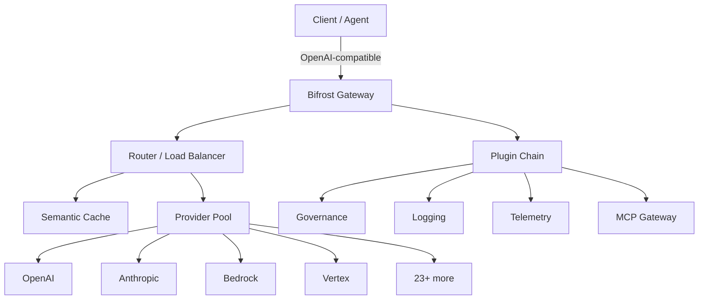

# Bifrost

## 一句话定位

高性能企业级 AI Gateway——Go 实现，11µs overhead@5k RPS，号称 50x faster than LiteLLM，统一 23+ LLM provider 接口。

## 它解决的问题

企业使用多个 LLM provider（OpenAI/Anthropic/Bedrock/Vertex 等）时面临：接口不统一、API key 管理复杂、无自动 failover、成本追踪困难、缺乏请求级缓存。Bifrost 用一个 Go 网关解决这些问题，且延迟开销几乎为零。

## 为什么值得关注（2026-06-22）

5,937 stars 日增 21。虽然日增不高，但技术指标极其硬核：**11µs overhead at 5k RPS**（t3.xlarge），100% success rate。这不是概念验证——是经过严肃 benchmark 验证的生产级网关。Apache 2.0 开源。支持 MCP gateway（Agent 工具调用也走网关），semantic caching，cluster mode，governance（budget + virtual keys + rate limiting）。

## 热度来源判断

技术指标驱动而非营销驱动。11µs overhead + 100% success rate 的 benchmark 数据有说服力。Go 生态对高性能网关有天然需求——Python 实现的 LiteLLM 在高并发场景下确实有性能瓶颈。Bifrost 抓住了这个缺口。

## 关键技术亮点

1. **极致性能**：Go 实现，11µs overhead@5k RPS（t3.xlarge），59µs on t3.medium，零失败请求
2. **23+ Provider 统一接口**：OpenAI-compatible API，一行代码替换 base_url 即可迁移
3. **Adaptive Load Balancer**：跨多个 API key 和 provider 智能分发请求
4. **Semantic Caching**：基于语义相似度的响应缓存，减少成本和延迟
5. **MCP Gateway**：Agent 工具调用也通过网关——统一的工具访问入口
6. **Cluster Mode**：多节点部署，适合企业级规模
7. **Governance**：virtual keys + budget management + rate limiting + usage tracking
8. **Plugin 架构**：governance/jsonparser/logging/mocker/semanticcache/telemetry 全部模块化

## 架构启发

Bifrost 的架构是经典的**Gateway + Plugin**模式应用于 AI 领域。和 API Gateway（Kong/APISIX）的相似度极高：

关键架构决策：Go 而非 Python/Rust——兼顾性能和可维护性；plugin 架构而非 monolith——企业可以按需启用；Web UI 配置——降低运维门槛。

## 定位判断

在 AI 平台架构中，Bifrost 占据 **AI Gateway** 层——所有 LLM 请求的统一入口。类比：Bifrost 之于 LLM，就像 Kong/APISIX 之于微服务 API。这个位置决定了它有潜力成为企业 AI 平台的核心基础设施。

## 风险 / 局限 / 泡沫点

1. **LiteLLM 生态护城河**：LiteLLM 社区更大、provider 覆盖更广、已有大量生产部署——纯性能优势可能不足以切换
2. **Gateway 单点风险**：引入网关意味着新的故障点——如果 Gateway 挂了，所有 AI 请求都受影响
3. **企业级功能验证不足**：cluster mode、governance 等功能在实际生产中的稳定性需要更多验证
4. **日增 21 stars 偏低**：说明社区认知仍在早期，需要更多传播

## 与同类项目的关系

- **LiteLLM**：Python 实现的 LLM proxy，生态最大，但性能瓶颈明显。Bifrost 直接对标。
- **freellmapi**（11.3K TS）：聚合 16 个 LLM 免费层——面向个人开发者，定位完全不同
- **Headroom**：虽然不是 gateway，但 proxy 模式有交集——Headroom 做压缩，Bifrost 做路由
- **OpenRouter**：闭源 SaaS 网关，Bifrost 是开源自部署替代

## 是否值得持续跟踪

**是。** AI Gateway 是企业 AI 平台的必选组件。Bifrost 在性能维度领先，如果后续能补齐生态和治理能力，有潜力成为这个品类的标准选择。

## 后续观察点

1. Provider 覆盖度增长——是否能快速跟上新 model/provider 上线速度
2. Cluster mode 在大规模生产中的表现
3. Semantic caching 的实际命中率和对回答质量的影响
4. MCP Gateway 功能的成熟度——是否能成为 Agent 工具调用的统一入口
5. 是否出现企业级采用案例

---
*首次记录：2026-06-22*
