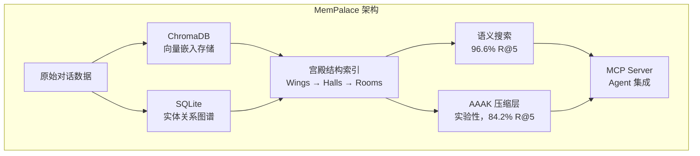

# MemPalace

## 一句话定位
史上最高分 AI 记忆系统，LongMemEval 96.6% R@5，完全本地运行，零 API 调用。

## 它解决的问题
AI Agent 每次对话都是全新开始，六个月的工作上下文在会话结束时消失。现有记忆系统试图让 AI 决定什么值得记忆，但往往会丢掉重要的上下文。MemPalace 采用"存一切，让它可搜索"的策略。

## 为什么值得关注（2026-04-12）
- 7 天内从 0 到 41,755 stars，AI 记忆系统史上最快增速
- LongMemEval 96.6% R@5，公开最高分，500 题独立复现
- 完全本地运行，ChromaDB 存储，零成本
- 创始人 Milla Jovovich 和 Ben Sigman 在 README 中公开承认过度宣传并纠正——技术诚实度极高

## 热度来源判断
- **名人效应**：Milla Jovovich 的参与带来大量非技术关注度，Star 数有膨胀成分
- **技术实力**：96.6% LongMemEval 得分可复现，核心技术真实
- **时机精准**：Agent 记忆需求在 2026 年 Q2 已成为共识

## 关键技术亮点
1. **原始逐字存储**：不做摘要、不做提取，直接存储原始对话文本。这是 96.6% 高分的来源——不丢数据
2. **宫殿架构**（Wings → Halls → Rooms → Closets → Drawers）：用记忆宫殿方法论组织记忆，提供可导航的结构化索引
3. **AAAK 压缩方言**（实验性）：面向 LLM 的有损压缩层，用缩写实体减少 Token。目前回归 12.4 个百分点（84.2% vs 96.6%），已诚实标注
4. **MCP Server 集成**：通过 MCP 协议与任何 AI Agent 对接
5. **ChromaDB + SQLite 双引擎**：ChromaDB 存储向量嵌入，SQLite 存储实体关系图

## 架构启发
- **"存一切"策略 > "智能筛选"策略**：在记忆系统中，不丢数据比节省空间更重要。摘要/提取会丢失上下文
- **分层架构**：原始存储层 + 元数据索引层 + 可选压缩层，各层独立演进
- **诚实是最强的技术品牌**：README 中的公开勘误（AAAK 回归、"30x lossless" 不实、"contradiction detection" 未集成）反而增强了可信度
- **宫殿隐喻的工程化**：将古代记忆术转化为可计算的数据结构

## 定位判断
**基础设施候选** — Agent 记忆层是确定性需求，MemPalace 的"存一切 + 宫殿索引"模式有成为标准的潜力。但需要修复安全漏洞并验证大规模性能后才能成为生产基础设施。

## 风险 / 局限 / 泡沫点
1. **名人效应 Star 膨胀**：大量非技术 Star，实际开发者基数需验证
2. **安全漏洞**：Issue #110 报告 hooks 中的 shell 注入，#74 报告 macOS ARM64 段错误
3. **ChromaDB 依赖**：单向量数据库依赖，数据规模上限未经验证
4. **AAAK 回归**：压缩模式降低 12.4 个百分点，核心卖点之一尚未兑现
5. **"30x lossless compression" 不实**：已公开承认，AAAK 是有损压缩

## 与同类项目的关系
- **GBrain**：不同层次——MemPalace 是存储/检索层，GBrain 是知识组织层，互补关系
- **Zep/Graphiti**：商业产品，MemPalace 的本地免费定位是差异化优势
- **LangChain Memory**：通用框架内置记忆，MemPalace 更专注、性能更高
- **claude-memory-compiler**：互补——memory compiler 负责从会话中提取知识，MemPalace 负责存储和检索

## 是否值得持续跟踪
**是，强烈建议持续跟踪**。Agent 记忆是 2026 年确定性的基础设施需求，MemPalace 的技术路线（原始存储 + 宫殿索引）有创新性。

## 后续观察点
1. 安全漏洞修复进度（Shell 注入 #110、ARM64 段错误 #74）
2. 企业级应用案例是否出现
3. AAAK 压缩模式的改进和实际效果
4. ChromaDB 规模上限的实际测试数据
5. 与 MCP 生态的集成深度

---
*首次记录：2026-04-12*
