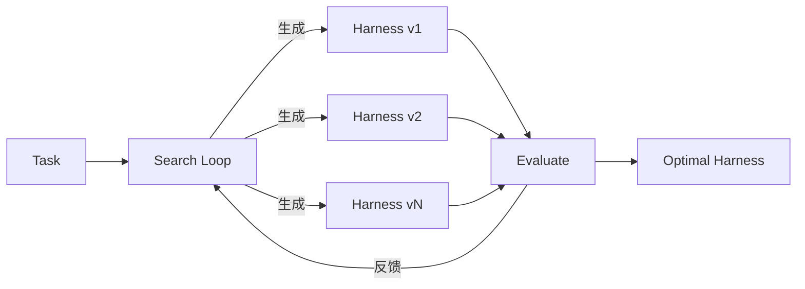

# meta-harness — Model Harness 自动优化

## 一句话定位

Stanford IRIS Lab 出品，自动搜索最优 model harness 配置的框架。

## 解决的问题

Model harness 是模型外围的代码（决定存储什么、检索什么、展示什么），直接影响 coding agent 的效果。当前 harness 设计靠人工经验调优。meta-harness 把这个过程自动化——在给定任务上搜索最优 harness 配置。

## 为什么值得关注

- Stanford IRIS Lab（Chelsea Finn 组），学术背书强
- 论文已发（arXiv 2603.28052）
- 对 coding agent 的 prompt/scaffold 优化有直接指导意义
- 解决的是 Agent 层的核心问题：外围代码的设计空间搜索

## 热度来源判断

444⭐，4/15 创建。学术项目，热度来自论文影响力和 coding agent 社区的关注。

## 关键技术亮点

- 搜索空间：memory system、retrieval strategy、display format
- 自动化搜索：给定基座模型，在任务上迭代搜索最优 harness
- 两个参考实验：文本分类 + Terminal-Bench 2.0
- 支持 Claude Code 作为 proposer agent

## 架构启发

核心启发：**Harness 是模型与任务之间的可优化层**。这和编译器的优化 pass 有类似的抽象——给定输入，搜索最优的中间表示。

## 定位判断

学习型/研究工具。短期是学术参考，中期可能启发商业 Agent 的 harness 优化产品。

## 风险/局限/泡沫点

- 研究代码，作者声明"仅验证能运行"
- 搜索空间定义需要人工介入
- 计算开销大（每次搜索需要大量 agent 运行）
- 学术项目，长期维护不确定

## 是否值得持续跟踪

✅ 是。Harness 优化是 coding agent 质量的关键瓶颈。

## 后续观察点

- 工业界是否采纳 meta-harness 思路
- 是否有更轻量的 harness 优化方案出现
- 论文引用和后续研究
