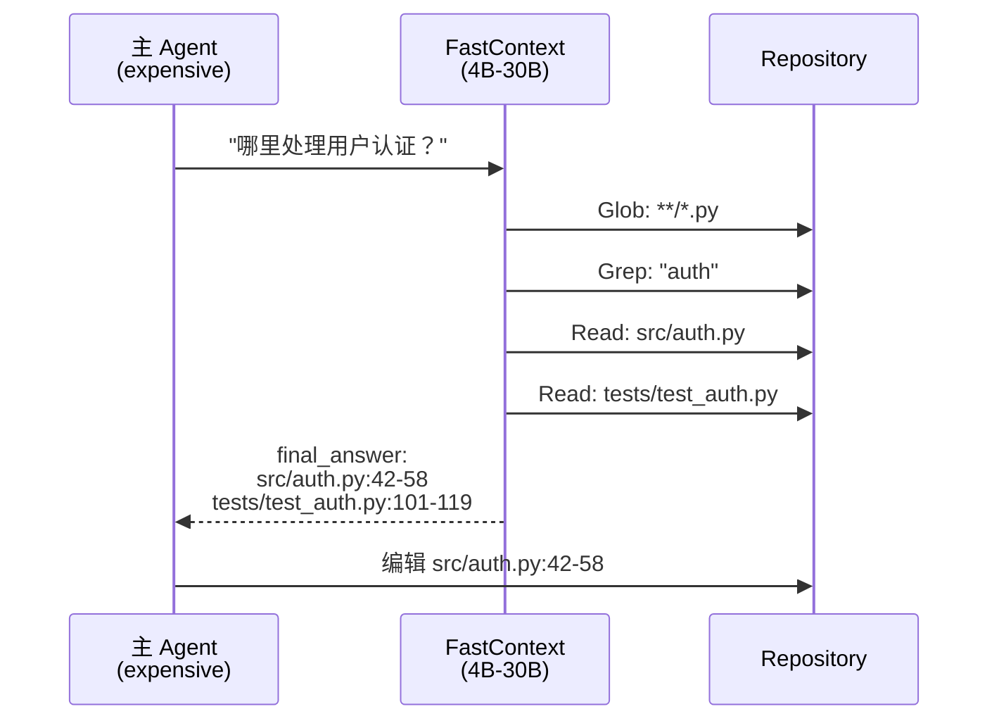

# Microsoft FastContext

## 一句话定位
Microsoft Research 出品的仓库探索子模型——用专用小模型（4B-30B）做 repo 探索，返回精确 file:line 引用，主 Coding Agent 只看关键代码，大幅节省 context window。

## 它解决的问题
现代 Coding Agent 用同一个模型既探索仓库又写代码。探索阶段的 Read/Grep/Glob 调用消耗大量 token，留在 history 中污染后续推理。对于大型仓库，探索可能消耗 50%+ 的 context budget。

## 为什么值得关注（2026-06-19）
- Microsoft Research 出品，arXiv 论文（2606.14066）+ 模型权重 + 代码全发
- 2026-06-15 刚发布，已有 587 stars
- 训练了 4B 到 30B 多个尺寸的探索模型，用 SFT + task-grounded RL
- 在 SWE-bench Multilingual、SWE-bench Pro、SWE-QA 上验证

## 热度来源判断
学术论文驱动 + 微软品牌背书。587 stars 不算爆发，但 context engineering 是 Coding Agent 的刚需，引用率会持续增长。

## 关键技术亮点
1. **探索-解决分离** — FastContext 只做探索（read-only），主 Agent 只做编辑
2. **并行工具调用** — 独立的 Read/Glob/Grep 可在同一 turn 并行发起
3. **Compact evidence** — 返回 `<final_answer>` 块，只有 file path + line range
4. **RL 训练** — SFT + task-grounded RL 训练探索策略，不是简单蒸馏

## 架构启发
FastContext 定义了 **Context 委托模式（Context Delegation Pattern）**：主 Agent 把 context 获取委托给专用子模型，就像资深工程师让实习生先做代码调研。这种分离降低了主模型的 context 压力，也使探索可复用。

## 定位判断
FastContext 可能成为 **Coding Agent 的标准 context 管理组件**。它不替代任何 Agent，而是作为插件嵌入 Claude Code、Codex、Cursor 等。如果 context 委托模式被广泛采纳，FastContext 有潜力成为事实标准。

## 风险 / 局限 / 泡沫点
1. **需要额外推理资源** — 4B 模型也需要 GPU/CPU 推理
2. **探索质量上限** — 小模型可能遗漏复杂跨文件依赖
3. **竞品风险** — Claude Code 内置 subagent 已有类似功能
4. **场景有限** — 只适用于有明确 file:line 答案的查询

## 与同类项目的关系
- **vs Claude Code subagent** — Claude Code 内置 subagent 是通用型，FastContext 是专用型 + RL 训练
- **vs headroom（context 压缩）** — 互补关系：headroom 压缩 history，FastContext 委托探索
- **vs turbovec（向量索引）** — turbovec 是语义搜索，FastContext 是 agentic 探索 + 引用

## 是否值得持续跟踪
**强烈建议。** Context 委托模式是 Coding Agent 架构的关键创新，FastContext 是这个模式的第一个学术论文级实现。

## 后续观察点
1. 是否被 Claude Code / Codex / Cursor 原生集成
2. SWE-bench 成绩提升的具体数据
3. 社区是否贡献更多训练数据
4. 是否出现 FastContext-as-a-Service

---
*首次记录：2026-06-19*
