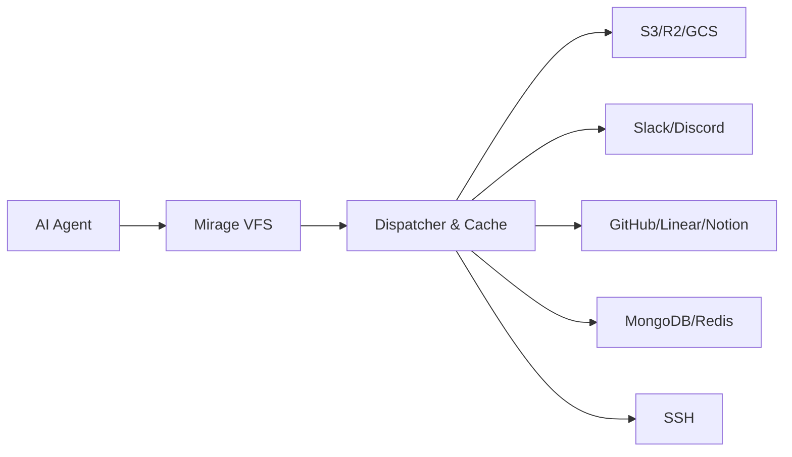

# Mirage

## 一句话定位
为 AI Agent 设计的统一虚拟文件系统（VFS），将 S3、Slack、GitHub、Gmail、Redis、MongoDB 等后端挂载为单一文件系统树，Agent 用 bash 语义操作一切。

## 它解决的问题
当前 AI Agent 访问不同后端需要学习 N 个 SDK / M 个 MCP Server，每个后端一套工具调用协议。这导致：
- Agent 工具列表爆炸，上下文窗口浪费严重
- 跨后端编排（如"从 Slack 读消息，处理后写到 GitHub Issue"）需要复杂的工具链
- 每个 Agent 框架都需要实现一遍后端适配

Mirage 的解法：用文件系统语义统一所有后端，Agent 只需要 `cat`/`ls`/`grep`/`cp` 等基础命令。

## 为什么值得关注（2026-05-08）
这是 Agent 基础设施层的一次范式级创新尝试。如果"文件系统语义统一后端访问"成立，这将成为 Agent 生态的重要基础设施组件——类似于 FUSE 之于操作系统，Mirage 之于 AI Agent。

核心洞察极为精准：**LLM 训练语料中 bash/file 操作是最密集的**，用这套语义访问后端比学 N 个 API 自然得多。

## 热度来源判断
- 2 天 925 stars，来自 strukto.ai（有商业背景和文档站）
- 技术洞察有深度，不是简单包装
- 有一定跟风成分（VFS + AI 是性感概念），但项目本身工程品质不低
- Python + TypeScript 双 SDK 同时发布，说明准备充分

## 关键技术亮点
1. **统一文件系统抽象**：S3 / Google Drive / Slack / Gmail / GitHub / Linear / Notion / Redis / MongoDB / SSH 等 15+ 后端统一挂载
2. **命令可扩展**：支持注册自定义命令（`ws.command('summarize', ...)`），支持按 resource + filetype 覆写命令行为
3. **可嵌入运行时**：Python SDK（`mirage-ai`）和 TypeScript SDK 都可嵌入 FastAPI / Express，无需独立进程
4. **跨 Agent 框架兼容**：支持 OpenAI Agents SDK、LangChain、Pydantic AI、CAMEL、OpenHands

## 架构启发
Mirage 的核心架构选择是"用最小公共语义（文件系统）统一最大异构后端"。这是一个经典的"薄抽象层"策略：
- 优点：Agent 学习成本极低，跨后端管道（pipe）天然可用
- Trade-off：文件系统语义无法完美表达所有操作（如 Slack 发消息用 `cp`？发线程用 `mkdir`？）
- 启发：**好的 Agent 基础设施应该复用 LLM 已有的知识（bash/file），而不是发明新协议**

与 MCP 的关系：Mirage 是对 MCP "一个后端一个协议适配器"范式的另一种回答。两者可以共存——Mirage 可以作为 MCP Server 的底层实现。

## 定位判断
在 Agent 基础设施栈中，Mirage 定位在"Agent ↔ 后端"之间的抽象层：
- 如果成功，它将成为 Agent 访问外部资源的标准接口层
- 与 MCP 定位类似但路径不同：MCP 是"工具协议"，Mirage 是"文件系统语义"

## 风险 / 局限 / 泡沫点
1. **文件系统语义的表达力限制**：并非所有后端操作都能自然映射到文件系统。复杂的 API 调用（如创建 GitHub PR + review）可能需要扩展语义
2. **2 天数据，跟风成分大**：需要 2-4 周确认真实采用率和社区活跃度
3. **性能和一致性**：跨后端的"文件系统操作"在延迟、一致性、错误处理上的挑战

## 与同类项目的关系
- **MCP (Model Context Protocol)**：直接竞品关系但路径不同。MCP 是工具协议，Mirage 是文件系统抽象。可能融合。
- **LangChain Tools**：LangChain 的工具层也解决"Agent 访问后端"问题，但每个工具是独立的。Mirage 用文件系统统一。
- **Browser Use**：用浏览器操作统一访问，Mirage 用文件系统语义统一访问。两个方向。

## 是否值得持续跟踪
**是。** 这是 Agent 基础设施层有潜力的创新方向。2-4 周内持续观察 star 增速和社区反馈。

## 后续观察点
1. 2 周后 star 是否持续增长到 3K+（排除跟风效应）
2. 是否出现 "Mirage + MCP" 集成方案或 "Mirage as MCP Server" 模式
3. 企业后端（如 Salesforce、SAP）的 Resource 适配器开发进度
4. 性能基准测试（vs 直接 SDK 调用的延迟对比）

---
*首次记录：2026-05-08*
