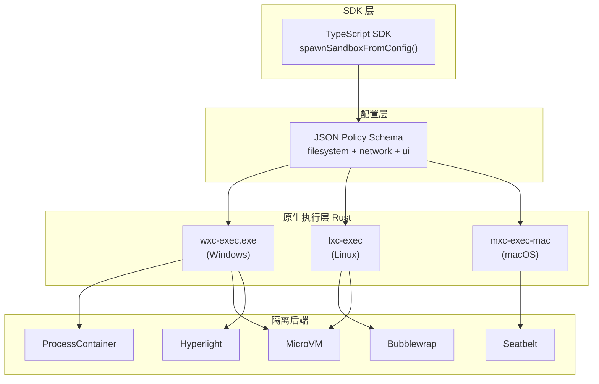

# Microsoft MXC (Execution Containers)

## 一句话定位
微软跨平台沙箱代码执行系统，用统一 JSON Schema 配置驱动多种隔离后端（ProcessContainer/Bubblewrap/Seatbelt/MicroVM/Hyperlight），为 Agent 代码执行提供安全边界。

## 它解决的问题
AI Agent 生成的代码、插件、工具需要安全执行环境。但 Windows/Linux/macOS 各有不同的隔离机制（AppContainer/Bubblewrap/Seatbelt），缺少统一的配置和管理层。MXC 用 JSON Schema 统一了这些差异。

## 为什么值得关注（2026-06-07）
MXC 填补了 Agent 安全执行基础设施的关键空白。随着 Coding Agent 和 MCP 工具调用越来越普及，**如何安全执行不可信代码**成为生产环境部署的硬约束。微软亲自下场做这个事，信号意义大于当前功能完成度。

## 热度来源判断
- **微软品牌背书**：Microsoft 官方仓库，Rust + TypeScript SDK
- **Agent 安全赛道热度**：Coding Agent 需要沙箱执行
- **57 stars/天**：Rust Trending 上榜
- 早期 preview，但架构设计清晰

## 关键技术亮点
1. **多后端统一抽象**：
   - Windows: ProcessContainer（默认）/ Windows Sandbox / WSLC / Hyperlight / MicroVM
   - Linux: Bubblewrap（默认）/ LXC / MicroVM / Hyperlight
   - macOS: Seatbelt
2. **策略驱动隔离**：文件系统（读写路径控制）、网络（代理/出站过滤）、UI（剪贴板/显示/GUI）
3. **有状态生命周期**：provision → start → exec → stop → deprovision，支持长时运行的沙箱会话
4. **TypeScript SDK**：`@microsoft/mxc-sdk` npm 包，一行代码创建沙箱
5. **版本化 Schema**：0.5.0-alpha（stable）→ 0.6.0-alpha（current）→ 0.7.0-dev（experimental）

## 架构启发

核心设计哲学：**不是发明新沙箱，而是统一现有沙箱的接口**。

## 定位判断
**基础设施候选** — 如果成熟起来，可能成为 Agent 代码执行沙箱的事实标准配置层。当前处于早期 preview，策略可能过于宽松。

## 风险 / 局限 / 泡沫点
1. **明确声明不可作为安全边界**："no MXC profiles should be treated as security boundaries currently"——当前是 preview，不是生产可用
2. **Windows 优先**：Linux/macOS 支持存在但不如 Windows 完善
3. **生态依赖**：需要各后端工具（bwrap/lxc/hyperlight）已安装
4. **竞品成熟度**：Firecracker（microVM）、gVisor 等已有生产验证

## 与同类项目的关系
- **vs Firecracker**：Firecracker 是一个具体的 microVM 实现，MXC 是**多后端的统一配置层**，可以包含 Firecracker 类的后端
- **vs gVisor**：gVisor 是 Linux syscall 拦截层，MXC 是更高层的策略管理
- **vs E2B**：E2B 是云端沙箱服务，MXC 是本地跨平台方案
- **vs Docker**：Docker 是容器运行时，MXC 更关注**策略驱动的安全隔离**

## 是否值得持续跟踪
**是。** 微软在 Agent 安全基础设施方向的战略投入，即使当前 preview 也有很高的学习价值。

## 后续观察点
1. 安全策略何时达到"可作为安全边界"的承诺
2. Agent 框架（Claude Code/Cursor/MCP）是否原生集成 MXC
3. 社区贡献的后端扩展（是否有 Kata Containers 等第三方后端）
4. 与 E2B/Firecracker 的定位分化

---
*首次记录：2026-06-07*
