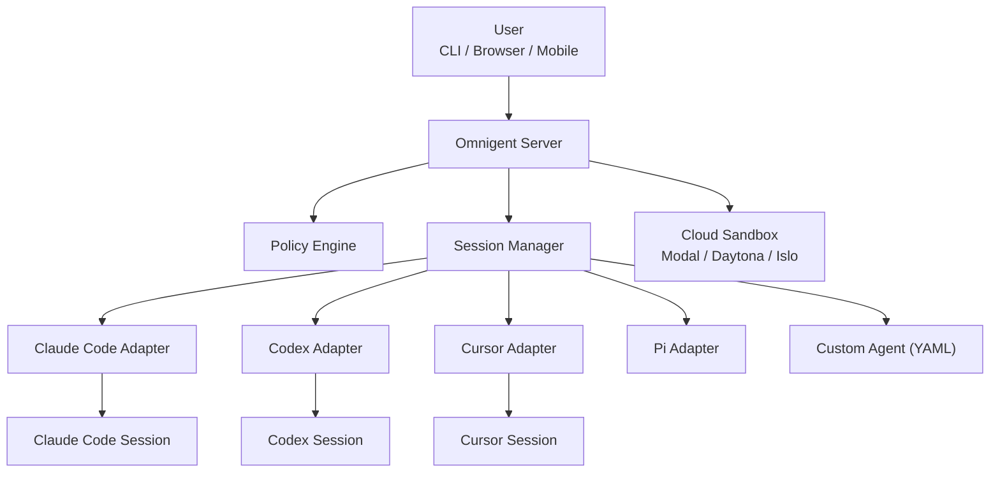

# Omnigent

## 一句话定位
开源 AI Agent meta-harness——用统一的编排层管理 Claude Code、Codex、Cursor、Pi 和自定义 agent，支持跨设备实时协作、策略治理和沙箱隔离。

## 它解决的问题
当团队同时使用 3-5 种 Coding Agent（Claude Code、Codex、Cursor、Pi 等）时，每个 agent 有自己的协议、自己的沙箱、自己的会话管理。无法跨 agent 协作、无法统一治理、无法从手机继续终端会话。这是一个真实的多 agent 管理痛点。

## 为什么值得关注（2026-06-19）
- 7 天 3,785 stars，212 个 issue 说明有真实用户在用
- Apache 2.0 License，macOS 桌面应用已可下载
- 首次提出 "meta-harness" 概念——不替换你的 agent，统一编排它们
- 支持 Modal/Daytona/Islo 云沙箱，从 CLI 或 server 按需启动

## 热度来源判断
真实需求驱动。多 agent 管理是每个重度 AI 开发者已经遇到的痛点。热度不是炒作，但 alpha 阶段（212 issue）说明工程成熟度还有距离。

## 关键技术亮点
1. **Transport 抽象层** — Claude Code、Codex、Cursor 的差异被封装在 adapter 中，上层 API 统一
2. **Policy 引擎** — 可在 server/agent/chat 三个粒度配置审批、预算上限、工具限制
3. **Session 持久化** — 终端 → 浏览器 → 手机，会话状态完整同步
4. **Cloud Sandbox** — 支持 Modal/Daytona/Islo，disposable 环境隔离

## 架构启发
meta-harness 模式的核心 trade-off：**抽象层次越高，兼容性越脆弱**。omnigent 需要追踪 5+ 个 agent 的协议变化，任何一个 agent 的 breaking change 都可能破坏编排层。这与 Kubernetes 管理 CRD 的挑战类似。

## 定位判断
在 Agent 生态中，omnigent 试图成为 **Agent 层的 Kubernetes**——不提供 agent 本身，但提供编排、治理、调度能力。如果成功，它将成为基础设施。如果失败，它会被各 agent 原生的编排能力取代。

## 风险 / 局限 / 泡沫点
1. **alpha 阶段，212 个 issue** — 不适合生产环境
2. **Adapter 维护成本** — 每个支持的 agent 协议变化都需要适配
3. **Python 3.12+ 限定** — 部署门槛比 Go/Node 高
4. **竞争风险** — 如果 Claude Code 原生支持多 agent 编排，omnigent 价值大减

## 与同类项目的关系
- **vs OpenClaw** — OpenClaw 是个人助理，omnigent 是团队编排层，定位不同
- **vs vercel/eve** — eve 是 filesystem-first 的开发框架，omnigent 是 runtime-first 的编排层
- **vs Claude Code 内置 subagent** — Claude Code 的 subagent 是单 agent 内部，omnigent 是跨 agent

## 是否值得持续跟踪
**是，强烈建议持续跟踪。** meta-harness 是 Agent 生态的关键缺失层，如果 omnigent 能稳定到 beta，将有很大的平台化潜力。

## 后续观察点
1. issue 关闭速度和 beta 发布时间线
2. 是否有企业用户案例
3. Adapter 数量和维护活跃度
4. 是否被某个大 agent（Claude Code/Codex）原生集成

---
*首次记录：2026-06-19*
