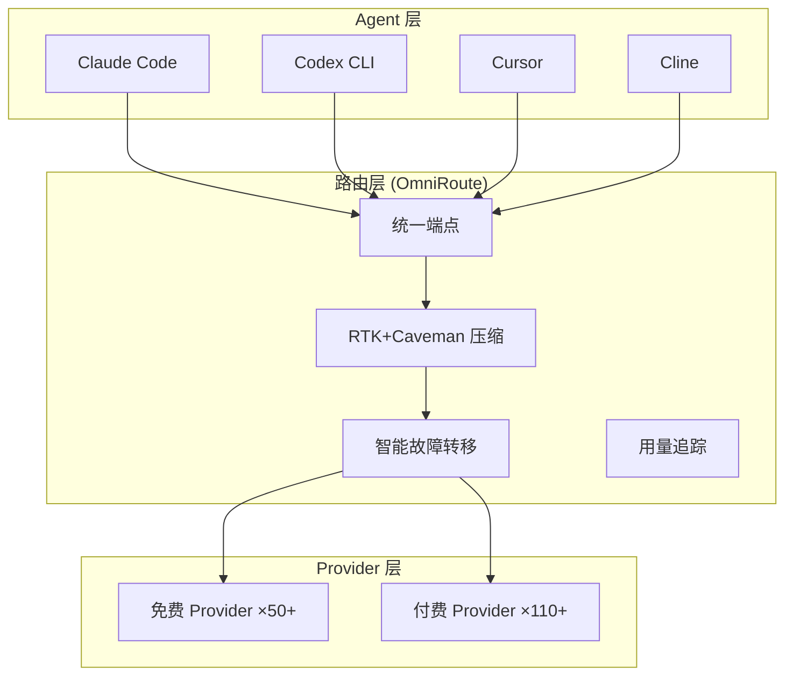

# OmniRoute — 免费 AI 网关：231+ Provider 统一接入

## 一句话定位
聚合 290+ AI Provider（90+ 免费）、500+ 模型的免费 MIT AI 网关，一个端点接入所有主流 LLM，RTK+Caveman 压缩节省 15-95% Token，支持 Claude Code、Codex、Cursor、Cline、Copilot 等主流工具。

## 它解决的问题
**目标用户：** 独立开发者、Coding Agent 用户、成本敏感团队
**痛点：** LLM API 费用高、多家 Provider 免费额度未充分利用、不同 Agent 工具需要不同 API 配置、token 消耗快触及限额

## 为什么值得关注（2026-07-24 更新）
GitHub Trending Weekly 上榜，周增 8,673 stars（从 16.2K → 27.9K），增速再次翻倍。Provider 数从 231 扩展到 290+，模型从 400+ 扩展到 500+，免费层从 50+ 扩展到 90+。500+ 贡献者维护，43 种语言 README。**已从工具型升级为基础设施候选——LLM 时代的 API 网关。**

## 热度来源判断
成本驱动 + Coding Agent 生态红利 + 多模型格局确认。当 LLM Provider 超过 500 个时，路由/聚合/降级/压缩自然成为基础设施层（类比微服务时代的 Kong/Nginx）。500+ 贡献者说明社区对 LLM 路由有强烈需求。免费层堆叠（90+ Provider）+ Token 压缩（15-95%）是核心价值主张。

## 关键技术亮点
1. **160+ Provider 聚合**：50+ 免费层 Provider，统一 API 端点
2. **RTK + Caveman 堆叠压缩**：声称节省 15-95% token（RTK 压缩重复模式，Caveman 压缩冗余语法）
3. **智能自动故障转移**：Provider 不可用时自动切换到下一个
4. **多协议支持**：MCP（Model Context Protocol）+ A2A（Agent-to-Agent）
5. **多端覆盖**：Desktop 应用 + PWA + Docker + npm 包

## 架构启发
OmniRoute 代表了 Agent 技术栈中的"路由层"：

## 定位判断
工具型。是 Agent 技术栈"路由层"的实用工具，但护城河较浅（Provider 列表和免费额度是公开信息，压缩算法是核心差异化）。

## 风险 / 局限 / 泡沫点
1. **Provider 稳定性风险**：免费 Provider 随时可能改政策/限流/下线
2. **压缩质量风险**：激进的 token 压缩可能影响 Agent 理解质量
3. **合规风险**：聚合多家 Provider 的免费额度可能违反各 Provider ToS
4. **维护负担**：160+ Provider 的 API 变更追踪和适配是持续的工程成本
5. **单点依赖**：如果 OmniRoute 自身服务中断，所有依赖它的 Agent 都会受影响

## 与同类项目的关系
- **vs FreeLLMAPI（13K⭐）**：定位相似，FreeLLMAPI 更偏后端聚合，OmniRoute 更偏全栈（Desktop+PWA+Docker）
- **vs OpenRouter**：OpenRouter 是商业产品（付费统一 API），OmniRoute 专注免费层聚合

## 是否值得持续跟踪
**观察型。** 作为"LLM 路由层"趋势的参与者跟踪，但需关注其长期可持续性（Provider 政策变化、压缩质量验证）。

## 后续观察点
1. 免费 Provider 的实际可用性（可用率、限流频率）
2. RTK+Caveman 压缩对不同任务质量的影响（是否导致 Agent 误解）
3. 是否被更大项目集成或收购
4. Provider 政策变化对服务可用性的影响

---
*首次记录：2026-06-29*
