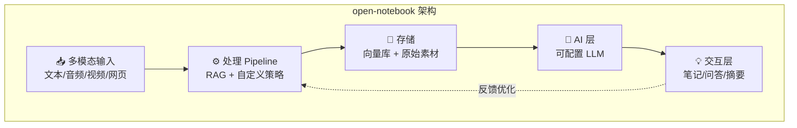

# open-notebook

## 一句话定位
开源 NotebookLM 替代方案，TypeScript 全栈实现，支持多模态灵活配置，可自托管。

## 它解决的问题
Google NotebookLM 证明了 AI 增强知识管理的价值，但：
- 数据在 Google 服务器上，企业无法使用
- 功能受限于 Google 的产品决策
- 无法自定义模型、Pipeline 和知识源

open-notebook 提供了一个完全可控的开源替代。

## 为什么值得关注（2026-06-14）
30K stars 里程碑（周增 3.8K），从概念验证进入成熟工具阶段。TypeScript 全栈实现降低了部署门槛，自托管特性解决了企业数据安全顾虑。在本周 GitHub Trending 中与 tolaria（16K⭐）共同标志着 AI 知识管理赛道的升温。

## 热度来源判断
- **Google NotebookLM 教育市场**：用户已理解 AI 知识管理的价值，寻找开源替代
- **数据主权需求**：企业和个人对数据可控的需求真实存在
- **自托管趋势**：与 tolaria、Obsidian 等知识管理工具的生态互补
- **TypeScript 降低门槛**：全栈 JS 开发者可以直接参与和部署

## 关键技术亮点
1. **TypeScript 全栈**：前后端统一语言，部署门槛低，社区参与门槛低
2. **多模态支持**：文本/音频/视频等多种知识源接入
3. **灵活的 AI Pipeline**：可自定义 RAG 策略、模型选择和 Prompt
4. **自托管架构**：数据完全可控，适合企业知识管理场景

## 架构启发
open-notebook 代表了 RAG 从"技术"到"产品"的转变——它不是在做一个更好的 RAG 库，而是在做一个更好的知识管理工具，RAG 只是底层能力。这对架构师的启发是：用户不关心 RAG，用户关心的是知识管理体验。

## 定位判断
- **生产可用**：功能完整，可自托管，适合个人和小团队使用
- 非基础设施候选——更偏应用层
- 有潜力成为企业知识管理平台的底座

## 风险 / 局限 / 泡沫点
1. ⚠️ **竞争激烈**：NotebookLM 本身免费且持续迭代，开源替代需要持续保持差异化
2. ⚠️ **维护可持续性**：个人主导项目（lfnovo），社区规模需持续扩大
3. ⚠️ **企业功能缺失**：SSO、权限管理、审计日志等企业功能未见
4. ⚠️ **模型成本**：自托管后 AI 推理成本由用户承担

## 与同类项目的关系
- **vs Google NotebookLM**：开源可控 vs 免费但数据在 Google。目标用户不同。
- **vs tolaria（16K⭐）**：open-notebook 偏 AI 知识管理，tolaria 偏 Markdown 知识库管理。前者 AI 更强，后者结构化更强。
- **vs Obsidian**：Obsidian 是笔记工具，open-notebook 是 AI 增强知识管理。层级不同但可互补。

## 是否值得持续跟踪
✅ 是。AI 增强知识管理是一个持续增长的赛道，open-notebook 是开源侧的领先者。

## 后续观察点
1. 企业功能路线图——是否引入 SSO/权限/审计
2. 多模态能力扩展——是否支持更多非文本格式
3. 社区增长——贡献者数量和质量变化
4. 商业模式——是否推出托管版或企业版

---
*首次记录：2026-06-14*
