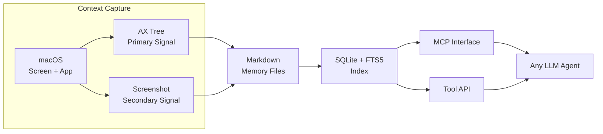

# OpenChronicle

## 一句话定位
开源、本地优先的 AI Agent 记忆层 — 从真实屏幕和应用上下文构建持久化 Markdown 记忆。

## 它解决的问题
AI Agent 无状态，每次对话从零开始。OpenAI 推出了 Chronicle（闭源），OpenChronicle 是其开源替代。

目标用户：需要 Agent 长期记忆的开发者、AI 工具用户。

## 为什么值得关注（2026-04-30）
- AX Tree 优先策略是当前记忆层项目中最务实的选择
- 本地优先 + Markdown 落盘，不锁定供应商
- MCP 兼容但不绑定 MCP，协议开放

## 热度来源判断
**真实需求驱动**。Agent 记忆是公认的痛点，OpenAI Chronicle 的发布验证了市场需求，OpenChronicle 乘势而起。

## 关键技术亮点

1. **AX Tree 优先策略**：使用无障碍树（Accessibility Tree）而非截图作为主要上下文信号。优势：成本更低、意图捕获更准、去重更容易、更小更清洁的记忆。

2. **Markdown 落盘 + SQLite 索引**：记忆以 Markdown 存储，SQLite FTS5 做全文搜索。人类可读、可编辑、可 Git 管理。

3. **Model-Agnostic**：支持 Ollama、LM Studio、OpenAI、Anthropic 或任何 LiteLLM 兼容提供商。

4. **Tool-Friendly**：任何能调用工具的 Agent 都能使用，MCP 客户端效果最佳。

## 架构启发

**设计哲学**：先低成本、高信号的方案（AX Tree），再逐步增强（截图辅助）。避免一上来就搞重型视觉管线。

**Trade-off**：目前仅 macOS，AX Tree 在 Linux/Windows 上需要不同的实现路径。

## 定位判断
**基础设施候选**。Agent 记忆层是 AI 工具链中缺失的一环，OpenChronicle 的设计理念（本地优先、可检查、协议开放）使其有潜力成为标准层。

## 风险 / 局限 / 泡沫点

1. **仅 macOS**：v0.1.0 只支持 macOS，跨平台路线图不明确。
2. **AX Tree 覆盖有限**：不是所有应用都暴露完整的 AX Tree，终端应用、游戏、部分 GUI 工具可能捕获不到有效信息。
3. **与 OpenAI Chronicle 的兼容性未知**：如果 Chronicle 推出 API 标准，OpenChronicle 是否跟进取决于社区。

## 与同类项目的关系

| 项目 | 策略 | 差异 |
|------|------|------|
| MemPalace | 对话历史直存 + ChromaDB | 偏向对话记忆，向量搜索 |
| stash (alash3al) | Episodes + Facts + Context | Go 实现，更轻量 |
| Mercury Second Brain | SQLite + FTS5 + 10 种记忆类型 | Agent 内置，非独立记忆层 |

## 是否值得持续跟踪
**是，高优先级**。AX Tree 策略如果被验证，将大幅降低 Agent 记忆层的成本和复杂度。

## 后续观察点

1. 跨平台支持（Linux / Windows）路线图
2. AX Tree vs 截图 vs API Hook 的效果对比 benchmark
3. 与 MCP 生态的整合深度

---
*首次记录：2026-04-30*
