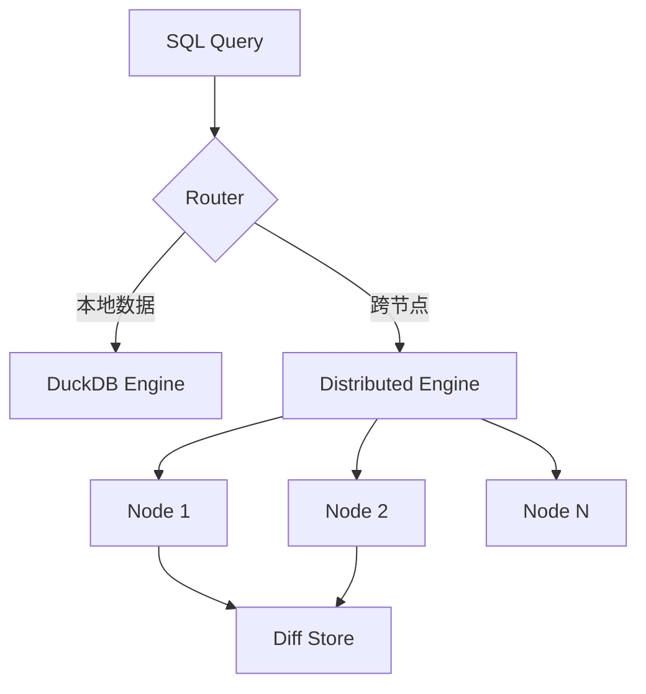

# openduck — 分布式 DuckDB

## 一句话定位

分布式 DuckDB 实现，双执行引擎 + 差分存储，Rust 编写。

## 解决的问题

DuckDB 已经成为分析领域的「SQLite」——单进程、零配置、高性能 OLAP。但它不支持分布式查询。openduck 尝试在 DuckDB 之上构建分布式能力，让分析工作负载可以按需扩展。

## 为什么值得关注

- DuckDB 生态位空白：单机分析有 DuckDB，分布式分析缺一个轻量方案
- 差分存储（differential storage）思路新颖，可能降低分布式分析的存储开销
- Rust 实现，性能基础好

## 热度来源判断

447⭐，4/14 创建。在 DuckDB 热度持续攀升的背景下，分布式扩展有天然吸引力。

## 关键技术亮点

- 双执行引擎：本地查询走 DuckDB 原生，跨节点走分布式引擎
- 差分存储：只存储变化部分，减少数据传输
- Rust 实现，与 DuckDB 的 C++ 核心通过 FFI 交互

## 架构启发

核心启发：**分析数据库的「本地优先 → 按需分布式」演进路径**，与 SQLite → LiteFS 的思路类似。

## 定位判断

工具型，有基础设施候选潜力。如果成熟，可以成为轻量级分析管道的核心组件。

## 风险/局限/泡沫点

- 非常早期（447⭐），功能完整度未知
- DuckDB Labs 官方可能有自己的分布式方案规划
- 双执行引擎的查询优化复杂性高
- 社区规模小，非知名团队

## 是否值得持续跟踪

✅ 是。DuckDB 分布式化是刚需，此项目方向正确。

## 后续观察点

- 性能基准测试是否发布
- DuckDB Labs 官方是否推出竞争方案
- 生产场景验证
