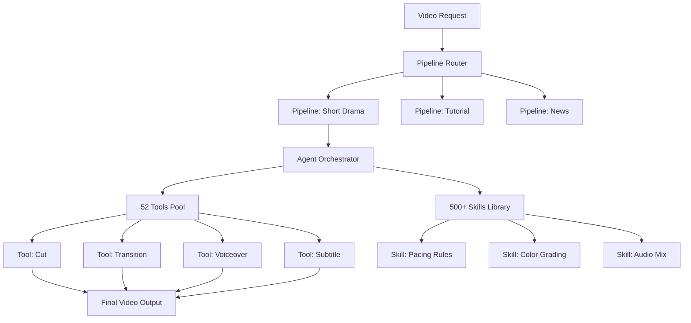

# OpenMontage

## 一句话定位

开源 Agentic 视频生产系统——12 pipelines × 52 tools × 500+ agent skills，将 AI coding assistant 变成完整的视频生产工作室。

## 2026-07-05 更新

stars 达到 33,050（周增 9,213）。持续在 GitHub Trending Top 10。关键信号：
- video-use（browser-use 团队，14.7K⭐ 周+4.1K）同步增长，双轨验证 Agent 视频生产赛道
- Agent 应用层从代码/文本扩展到多媒体生产的信号更加明确
- 评分维持 85，平台候选定位不变

---

## 2026-07-03 更新

stars 达到 31,677（周增 12,624），登顶 GitHub Trending 周榜榜首。从 6/22 首次记录到今天 11 天增长 273%。关键判断升级：OpenMontage 定义了 "Agentic Video Production" 赛道，video-use（browser-use 团队，13.7K⭐）同期增长形成双轨验证。Agent 能力边界从代码生产扩展到内容生产——这不是 "AI 视频生成" 赛道（Sora/Runway），而是 "Agent 驱动的视频 pipeline" 赛道。

评分调整：Score 85（↓1），因为 31.7K star 证明了热度，但 "500+ skills" 可维护性和实际输出质量仍待验证，"平台候选" 定位需更多非 star 指标支撑。

---

## 2026-06-26 更新

stars 从 8,487（6/22）暴涨到 21,941（6/26），4天 +158%。重要新增信息：
- **双渲染引擎**：Remotion（React-based，数据驱动场景）+ HyperFrames（HTML/CSS/GSAP，动效驱动场景），Agent 在 proposal 阶段自动选择
- **免费路径验证**：Piper TTS（离线）+ Archive.org/NASA/Wikimedia + Remotion = $0.15/视频
- **YouTube 持续输出**：每条视频附带完整 prompt + pipeline + 成本，形成 demo→adoption 正循环
- **pipeline = skill + tools + stages** 架构与 coding agent 的 harness 模式完全同构

## 它解决的问题

视频制作是多步骤、多工具的复杂流程：素材采集→剪辑→特效→转场→配音→字幕→导出。现有工具要么是单体应用（Premiere/Resolve）要么是单一 AI 能力（生成/配音/字幕）。OpenMontage 将整个流程分解为 Agent 可执行的 skill 集合，实现端到端自动化。

## 为什么值得关注（2026-06-22）

8,487 stars 日增 993，Python trending #1。这不是"AI 视频生成器"——而是**用 Agent 编排逻辑重构内容生产流水线**。12 pipelines 覆盖不同类型视频制作流程，52 tools 提供原子能力，500+ agent skills 编码领域最佳实践。把 AI coding assistant（Claude Code 等）当作执行引擎，这是一个全新的 Agent 应用范式。

## 热度来源判断

内容创作市场巨大 + AI Agent 编排从概念验证进入实用阶段。993 stars/day 说明击中了真实痛点——内容创作者需要批量化、自动化、可重复的视频生产。但需要警惕炒作因素——"世界首个开源 agentic 视频生产系统"的标签带有营销成分。

## 关键技术亮点

1. **12 Pipelines**：不同视频类型（短剧、教程、新闻、广告等）的完整生产流水线
2. **52 Tools**：视频处理的原子能力（剪辑、转场、特效、配音、字幕、格式转换等）
3. **500+ Agent Skills**：将视频制作领域知识编码为 Agent 可执行的 skill 文档
4. **AI Coding Assistant 作为执行引擎**：Claude Code/Codex 作为"工厂工人"执行生产任务
5. **Agentic 编排**：不是脚本式自动化，而是 Agent 自主决策执行路径

## 架构启发

OpenMontage 的核心架构思想是**"将领域工作流编码为 Agent Skills"**：

这个模式可以迁移到任何领域——关键是把领域最佳实践拆解为 tool（原子能力）+ skill（编排知识）。

## 定位判断

OpenMontage 是**Agentic 内容生产**领域的先行者。它不是视频编辑器（不能替代 Premiere），而是**视频生产的 Agent 编排层**——类比：OpenMontage 之于视频生产，就像 n8n 之于工作流自动化。

## 风险 / 局限 / 泡沫点

1. **视频质量未经验证**：star 数高但缺乏高质量输出案例的广泛验证
2. **500+ skills 的可维护性**：大量 skill 文档的维护成本高，且视频制作最佳实践在不断进化
3. **对 AI Coding Assistant 的过度依赖**：把 Claude Code 当视频生产引擎，存在能力边界和成本问题
4. **营销标签风险**："世界首个"标签需要更多实际验证
5. **内容创作的主观性**：视频制作不是纯流程化工作，创意判断很难完全 Agent 化

## 与同类项目的关系

- **Premiere / DaVinci Resolve**：传统专业视频编辑器——完全不同的定位
- **Runway / Pika**：AI 视频生成——单点能力，OpenMontage 是编排层
- **n8n / Temporal**：通用工作流编排——OpenMontage 是垂直化的视频领域编排
- **Palmier-Pro**（4.9K macOS 视频编辑器）：更偏桌面工具

## 是否值得持续跟踪

**是，但有保留。** OpenMontage 的 Agent 编排架构有跨领域参考价值，但作为视频生产工具本身需要更多质量验证。重点跟踪的是它的"tool + skill 编排"模式是否可迁移。

## 后续观察点

1. 实际视频输出质量——是否有令人信服的生产级案例
2. 500+ skills 的演进——是持续增长还是逐渐废弃
3. 是否出现非视频领域的 OpenMontage-like 项目（用类似架构编排其他领域）
4. 用户反馈——真实用户 vs star 农场的比例

---
*首次记录：2026-06-22*
