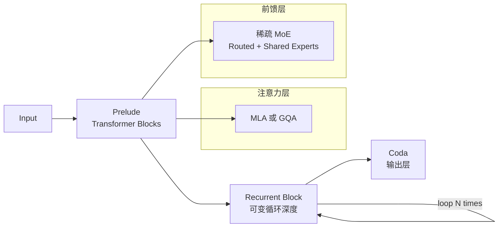

# OpenMythos

## 一句话定位
基于公开研究文献从第一性原理重建 Claude Mythos 架构的开源实现，实现了 Recurrent-Depth Transformer 三阶段推理。

## 它解决的问题
面向 LLM 研究者和架构工程师，提供了对闭源前沿模型架构的理解和实验平台。解决了"看得见论文但摸不着实现"的问题。

## 为什么值得关注（2026-04-23）
4 天 8.7k stars，代表了 LLM 架构逆向工程的社区热潮。Recurrent-Depth Transformer (RDT) 可能是 test-time compute 时代的关键架构范式。

## 热度来源判断
- **真实需求**：社区对 Claude 实际架构的强烈好奇心
- **技术热度**：RDT + MoE 组合是前沿架构探索
- **泡沫成分**：约 30%，纯理论重建无官方验证，部分 star 来自猎奇心理
- **KOL 效应**：kyegomez 本身是 AI 社区活跃研究者

## 关键技术亮点
1. **三阶段 RDT 架构**：Prelude (transformer blocks) → Recurrent Block (可变深度循环) → Coda，实现 compute-adaptive 推理
2. **MLA/GQA 双注意力**：支持 Multi-Head Latent Attention 和 Grouped Query Attention 切换
3. **稀疏 MoE**：routed + shared experts 前馈网络，适配不同规模
4. **PyTorch 实现可安装**：`pip install open-mythos`，Flash Attention 2 可选

## 架构启发

- **compute-adaptive 推理**：通过可变循环深度实现"想得越久越好"，是 test-time compute 的架构基础
- **稀疏 MoE + RDT 组合**：解决了"模型要大但推理要快"的矛盾

## 定位判断
**学习型 / 研究型。** 当前是架构理解和实验平台，不是生产级推理引擎。对理解前沿 LLM 架构设计有极高价值。

## 风险 / 局限 / 泡沫点
1. **纯理论重建**：无 Anthropic 官方验证，工程细节可能严重偏差
2. **无可训练数据**：只有架构定义，无训练 pipeline 和数据
3. **学术 vs 工程**：研究价值高，但离可部署有巨大距离
4. **热度可能快速衰减**：逆向工程类项目往往"看热闹"居多

## 与同类项目的关系
- **llama (Meta)**：官方开源，完整训练 → OpenMythos 只有架构
- **Mistral**：商业开源路线 → OpenMythos 是社区逆向
- **其他 RDT 实现**：OpenMythos 是最完整的 Claude 架构复现尝试

## 是否值得持续跟踪
**是。** 但关注点应在架构设计思想而非项目本身。RDT 范式如果被更多模型采用，OpenMythos 的参考价值会持续增加。

## 后续观察点
1. 是否有人基于此架构完成实际训练并产出有意义的结果
2. Anthropic 是否公开更多 Mythos 架构细节（验证/否定当前重建）
3. RDT 范式是否在其他开源模型中被采用

### 评分

| 维度 | 分数 | 理由 |
|------|------|------|
| 热度质量 | 7 | 真实好奇心驱动，但有猎奇成分 |
| 技术创新度 | 8 | RDT + MoE 组合有真实工程创新 |
| 工程成熟度 | 4 | 可安装但无可训练、无验证 |
| 架构启发价值 | 9 | 对理解前沿架构设计有极高价值 |
| 企业落地潜力 | 3 | 纯研究，短期无落地可能 |
| 中期趋势概率 | 7 | RDT 范式可能被广泛采用 |
| 平台化潜力 | 3 | 不太可能成为平台 |
| 基础设施潜力 | 4 | 思想可能影响基础设施设计 |

- **总分**：45/80
- **归类**：学习型
- **建议持续跟踪**：是

---
*首次记录：2026-04-23*
