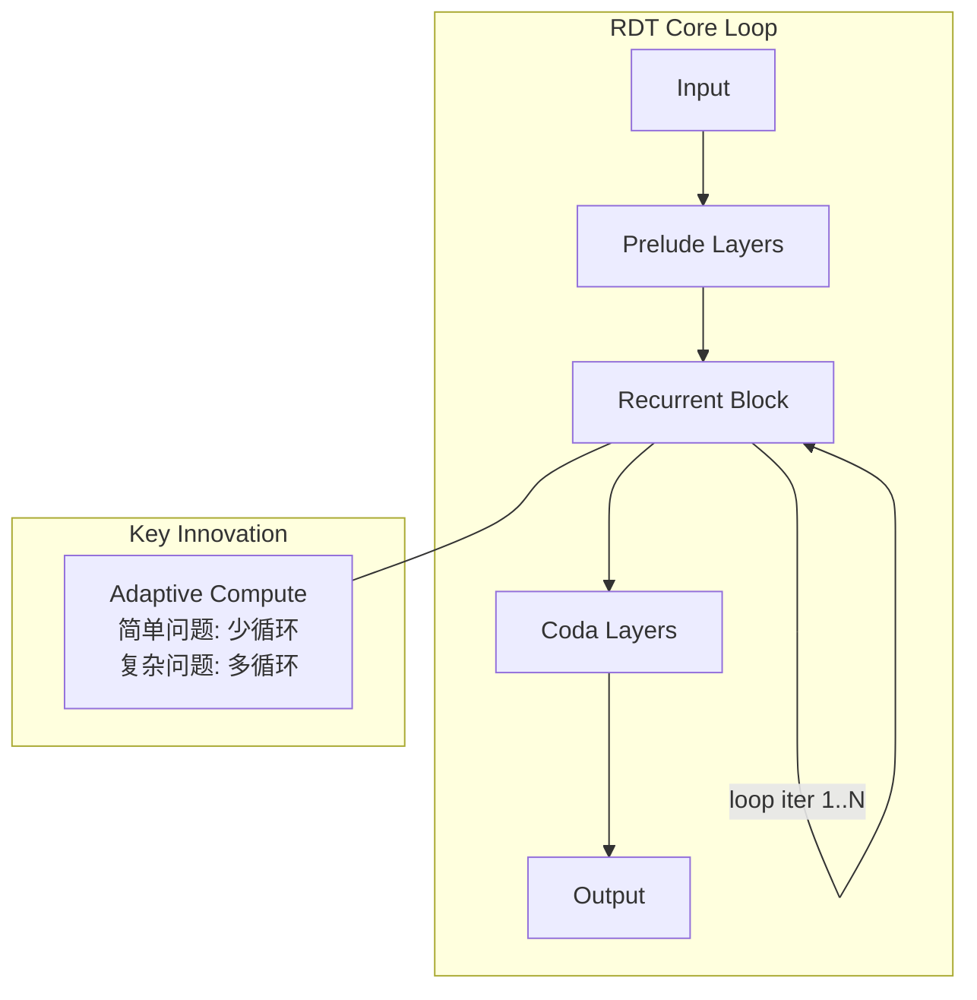

# OpenMythos

## 一句话定位
基于公开论文理论重建 Claude Mythos 架构的开源实现 — Recurrent-Depth Transformer + Sparse MoE。

## 它解决的问题
大模型架构不透明。Anthropic 的 Claude 系列被广泛认为采用了创新的推理架构，但从未公开细节。OpenMythos 为研究者和工程师提供了一个可运行、可调试的理论参考实现。

目标用户：ML 研究者、架构师、对推理优化感兴趣的工程师。

## 为什么值得关注（2026-04-30）
- 12 天 11.2K stars，是本月增长最快的研究型项目
- 首次将 Recurrent-Depth Transformer 的概念推向社区实践
- 直接影响对推理基础设施未来设计的认知

## 热度来源判断
**真实需求 + 社区好奇心驱动**。Anthropic 的 Claude 在推理质量上与竞品明显不同，社区对"它到底怎么做到的"有强烈求知欲。OpenMythos 满足了这个需求。但需注意：star 增长中相当部分来自"围观"而非"使用"。

## 关键技术亮点

1. **Recurrent-Depth Transformer (RDT)**：三层架构（Prelude → Recurrent Block × N → Coda），推理时计算深度可变。核心洞察：不是所有 token 都需要相同深度的计算。

2. **MLA / GQA 双注意力切换**：支持 Multi-Head Latent Attention（DeepSeek 风格 KV 压缩）和 Grouped Query Attention，可在配置中切换。

3. **Sparse MoE with Shared Experts**：路由专家 + 共享专家的混合 FFN，21B 活跃参数承载大模型能力。

4. **pip install 即可运行**：`pip install open-mythos` 即可实验，门槛极低。

## 架构启发

**设计哲学**：推理成本应该与问题复杂度成正比。这打破了"每个 token 固定计算量"的传统范式。

**Trade-off**：循环次数的上限需要平衡延迟和准确率。过高的循环次数会导致尾延迟不可控。

## 定位判断
**学习型 + 研究探索型**。目前不适合生产使用，但作为理解下一代 Transformer 架构的教学工具和实验平台，价值极高。

## 风险 / 局限 / 泡沫点

1. **理论重建 vs 实际架构**：完全基于公开论文推测，Anthropic 从未确认 Mythos 架构细节。实际实现可能截然不同。
2. **无预训练权重**：仅提供架构代码，无可用预训练模型。真正的验证需要完整训练流程。
3. **过度追捧风险**：社区可能将理论模型等同于 Anthropic 的实际做法，产生误导。

## 与同类项目的关系

| 项目 | 定位 | 差异 |
|------|------|------|
| DeepSeek-V3/R1 | 生产级 MoE 模型 | 有完整训练和权重，生产可用 |
| Mistral | 开源 MoE 模型 | 成熟产品，OpenMythos 是纯架构 |
| llama.cpp | 推理框架 | 聚焦推理优化，OpenMythos 聚焦架构设计 |

## 是否值得持续跟踪
**是，高优先级**。RDT 概念如果被验证，将改变推理基础设施设计。

## 后续观察点

1. 是否出现基于 OpenMythos 架构的实际预训练尝试
2. Anthropic 是否对 Mythos 架构做出任何公开回应
3. RDT 的推理效率 benchmark（与标准 Transformer 对比）

---
*首次记录：2026-04-30*
