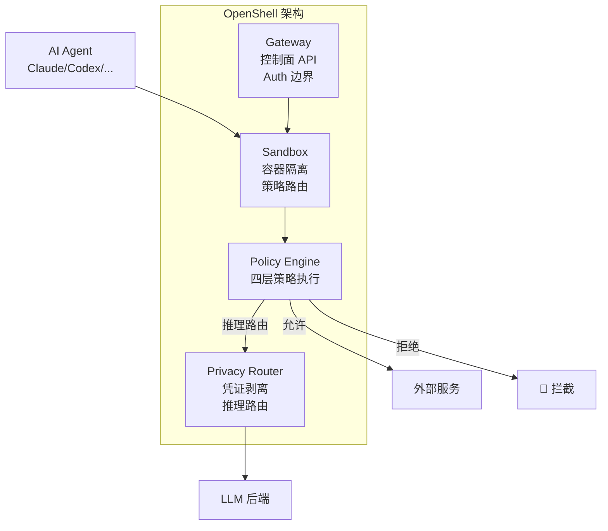

# NVIDIA OpenShell

## 一句话定位
NVIDIA 出品的 Agent 安全运行时沙箱——Rust 实现，四层策略防御（文件系统/网络/进程/推理），凭证隔离，GPU 直通，覆盖 OWASP Agentic Top 10。

## 它解决的问题
AI Agent 在执行任务时需要访问文件系统、网络、API 密钥等敏感资源。当前大多数 Agent 直接在宿主机运行，存在数据泄露、凭证暴露、未授权操作等安全风险。OpenShell 为每个 Agent 提供隔离沙箱，通过声明式 YAML 策略控制所有资源访问。

## 为什么值得关注（2026-06-03）
- **NVIDIA 官方出品**，背书强度高
- **Rust 实现**，性能和安全双重保障
- **四层防御体系**是目前最完整的 Agent 沙箱方案：文件系统（锁定）+ 网络（热重载）+ 进程（锁定）+ 推理路由（热重载）
- **GPU 直通**支持本地推理，这是其他沙箱方案没有的
- **凭证隔离设计**正确：凭证不进沙箱文件系统，环境变量注入
- 已有 Helm chart，K8s 部署路线正在开发

## 热度来源判断
- GitHub Trending Rust 排名前列，+142 stars/day
- NVIDIA 品牌效应 + Agent 安全刚需双重驱动
- Alpha 阶段已有 6.6K stars，说明市场期待度高

## 关键技术亮点

### 策略引擎
- 声明式 YAML 策略，静态层（文件系统/进程）锁定，动态层（网络/推理）热重载
- L7 级别 HTTP 方法 + 路径粒度控制

### 凭证管理
- 自动发现 Claude/Codex/Copilot/OpenCode 凭证
- Provider 抽象，运行时注入，不落盘

### GPU 直通
- CDI 优先，回退 NVIDIA Container Toolkit
- 实验性但路线明确

### Agent 支持
- Claude Code / Codex / Copilot / OpenCode / OpenClaw / Ollama / Pi
- 社区可贡献新 Agent 镜像

## 架构启发

**架构师启发：**
1. Agent 沙箱应该是 Agent 运行时的标准组件，不是可选安全加固
2. 策略热重载设计使 Agent 运行时可以动态扩展能力，无需重启
3. 推理路由（Privacy Router）是独特设计——Agent 的 API 调用经过审计后才转发
4. 与 Microsoft AGT 互补：AGT 定义策略，OpenShell 执行策略

## 定位判断
**基础设施候选。** 如果 Agent 成为标准开发模式，安全沙箱运行时就是必须的基础设施层。NVIDIA 的入场为这个品类提供了强有力的验证。

## 风险/局限/泡沫点
1. **Elastic License 2.0（引擎部分）**——商业使用受限，SDK 是 Apache 2.0
2. **Alpha 阶段**——单租户模式，企业多租户部署还需等待
3. **依赖 Docker/Podman/MicroVM**——对已有容器环境的团队友好，但增加了部署复杂度
4. **NVIDIA 生态绑定**——GPU 直通依赖 NVIDIA 硬件和驱动
5. **竞品风险**——Docker/Mozilla 等也可能推出类似方案

## 与同类项目的关系
- **Microsoft AGT**：互补关系，AGT 做策略定义，OpenShell 做沙箱执行
- **Docker/Podman**：底层运行时，OpenShell 在其上构建 Agent 感知层
- **Anthropic Cybersecurity Skills**：安全知识层，与沙箱运行时互补

## 是否值得持续跟踪
**是。** Agent 安全运行时是明确的中期趋势，NVIDIA 出品增加了成为标准的可能性。

## 后续观察点
1. 引擎 License 是否会调整（ELv2 → Apache 2.0？）
2. K8s 多租户路线的推进速度
3. 社区贡献的 Agent 镜像生态
4. 与主流 Agent Harness（ECC/Claude Code/Codex）的集成深度
5. GPU 直通的稳定性和生产就绪度

---

*档案创建于 2026-06-03 · 数据截止 2026-06-03 06:00 CST*
