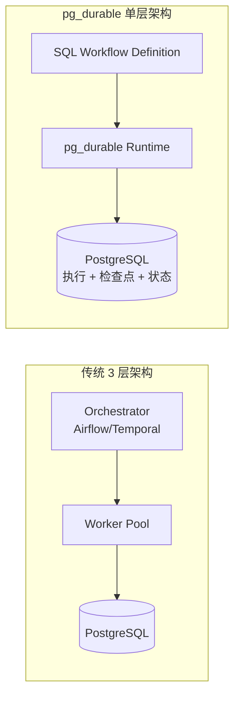

# pg_durable

## 一句话定位

微软官方 PostgreSQL 扩展，将 Durable Execution（容错工作流引擎）原生嵌入数据库，消除外部编排器需求。

## 它解决的问题

数据团队构建 ETL / embedding / 数据清洗管道时，通常需要拼接 cron job + worker + queue + status table + orchestrator（Airflow/Temporal）来保证可靠性。pg_durable 将这一切内化到 PostgreSQL 中：用 SQL 定义工作流，运行时自动检查点，崩溃/重启后自动恢复。

## 为什么值得关注（2026-06-08）

1. **微软官方出品**，不是社区实验——代表了微软对"compute close to data"方向的架构判断
2. **Rust 实现**，作为 PostgreSQL extension 运行，性能和安全兼顾
3. **SQL-native 工作流定义**：`~>` (sequential) 和 `|=>` (parallel fan-out) 操作符
4. 在 Azure HorizonDB（微软新云服务）中内置——说明有商业化路径支撑

## 热度来源判断

- **真实需求**。数据工程师苦 Airflow + Worker + Queue 久矣，将编排移回数据库是简化架构的真实需求
- 微软品牌背书带来初始曝光，但 +314/天的增速说明开发者确实在认真评估
- 52 个 open issues 反映了真实用户在尝试使用，不是纯 star farming

## 关键技术亮点

1. **SQL-native DAG 定义**：用 `~>` 和 `|=>` 组合操作符定义工作流图，`df.start()` 启动
2. **检查点持久化**：每步执行后自动 checkpoint 到 PG 系统表，崩溃后从最后检查点恢复
3. **零外部基础设施**：不需要 Redis、Temporal、Airflow、Step Functions
4. **Rust 实现**：作为 PG extension 运行在 `shared_preload_libraries`，后台 worker 异步执行
5. **并行执行**：`|=>` 操作符原生 fan-out，自动等待所有分支完成后 join

```sql
-- 示例：并行处理 + 汇总
SELECT df.start(
    'SELECT id FROM documents WHERE processed = false LIMIT 100' |=> 'batch'
    ~> 'UPDATE documents SET processed = true WHERE id = ANY($batch)'
);
```

## 架构启发

pg_durable 代表了 **data-compute convergence**（数据-计算收敛）趋势：



**核心洞察**：当工作流本质是数据转换（chunk → embed → upsert），把编排逻辑放在数据旁边比维护一个独立编排集群更简洁。这不是取代 Temporal（跨系统编排仍需要），而是**消除不必要的编排器**。

### 适用场景 vs 不适用场景

| 适用 | 不适用 |
|------|--------|
| 向量 embedding 管道 | 跨多个异构系统的编排 |
| 批量数据清洗/去重 | 需要亚毫秒同步响应的场景 |
| 定时维护任务 | 无法安装 PG 扩展的云托管环境 |
| Fan-out 聚合查询 | 主要逻辑在应用层的非 SQL 工作流 |

## 定位判断

- 当前：**观察型**（1.4K stars，早期 preview）
- 趋势：**基础设施候选** — 如果微软持续投入，将成为 PG 生态标配

## 风险 / 局限 / 泡沫点

1. **早期阶段**：52 个 open issues，README 明确标注 limitations
2. **SQL-shaped 限制**：复杂控制流需要包装成 SQL 函数或 HTTP 端点
3. **微软内部优先级不确定**：可能被作为 Azure HorizonDB 的独家特性，开源版本投入有限
4. **与 Temporal 的竞争定位**：pg_durable 解决的是数据层内编排，不是通用编排，但市场教育可能混淆
5. **PostgreSQL 扩展安装门槛**：很多云 PG 服务不支持自定义扩展

## 与同类项目的关系

- **vs Temporal**：Temporal 是跨系统通用编排器，pg_durable 是数据层内编排器
- **vs Airflow**：Airflow 是 Python 生态 + 独立调度，pg_durable 是 SQL 生态 + 内嵌执行
- **vs pg_cron**：pg_cron 只是定时执行，pg_durable 是 DAG + 检查点 + 容错恢复
- **vs DBOS**：DBOS（MIT）提出过类似理念，pg_durable 是微软的工程化实现

## 是否值得持续跟踪

**是。** 微软官方 + 数据层编排新范式 + Rust 实现，三个因素叠加使其成为高价值观察对象。

## 后续观察点

1. 微软是否在 Azure HorizonDB 之外持续维护开源版本
2. 生产环境用户的反馈（特别是 embedding 管道场景）
3. 复杂工作流（分支/循环/错误处理）的 SQL 表达能力上限
4. 社区贡献者增长和 issue 解决速度

---
*首次记录：2026-06-08*
