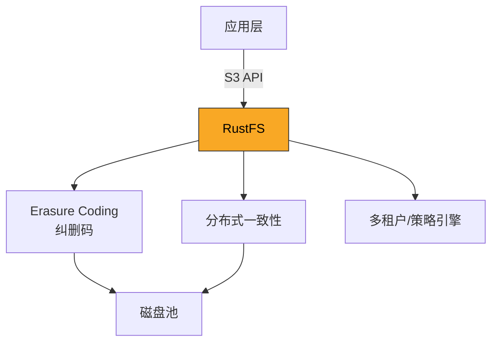

# RustFS

## 一句话定位

用 Rust 构建的高性能 S3 兼容对象存储系统，定位为 MinIO 的 Apache 2.0 替代品。

## 解决的问题

1. **MinIO 许可证困境**：MinIO 切换 AGPL-3.0 后，商业产品无法免费使用
2. **小对象性能瓶颈**：传统对象存储在 4KB 等小文件场景下性能不佳
3. **迁移成本高**：从 MinIO 迁移到其他方案通常需要改代码

## 为什么值得关注

- Apache 2.0 许可证，商业友好
- 声称 4KB 小对象性能是 MinIO 的 2.3x
- **Drop-in 二进制替换**：可直接替换 MinIO 二进制文件
- 23K+ stars，GitHub Trending 排名靠前
- Rust 在基础设施层的能力证明

## 热度来源判断

- **真实需求驱动**：MinIO AGPL 迁移潮是真实的商业痛点
- **Rust 热度加持**：Rust 在基础设施领域的声望正在上升
- **部分情绪反应**：对 MinIO 商业化的不满推动了一部分 star

## 关键技术亮点

1. **Rust 全栈构建**：零成本抽象 + 内存安全，天然适合 I/O 密集场景
2. **S3 API 完整兼容**：与 AWS S3、MinIO、Ceph 互操作
3. **轻量二进制**：<100MB，支持 ARM 到数据中心
4. **共存与迁移**：支持与现有 MinIO/Ceph 集群共存

## 架构启发

- "Rust 重写经典基础设施 + 更友好许可证" 是可复制的模式
- Drop-in 替换策略大幅降低迁移摩擦力

## 定位判断

**基础设施候选**。不是平台或工具，是基础设施级组件。如果生产验证通过，有潜力成为 MinIO 的默认开源替代。

## 风险/局限/泡沫点

1. **Benchmark 可信度**：2.3x 数据来自项目自身，缺乏第三方独立验证
2. **生产验证不足**：新项目，大规模部署的故障恢复、数据一致性未验证
3. **社区可持续性**：目前主要贡献者数量有限
4. **MinIO 可能回击**：MinIO 在许可证或性能上可能做出调整

## 与同类项目的关系

| 项目 | 语言 | 许可证 | 定位 |
|------|------|--------|------|
| RustFS | Rust | Apache 2.0 | MinIO 直接替代 |
| SeaweedFS | Go | Apache 2.0 | 海量小文件优化 |
| Garage | Rust | AGPL-3.0 | Geo-distributed |
| Ceph | C++ | LGPL-2.1 | 企业级统一存储 |

## 是否值得持续跟踪

**是**。存储基础设施替换窗口期明确，Apache 2.0 许可证是硬优势。

## 是否值得企业 PoC

**是，但需独立验证**。建议在非生产环境进行 benchmark 和稳定性测试后再评估。

## 后续观察点

1. 第三方独立 benchmark 结果
2. 生产环境部署案例
3. 社区贡献者增长趋势
4. MinIO 的应对策略
5. 与 Kubernetes 生态的集成程度
