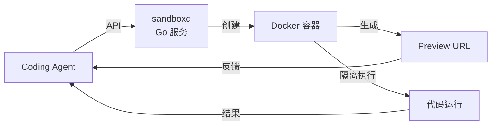

# tastyeffectco/sandboxd

## 一句话定位
自托管开发沙箱：Go/Docker 实现 Agent 隔离环境 + Preview URL，一条命令启动，无需 K8s。

## 它解决的问题
Coding Agent 需要安全的执行环境来运行代码、安装依赖、预览结果。现有方案要么太重（K8s），要么不安全（本地执行），要么依赖云服务。sandboxd 提供轻量级、自托管的沙箱方案。

## 为什么值得关注（2026-06-11）

1. **精准需求** — Coding Agent 的运行时隔离是刚需
2. **轻量实现** — Go + Docker，无 K8s 依赖，降低部署门槛
3. **自托管** — 数据不离开企业环境，合规友好
4. **Preview URL** — 方便 Agent 和人类查看结果

## 热度来源判断
- Coding Agent 生态爆发带动周边工具需求
- 自托管 + 无 K8s 切中中小企业痛点

## 关键技术亮点
- **Go 实现** — 单二进制部署，启动快
- **Docker 隔离** — 每个沙箱独立容器
- **Preview URL** — 自动生成预览链接
- **一条命令** — 极简的使用体验
- **Agent 友好** — API 设计面向 Agent 调用

## 架构启发

**启发 1：** Agent 时代的开发环境需要「即用即弃」的沙箱能力，类似 CI Runner 但更轻量。
**启发 2：** 自托管 + 无 K8s 是中小企业采用 Agent 工具的关键门槛降低。
**启发 3：** Preview URL 是 Agent 与人类协作的重要接口。

## 定位判断
**基础设施候选。** 如果 Coding Agent 成为主流，开发沙箱就是标准基础设施层。

## 风险/局限/泡沫点
1. **Docker 安全性** — Docker 隔离并非绝对安全，高安全场景需更强隔离
2. **竞品可能** — 大厂（如 GitHub Codespaces）可能直接内置类似能力
3. **规模限制** — Docker 方案在大量并发沙箱场景可能有性能瓶颈
4. **功能相对简单** — 目前功能集较基础

## 与同类项目的关系
- **GitHub Codespaces** — 竞品，更重但更成熟
- **E2B** — 竞品，云端沙箱，sandboxd 是自托管版
- **Daytona** — 同赛道，更偏完整开发环境

## 是否值得持续跟踪
✅ 是。Agent 基础设施层的重要项目。

## 后续观察点
1. 并发沙箱数量上限和性能表现
2. 安全隔离能力增强（gVisor/Firecracker 支持）
3. 企业级使用案例
4. 与主流 Coding Agent 的集成情况
