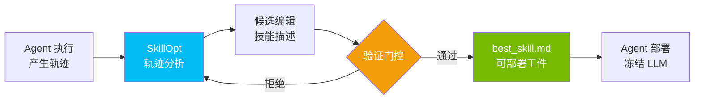

# Microsoft SkillOpt

## 一句话定位
文本空间技能优化器——为冻结的 LLM Agent 训练可复用的自然语言技能，产出可部署的 best_skill.md 工件。

## 它解决的问题
Agent Skill（如 Claude Code Skills、Codex Skills）目前完全依赖手工编写和人工调优。当 Skill 数量增长、复杂度提升时，手工迭代效率极低，且缺乏系统化的质量保障方法。SkillOpt 把「prompt engineering」升级为「prompt training」。

## 为什么值得关注（2026-06-05）
Microsoft 官方出品，MIT 协议，第一个提出系统化 Agent Skill 训练方法的开源项目。4.9K stars + 487 forks 说明社区在积极尝试。这是 Agent Skill 从「手工作坊」到「工业化训练」的关键转折点。

## 热度来源判断
- 真实需求：Agent Skill 生态爆发（html-anything 75 种 Skill、9arm-skills、gsd-core 等），但 Skill 质量参差不齐
- Microsoft 背书增加了信任度
- 487 forks 反映开发者不只是收藏，在积极实验
- MIT 协议消除了商用障碍

## 关键技术亮点
1. **文本空间优化**：不修改 LLM 权重，只优化自然语言技能描述。这意味着任何冻结的 LLM 都可以使用
2. **轨迹驱动编辑（Trajectory-Driven Edits）**：从 Agent 执行轨迹中提取优化信号，自动编辑技能描述
3. **验证门控更新（Validation-Gated Updates）**：每次技能修改必须通过验证才能合并，防止优化方向跑偏
4. **可部署工件**：产出 best_skill.md，直接可部署到 Claude Code / Codex / Copilot 等 Agent

## 架构启发
- Skill = 文本空间的「模型参数」。SkillOpt = 文本空间的「训练器」
- 验证门控是关键设计：等同于 ML 训练中的 evaluation set
- 轨迹数据 = 训练数据。谁掌握了 Agent 执行轨迹，谁就能训练更好的 Skill
- 启发：未来可能出现「Skill 训练数据市场」和「Skill 评估基准」

## 定位判断
**平台候选。** 如果 Skill 训练范式成立，SkillOpt 将成为 Agent Skill 生命周期的核心工具——从编写、训练、验证到部署的基础设施。

## 风险 / 局限 / 泡沫点
1. **实验性项目**：Microsoft Research 出品，可能缺乏长期产品化承诺
2. **效果未验证**：文本空间优化在复杂场景的效果缺乏大规模验证
3. **轨迹数据依赖**：需要大量高质量的 Agent 执行轨迹，冷启动困难
4. **评估标准缺失**：什么是「更好的 Skill」？缺乏行业统一评估基准

## 与同类项目的关系
- **html-anything (6.1K)**：Skill 的消费者/应用层（75 种 Skill 的 agentic HTML 编辑器），与 SkillOpt 是上下游关系
- **gsd-core (2.7K)**：Spec-driven Agent 开发流程，关注 Skill 的组织和管理，与 SkillOpt 的训练能力互补
- **9arm-skills (2.7K)**：Shell 技能集合，SkillOpt 可以用来训练优化这些 Skill

## 是否值得持续跟踪
**强烈建议持续跟踪。** Agent Skill 训练是 Agent 自主演化能力的基础设施级能力。如果 SkillOpt 的方法论成立，将深刻影响整个 Agent Skill 生态。

## 后续观察点
1. 验证门控的具体实现：是基于规则、模型评估、还是人工审查？
2. 社区是否开始贡献轨迹数据集
3. Microsoft 是否将 SkillOpt 集成到 Copilot 产品线
4. 出现基于 SkillOpt 训练的高质量 Skill 发布

---
*首次记录：2026-06-05*
