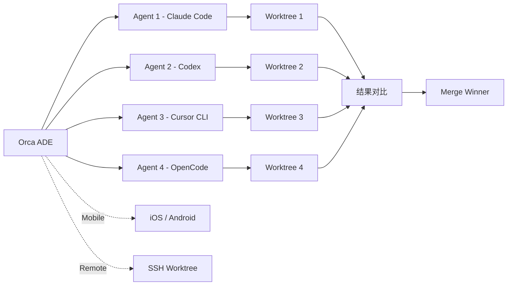

# Orca

## 一句话定位

并行 Agent 开发环境（ADE）——让开发者同时运行多个 AI coding agent，每个在独立 git worktree 中工作，支持桌面 + 移动端 + SSH 远程。

## 它解决的问题

使用 Claude Code、Codex 等 CLI agent 时，开发者只能在一个终端中运行一个 agent。如果想让多个 agent 并行处理不同任务（或对同一任务给出不同方案），需要手动管理多个终端窗口和 git 分支。Orca 将这个流程产品化：一个界面管理所有 agent，每个 agent 独立 worktree，结果可视化对比。

## 为什么值得关注（2026-06-22）

5,784 stars 日增 134，在多 Agent 编排赛道中定位最清晰。不是另一个 Agent 框架——而是**Agent 的 IDE**（ADE, Agent Development Environment）。30+ CLI agent 兼容（Claude Code/Codex/Cursor/Grok/Copilot/OpenCode/Amp/Antigravity/Pi/Hermes/Devin/Goose 等全系列）。移动端伴侣（iOS + Android）可以远程监控和指导 agent。日级发布节奏。

## 热度来源判断

真实需求驱动。多 Agent 并行工作是 AI 编程生产力的下一阶段——从"一个 AI 助手"到"一个 AI 团队"。Orca 解决的是协调和管理问题，不是造另一个 agent。star 增长稳定而非爆发式，说明用户留存好。

## 关键技术亮点

1. **Parallel Worktrees**：一个 prompt 扇出到 5 个 agent，每个在独立 git worktree，结果对比后合并 winner
2. **Terminal Splits**：Ghostty-class 终端 + WebGL 渲染 + 无限分屏 + scrollback 跨重启存活
3. **Design Mode**：点击 Chromium 窗口中任意 UI 元素，将 HTML/CSS/截图直接发送到 agent prompt
4. **GitHub & Linear 原生**：浏览 PR、issue、项目看板，从任何任务打开 worktree
5. **SSH Worktrees**：在远程强力机器上运行 agent，自动重连 + 端口转发
6. **Orca CLI**：agent 也可以驱动 Orca——`orca worktree create/snapshot/click/fill`
7. **Computer Use**：让 agent 操作桌面应用和可见 UI

## 架构启发

Orca 的核心架构哲学是**"Agent 作为一等公民的开发资源"**——和代码、分支、issue 同等重要。它重新定义了开发环境的组成要素：不再只是编辑器 + 终端 + 调试器，而是 **编辑器 + 终端 + Agent 管理器**。Worktree 隔离是多 Agent 并行的关键技术选择——它利用了 git 原生能力而非自建隔离机制。

## 定位判断

在 Agent 生态中，Orca 占据了 **ADE（Agent Development Environment）** 这个全新品类。它不是 agent（不生成代码），不是框架（不提供 SDK），不是 gateway（不路由请求）——它是让开发者高效管理多个 agent 的**工作环境**。类比：Orca 之于 Agent，就像 VS Code 之于编程。

## 风险 / 局限 / 泡沫点

1. **CLI Agent 快速迭代风险**：30+ agent 兼容是优势也是维护负担——每个 agent 的接口和行为都在变化
2. **桌面应用分发壁垒**：非 Web 应用，需要用户下载安装——增长受限于分发能力
3. **竞争激烈**：herdr（Rust 终端 multiplexer）、claude-squad（Go 管理器）从终端切入，可能分流用户
4. **开源可持续性**：MIT 开源，但有明确的商业意图（onorca.dev）——开源核心 + 商业增强的平衡需要观察

## 与同类项目的关系

- **herdr**（6.6K Rust）：终端 agent multiplexer，更轻量但没有 IDE 级体验
- **claude-squad**（7.8K Go）：专注 Claude Code/Codex/OpenCode 管理，生态更窄
- **jcode**（7.5K Rust）：coding agent harness，偏框架而非 IDE
- **ruflo**（60.7K TS）：Claude multi-agent swarm meta-harness，更偏编排框架

## 是否值得持续跟踪

**是。** Orca 代表了 Agent 时代开发环境的演进方向。如果多 Agent 并行成为主流开发模式，ADE 品类将和 IDE 一样重要。

## 后续观察点

1. 移动端使用数据——是否真的有人从手机指导 agent 工作
2. 30+ agent 兼容的维护成本——哪些 agent 被实际使用最多
3. 是否出现 Orca 专属的 agent skill/插件生态
4. Worktree 并行模式在大型团队中的实际效果验证

---
*首次记录：2026-06-22*
