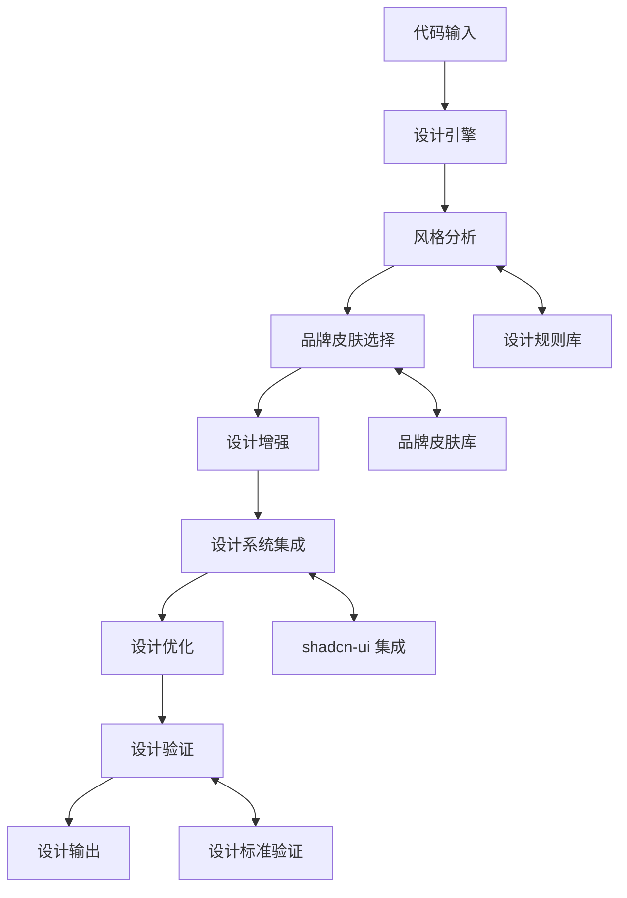

# styleseed

## 基本信息

- **项目名称**：styleseed
- **GitHub 链接**：https://github.com/bitjaru/styleseed
- **一句话定位**：AI 设计引擎，让 AI 代码像 UI/UX 设计师
- **创建时间**：2026-04-07
- **主要语言**：TypeScript
- **开源协议**：MIT License
- **当前 Stars**：120

## 项目概述

styleseed 是一个 AI 驱动的设计引擎，专门用于提升 AI 代码的 UI/UX 设计能力。该工具允许用户选择品牌皮肤，让 AI 生成的代码具备专业级的设计质量，与主流设计系统如 shadcn-ui 深度集成。

## 核心价值

### 它是做什么的
- **设计能力增强**：为 AI 代码注入专业设计能力
- **品牌一致性**：确保设计语言的品牌一致性
- **设计系统集成**：与 shadcn-ui 等设计系统深度集成
- **自动化设计**：减少人工设计工作量

### 它为什么火
1. **需求精准**：解决开发者设计能力短板的痛点
2. **技术先进**：基于现代化的 TypeScript 技术栈
3. **生态友好**：与 shadcn-ui 生态系统深度集成
4. **效果显著**：提供专业级的设计输出质量

### 它真正的技术亮点
- **品牌皮肤系统**：支持多种设计风格的品牌皮肤
- **设计-开发一体化**：从设计到代码的无缝衔接
- **现代化架构**：基于 TypeScript 的可扩展架构
- **AI 设计增强**：AI 代码的专业化设计处理

### 它解决的问题是否真实存在
**真实存在**：开发者普遍缺乏专业设计能力，设计任务耗时，品牌一致性难以保障，这些都是开发团队中的真实痛点。

### 它更偏玩具、工具、平台还是基础设施
**工具型**：作为一个实用的开发工具，提升开发效率和设计质量。

### 它属于短期热点还是中期趋势
**中期趋势**：AI 辅助设计是长期发展趋势，但具体实现技术会不断演进。

### 它对架构师最有价值的启发
1. **设计-开发一体化**：打破设计和开发的壁垒
2. **品牌一致性保障**：自动化设计语言管理
3. **智能化设计流程**：AI 驱动的智能设计决策

### 它是否值得持续跟踪
**建议持续跟踪**：AI 辅助设计工具是重要的开发工具演进方向。

### 它是否值得企业内部做 PoC
**值得做 PoC**：希望提升开发团队设计能力的企业可以考虑验证。

## 评分分析

| 维度 | 评分 | 理由 |
|------|------|------|
| 热度质量 | 8/10 | 解决开发者设计痛点，技术先进 |
| 技术创新度 | 8/10 | AI 设计引擎的创新应用 |
| 工程成熟度 | 8/10 | TypeScript 实现，架构清晰 |
| 架构启发价值 | 8/10 | 设计-开发一体化架构 |
| 企业落地潜力 | 7/10 | 开发团队有明确需求 |
| 中期趋势概率 | 8/10 | AI 辅助设计是长期趋势 |
| 平台化潜力 | 7/10 | 可能扩展为更完整的设计平台 |
| 基础设施潜力 | 6/10 | 主要是工具层面，基础设施属性较弱 |

**总分：65/100**
**项目归类**：工具型
**是否建议持续跟踪**：是

## 技术架构

### 核心组件
1. **设计引擎**：负责 AI 代码的设计增强
2. **品牌皮肤系统**：管理不同品牌的设计语言
3. **设计集成器**：与 shadcn-ui 等设计系统集成
4. **设计优化器**：优化生成代码的设计质量
5. **设计验证器**：确保设计一致性

### 技术栈
- **编程语言**：TypeScript
- **UI 框架**：与 React 集成
- **设计系统**：shadcn-ui 深度集成
- **AI 技术**：AI 设计增强算法
- **构建工具**：现代化前端构建体系

### 架构图

## 应用场景

### 开发团队
- **设计能力增强**：提升开发团队的设计水平
- **品牌一致性**：确保产品设计语言的一致性
- **开发效率**：减少设计和开发的协调成本

### 设计团队
- **辅助设计**：为设计师提供 AI 辅助工具
- **快速原型**：快速生成设计原型
- **风格管理**：统一管理不同项目的设计风格

### 产品团队
- **产品原型**：快速生成产品原型
- **设计验证**：验证设计方案的可行性
- **风格指导**：为产品开发提供设计指导

## 风险与局限

### 主要风险
1. **设计质量**：AI 设计质量依赖训练数据
2. **创意局限**：可能缺乏创意突破
3. **标准化**：设计标准可能不够完善
4. **生态依赖**：依赖 shadcn-ui 等特定生态

### 局限性
1. **领域限制**：主要适用于特定设计系统
2. **复杂度限制**：复杂设计场景支持有限
3. **学习成本**：需要学习使用新工具
4. **定制化**：高度定制化需求支持有限

## 竞争分析

### 现有解决方案
- **传统设计工具**：Adobe XD、Figma 等专业设计工具
- **AI 设计工具**：Midjourney、DALL-E 等生成式设计工具
- **开发工具**：传统 IDE 和代码编辑器

### 对比优势
1. **专业性**：专门针对 AI 代码的设计增强
2. **集成性**：与开发流程深度集成
3. **一致性**：确保品牌设计语言的一致性
4. **效率**：提升设计到代码的转换效率

## 发展趋势

### 短期发展
1. **功能完善**：设计功能的进一步完善
2. **生态扩展**：支持更多设计系统和框架
3. **用户体验**：工具易用性的改进

### 中期发展
1. **智能化提升**：AI 设计能力的提升
2. **平台化**：扩展为更完整的设计平台
3. **企业级功能**：企业级设计管理功能

### 长期愿景
1. **设计自动化**：设计流程的完全自动化
2. **智能设计网络**：全球设计资源的智能化配置
3. **设计民主化**：让每个人都能获得专业设计能力

## 观察点

### 关键指标
1. **社区活跃度**：GitHub 活跃度和贡献者质量
2. **生态集成**：与设计系统的集成情况
3. **用户反馈**：实际用户的使用反馈
4. **设计质量**：生成代码的设计质量评估

### 建议关注
1. **技术演进**：AI 设计技术的迭代速度
2. **企业采纳**：企业的采纳情况和效果
3. **标准化**：设计标准的建立和完善
4. **伦理问题**：AI 设计的版权和伦理问题

## 总结

styleseed 代表了 AI 辅助设计工具的重要创新，专门针对开发者设计能力短板提供解决方案。该项目的品牌皮肤系统、设计-开发一体化和现代化架构等技术亮点，使其在提升开发效率和设计质量方面具有重要价值。对于开发团队和设计团队都具有重要的参考意义。建议持续关注其在 AI 设计技术演进和企业应用方面的发展。