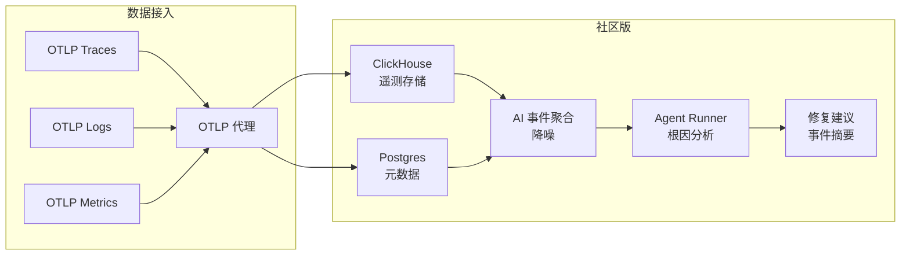

# superloglabs/superlog

## 一句话定位
AI 原生可观测性平台：OpenTelemetry + ClickHouse + AI Agent 自愈，从信号聚合到根因分析到修复建议的闭环。

## 它解决的问题
传统可观测性工具的三大痛点：(1) 告警风暴让人疲劳；(2) 找到根因需要人工排查；(3) 发现问题后修复建议缺失。superlog 用 AI Agent 贯穿「发现问题→定位根因→修复建议」全链路。

## 为什么值得关注（2026-06-11）

1. **YC P26 背书** — 商业验证 + 资源支持
2. **AI-native 架构** — 不是在监控上加 AI 壳，而是从底层设计
3. **OpenTelemetry 原生** — 基于事实标准，可集成性强
4. **开源核心** — 社区版包含完整可观测性功能

## 热度来源判断
- YC 品牌效应 + 可观测性 + AI 自愈是真需求 + 技术栈现代
- 持续增长，非爆发式

## 关键技术亮点
- **OTLP 原生** — 支持 traces/logs/metrics 统一接入
- **ClickHouse 查询引擎** — 海量遥测数据高性能查询
- **AI 事件聚合** — 将噪声信号自动聚合为事件
- **Agent Runner** — 可插拔的 AI 调查运行时
- **社区 Agent** — 默认 agent 自动记录事件摘要
- **Postgres 元数据** — 事件、配置等元数据存储

## 架构启发

**启发 1：** AI-native 可观测性的核心不是展示更多数据，而是减少需要人看的数据。
**启发 2：** OpenTelemetry 是可观测性的 TCP/IP，基于 OTel 构建意味着天然的可集成性。
**启发 3：** Agent Runner 可插拔设计意味着 AI 调查能力可以持续进化。

## 定位判断
**平台候选。** 可观测性天然是平台生意，AI 自愈能力是差异化壁垒。

## 风险/局限/泡沫点
1. **AI 修复的可靠性** — 目前更偏辅助建议，离真正自动修复还有距离
2. **竞品密集** — Grafana/Datadog/New Relic 都在加 AI 能力
3. **ClickHouse 运维门槛** — 自托管需要 ClickHouse 运维能力
4. **商业模型待验证** — 开源核心 + 云版的模式在可观测性领域竞争激烈

## 与同类项目的关系
- **Grafana** — 竞品，Grafana 也在加 AI，但 superlog 是 AI-native
- **Datadog** — 竞品，Datadog 更成熟但更贵
- **SigNoz** — 同赛道，SigNoz 也是 OTel-native，但缺少 AI 自愈

## 是否值得持续跟踪
✅ 是。AI 原生可观测性是确定性趋势。

## 后续观察点
1. AI 修复建议的准确率和采纳率
2. 社区版功能与企业版差异化
3. 大规模部署案例
4. Agent Runner 生态（第三方 Agent 插件）
5. 与 Grafana 生态的竞合关系
