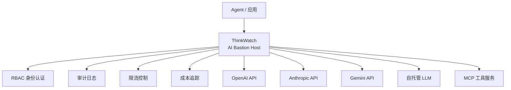

# ThinkWatch

## 一句话定位
企业级 AI 堡垒主机，统一代理 OpenAI/Anthropic/Gemini/MCP 访问，提供 RBAC、审计日志、限流和成本追踪。

## 它解决的问题
企业在部署 AI Agent 时面临的核心安全问题：API Key 散落各处、无法审计谁调用了什么、无法控制成本、无法限流。当前大多数团队直接把 API Key 硬编码在 Agent 配置中，零治理。

## 为什么值得关注（2026-04-25）
Agent 从个人工具走向企业部署，第一道门槛就是安全与治理。ThinkWatch 填补了"AI API Gateway"这个空白——类似 Kong/Nginx 在微服务中的角色，但专为 LLM API 和 MCP 协议设计。Rust 实现说明对延迟敏感。

## 热度来源判断
热度不高（444 stars），但方向精准。这类基础设施项目不需要 viral 增长，关键是企业采纳。Rust 实现吸引技术决策者。

## 关键技术亮点
1. **MCP 协议支持**：不只是 LLM API 代理，还支持 MCP 工具层的统一代理，这让它成为 Agent 全链路网关
2. **Rust 实现**：无 GC、低延迟，适合高并发 Agent 调用场景
3. **四合一能力**：RBAC + 审计 + 限流 + 成本追踪，覆盖企业治理的核心需求

## 架构启发
ThinkWatch 代表了 AI 时代的 API Gateway 范式。微服务时代有 Kong/Nginx/Envoy，Agent 时代需要类似的统一入口。关键设计决策：
- 代理模式 vs SDK 模式：ThinkWatch 选择代理模式，零侵入
- 语言选择：Rust 适合基础设施层，Go 适合应用层
- MCP 支持意味着它定位为 Agent 全链路网关，不只是 LLM 代理

## 定位判断
基础设施候选。AI 时代的 API Gateway，定位清晰。与 Kong/Nginx 形成类比。

## 风险 / 局限 / 泡沫点
1. **Rust 生态限制**：Agent 开发者主要是 Python/TS，Rust 基础设施的贡献者基数小
2. **大厂竞争**：Azure API Management、AWS Bedrock 已有类似 AI 治理功能，商业产品可能更快覆盖
3. **早期项目**：444 stars，文档和社区都处于早期阶段

## 与同类项目的关系
- **LiteLLM**：Python 实现的 LLM API 代理，功能类似但无 MCP 支持、无 Rust 性能
- **Portkey**：商业化 AI Gateway，SaaS 模式
- **OpenRouter**：LLM 路由服务，但不做安全治理

## 是否值得持续跟踪
是。方向确定，Rust + MCP 的组合有差异化。需要观察企业采纳情况和社区活跃度。

## 后续观察点
1. 是否有企业级用户公开分享使用经验
2. MCP 支持的完整度和稳定性
3. 与 LiteLLM 的功能对比演进

---
*首次记录：2026-04-25*
