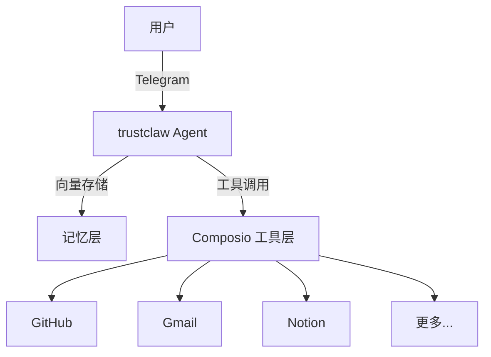

# trustclaw

## 一句话定位
自托管个人 AI Agent——向量记忆 + Composio 工具集成 + Telegram 交互，隐私优先的个人 AI 助手。

## 它解决的问题
当前个人 AI Agent 大多依赖云服务（ChatGPT、Claude 等），用户数据不可控。trustclaw 解决：
- 数据隐私：完全自托管，数据不离开用户的服务器
- 工具集成：通过 Composio 连接 250+ 应用
- 持续可用：Telegram 交互，随时随地的个人 Agent
- 记忆持久化：向量存储确保 Agent 记住历史交互

目标用户：注重隐私的个人开发者和技术爱好者。

## 为什么值得关注（2026-05-18）
自托管 AI Agent 是一个持续增长的方向。trustclaw 的亮点在于：
1. 背后是 ComposioHQ（有商业化能力的团队）
2. 技术栈务实（TypeScript + 向量记忆 + Telegram）
3. 与 Composio 工具生态的天然集成

## 热度来源判断
- ComposioHQ 的品牌背书带来初始流量
- "自托管 + 隐私"定位切中当前数据安全的痛点
- Telegram 集成降低了使用门槛
- 热度相对真实，但增长速度中等，说明市场接受度还在验证中

## 关键技术亮点
1. **向量记忆**：基于向量数据库的长期记忆管理，支持语义检索
2. **Composio 集成**：250+ 应用的工具调用能力（GitHub、Gmail、Notion 等）
3. **Telegram 交互**：原生 Telegram Bot 集成，移动端随时可用
4. **自托管设计**：Docker 一键部署，数据完全本地化

## 架构启发
trustclaw 代表了"个人 AI Agent = 记忆 + 工具 + 交互"的三层架构：

这个架构模式清晰，可复用于其他自托管 Agent 项目。

## 定位判断
**工具型**项目，有潜力演化为**平台候选**（如果 Composio 生态持续增长）。
- 不是基础设施（依赖 Composio 作为工具层）
- 不是纯研究（有明确的产品定位）
- 在自托管 AI Agent 赛道中属于中游位置

## 风险 / 局限 / 泡沫点
1. **Composio 依赖**：核心能力（工具调用）完全依赖 Composio，如果 Composio 变更 API 或定价策略，trustclaw 将受直接影响
2. **记忆管理深度**：向量记忆是基础方案，缺乏记忆优先级、遗忘机制、上下文窗口管理等高级特性
3. **Telegram 单一入口**：目前只有 Telegram 交互，缺少 Web UI 和其他入口
4. **ComposioHQ 的战略意图不明**：这是独立产品还是 Composio 的示例项目？

## 与同类项目的关系
| 维度 | trustclaw | Open Interpreter | n8n |
|------|-----------|-----------------|-----|
| 核心定位 | 自托管个人 Agent | 本地代码解释器 | 工作流自动化 |
| 记忆管理 | 向量记忆 | ❌ | ❌ |
| 工具集成 | Composio 250+ | 本地命令 | 400+ 集成 |
| 自托管 | ✅ | ✅ | ✅ |
| 交互方式 | Telegram | CLI | Web UI |

## 是否值得持续跟踪
**值得跟踪**。理由：
1. ComposioHQ 有商业化能力，项目不会轻易弃坑
2. 自托管 + 隐私方向持续有需求
3. 向量记忆 + 工具集成的架构模式清晰可复用

## 后续观察点
1. 是否会扩展交互入口（Web UI、API 等）
2. 记忆管理是否会引入分层/优先级机制
3. Composio 工具生态的持续增长情况
4. 是否会形成用户社区和插件生态

---
*首次记录：2026-05-18*
