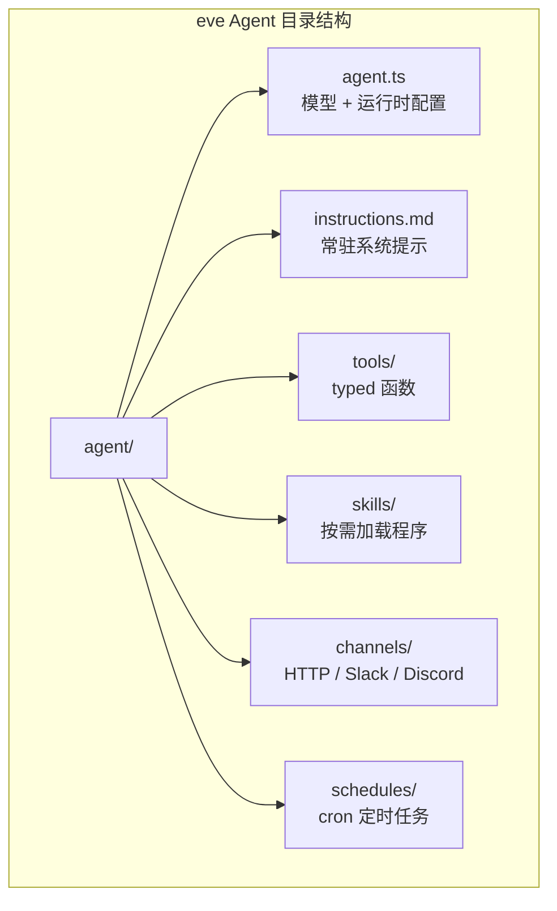

# Vercel Eve

## 一句话定位
Vercel 出品的 filesystem-first AI Agent 框架——agent 的能力（tools/skills/channels/schedules）映射到约定目录结构，文件系统就是 agent 的开发界面。

## 它解决的问题
构建 AI Agent 通常需要学习框架特定的 DSL 或配置格式。eve 的方案是：你不需要学框架，只需要按目录约定放文件——`tools/` 是工具，`skills/` 是技能，`channels/` 是消息通道，`schedules/` 是定时任务。

## 为什么值得关注（2026-06-19）
- Vercel 出品，品牌信任 + npm 生态 + Vercel 部署链路
- 3 天 1,327 stars，开发者社区关注度高
- `npx eve@latest init` 一键创建 agent 项目，DX 极佳
- 文档内置在 npm 包中（`node_modules/eve/docs`），Coding Agent 可直接读取

## 热度来源判断
Vercel 品牌效应 + filesystem-first 理念优雅 + TypeScript 开发者基数大。热度有真实需求支撑，但也包含 Vercel 粉丝效应。

## 关键技术亮点
1. **Filesystem as API** — agent.ts（配置）、instructions.md（系统提示）、tools/（函数）、skills/（按需加载）、channels/（消息）、schedules/（定时）
2. **Skills 按需加载** — 不是一次性灌入所有 context，而是根据需要加载 skill
3. **Channels 抽象** — HTTP、Slack、Discord 消息通道统一管理
4. **内嵌文档** — npm 包包含完整文档，Coding Agent 无需联网查文档

## 架构启发
eve 的设计哲学是 **convention over configuration** 应用于 Agent 开发。这与 Next.js 的 app/ 目录约定一脉相承，Vercel 在把这个模式复制到 Agent 领域。

## 定位判断
eve 是 **Agent 开发框架层的 Next.js**——通过约定优于配置大幅降低 Agent 开发门槛。如果 Vercel 部署链路打通，它可能成为 TypeScript 开发者构建 Agent 的事实标准。

## 风险 / 局限 / 泡沫点
1. **TypeScript 限定** — Python/Go 开发者被排除在外
2. **Vercel 锁定风险** — channels/schedules 依赖 Vercel 基础设施才能发挥最大价值
3. **早期阶段** — 78 forks，33 issues，生态尚小
4. **与 LangChain/LangGraph 竞争** — 已有大型框架占据开发者心智

## 与同类项目的关系
- **vs LangChain/LangGraph** — LangChain 是 Python-first + 链式组合，eve 是 TypeScript-first + 目录约定
- **vs omnigent** — omnigent 编排已有 agent，eve 从零构建 agent
- **vs Claude Code skills** — Claude Code skills 是单个 Skill 文件，eve 是完整框架

## 是否值得持续跟踪
**是。** Vercel 的分发能力 + filesystem-first 的优雅设计 = TypeScript Agent 开发的重要变量。

## 后续观察点
1. npm 下载量趋势
2. 社区贡献的 tools/skills/channels 数量
3. 是否与 Vercel 部署链路深度集成
4. 是否出现基于 eve 构建的生产 Agent

---
*首次记录：2026-06-19*
