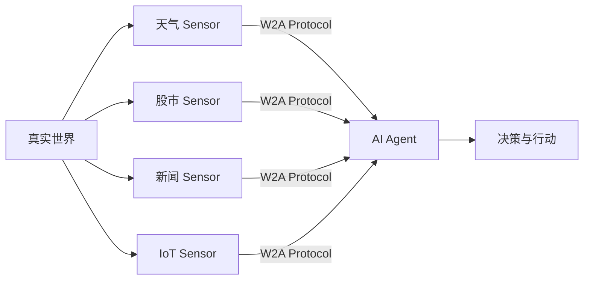

# World2Agent

## 一句话定位
开放协议标准化 AI Agent 对真实世界的感知层 — "Agent 感知不了的就无法行动"。

## 它解决的问题
AI Agent 目前对真实世界的信息获取是碎片化的：每个 Agent 需要自己对接天气 API、股市数据、新闻源、IoT 传感器等。World2Agent 提出了一个统一的 "Sensor → Agent" 协议。

## 为什么值得关注（2026-05-01）
提出了一个重要的概念层 — **Agent Perception Standardization**。当 Agent 生态从编码助手扩展到通用 Agent，对物理/数字世界实时数据的标准化接入将成为刚需。W2A 试图建立这个标准。

## 热度来源判断
概念新颖 + 开发者对 Agent 标准化协议的期待。但当前 588 stars 更多反映的是概念吸引力而非实际落地。

## 关键技术亮点
1. **Sensor Protocol**：统一的感知层协议 — Sensor 观测数据源，按 W2A schema 输出结构化数据
2. **Schema-First 设计**：所有信号遵循统一 schema，Agent 不需要知道数据源的具体实现
3. **Agent Runtime 插件**：原生支持 Claude Code、Hermes、OpenClaw 的插件集成
4. **SensorHub**：传感器市场/hub，社区可贡献新的 Sensor
5. **Apache 2.0 开源**

## 架构启发
W2A 的架构模式是 **World → Sensor → Agent**，这是一个经典的分层抽象：

这个模式与 MCP（Model Context Protocol）形成互补：MCP 解决 Agent 如何使用工具，W2A 解决 Agent 如何感知世界。

## 定位判断
协议层 / 基础设施候选。W2A 不是产品而是协议，它的价值取决于能否建立生态。

## 风险 / 屺限 / 泡沫点
1. **鸡生蛋问题**：协议需要足够多的 Sensor 实现才能吸引 Agent 开发者，反之亦然
2. **与 MCP 的关系不明确**：MCP 已经在工具接入层建立了标准，W2A 需要明确与 MCP 的边界
3. **Sensor 质量不可控**：社区贡献的 Sensor 数据质量如何保证？
4. **早期阶段**：目前仅 8 天历史，生态几乎为零

## 与同类项目的关系
- **MCP (Model Context Protocol)**：MCP 解决工具调用标准化，W2A 解决感知标准化，理论上互补
- **OpenAI Plugin/Action**：闭源方案，功能覆盖但非标准
- **Home Assistant**：IoT 领域的感知标准化，但局限于智能家居

## 是否值得持续跟踪
**是**。Agent 感知层的标准化是一个真实需求，即使 W2A 本身不能成功，这个方向会出现赢家。

## 后续观察点
1. SensorHub 是否出现高质量社区贡献
2. 是否被主流 Agent 框架采纳
3. 与 MCP 生态的整合/竞争关系

---
*首次记录：2026-05-01*
