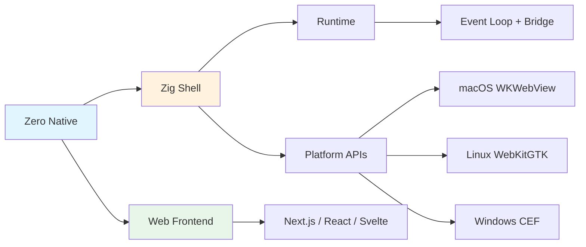

# Zero Native

## 一句话定位
Vercel Labs 出品的 Zig 桌面应用 shell，用 Web UI 构建原生桌面应用，支持系统 WebView 和 Chromium/CEF 双引擎。

## 它解决的问题
Electron 太重（打包 Chromium），Tauri 太复杂（Rust 学习曲线），原生开发太贵。Zero Native 用 Zig 作为原生层 + WebView 作为 UI 层，在轻量和能力之间找到平衡。

## 为什么值得关注（2026-05-14）
- **Vercel Labs 出品**：背后是 Web 开发工具链的领导者
- **Zig 而非 Rust**：选择 Zig 的 C 互操作性和编译速度优势
- **双引擎策略**：系统 WebView（极轻量）或 Chromium/CEF（渲染一致性）
- **安全模型明确**：WebView 默认不信任，所有原生命令 opt-in

## 热度来源判断
热度有 Vercel 品牌加持，但技术选择合理。3.3K stars 在 6 天内不算爆发性增长，但稳步上升。Zig 生态的关注度在上升，Vercel 的背书增加了可信度。

## 关键技术亮点
1. **Zig 原生层**：Zig 直接调用 C，平台 SDK、原生库、编解码器都触手可及，无需 heavy FFI
2. **显式安全模型**：WebView 被视为不信任的，原生命令、权限、导航、外部链接全部 opt-in + 策略控制
3. **快速原生重建**：Zig 编译速度快，原生层修改后秒级重编译
4. **WebViewSource 抽象**：支持内联 HTML、URL 或打包前端资源

## 架构启发
- Web UI + 轻量原生壳的架构模式正在被重新定义
- Zig 在系统编程领域的定位：不是替代 Rust，而是替代 C 的场景中更具竞争力
- Vercel 的技术版图从 Web 延伸到桌面，全栈开发的"全"在扩大

## 定位判断
基础设施候选。如果成熟，可能成为 Electron/Tauri 的替代方案。但当前仍为 pre-release。

## 风险 / 屧限 / 泡沫点
1. **Pre-release 状态**：API 不稳定，不建议生产使用
2. **Zig 生态不成熟**：相比 Rust，Zig 的库生态和社区较小
3. **Vercel Labs 项目风险**：Labs 项目可能被放弃或大幅修改方向
4. **CEF 路径尚未完全成熟**：系统 WebView 路径可用，但 CEF 打包体验还不完善

## 与同类项目的关系
- **Electron**：重量级方案，打包 Chromium，内存占用大
- **Tauri**：Rust + WebView，更成熟但 Rust 学习曲线陡峭
- **WRY**：Rust WebView 库，Tauri 的底层
- **Neutralinojs**：轻量级 Web 桌面框架，但社区较小

## 是否值得持续跟踪
**是**。Vercel Labs 的技术判断力值得信任，Zig 在桌面开发的应用是值得关注的新方向。

## 后续观察点
1. Vercel 是否将此项目从 Labs 毕业到正式产品
2. Zig 生态中桌面应用框架的成熟速度
3. 与 Tauri 的实际性能和开发体验对比

---
*首次记录：2026-05-14*
